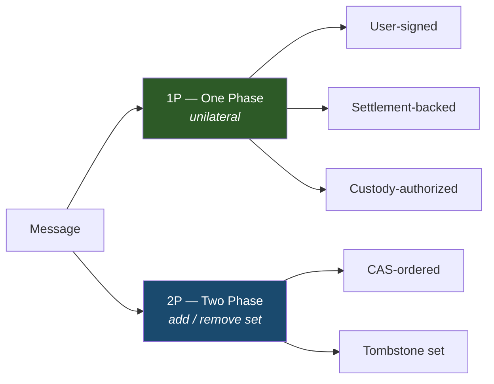
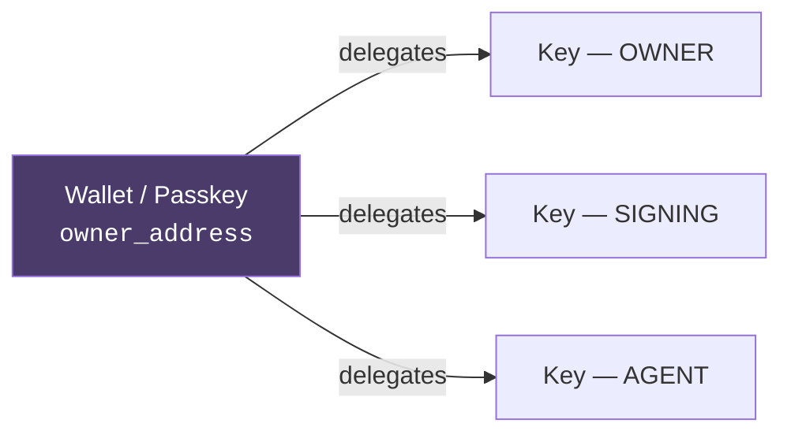
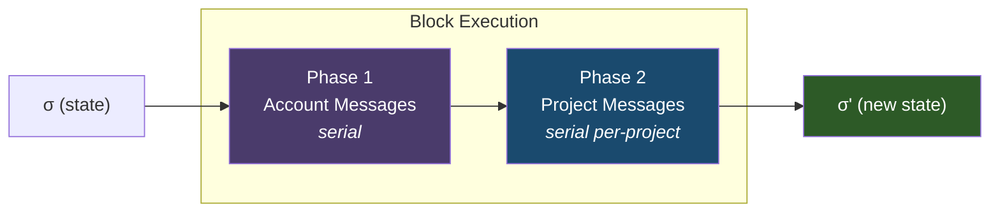

<picture>
  <source media="(prefers-color-scheme: dark)" srcset="../assets/logo-shapes-dark.svg">
  <source media="(prefers-color-scheme: light)" srcset="../assets/logo-shapes-light.svg">
  
</picture>

# Makechain

A specialized protocol built for making things.

**Version:** 2026.4.2

> Makechain orders and stores signed messages — project creation, commits, ref updates, access control — on a single-chain BFT ledger with sub-second finality. Consensus handles metadata; file content lives off-chain. Every committed message is verifiable from canonical state and, where applicable, finalized message-local external evidence.

### Table of Contents

1. [Introduction](#1-introduction)
2. [Data Model](#2-data-model)
3. [Identity](#3-identity)
4. [State Transition Function](#4-state-transition-function)
5. [Authorization Model](#5-authorization-model)
6. [Storage Model](#6-storage-model)
7. [Validation Rules](#7-validation-rules)
8. [Consensus](#8-consensus)
9. [Onchain Integration](#9-onchain-integration)
10. [Networking](#10-networking)
11. [Storage Limits and Pruning](#11-storage-limits-and-pruning)
12. [Content Storage](#12-content-storage)
13. [Versioning](#13-versioning)
- [Appendix A: Protocol Constants](#appendix-a-protocol-constants)
- [Appendix B: Wire Format and Canonical Encoding](#appendix-b-wire-format-and-canonical-encoding)
- [Appendix C: Onchain Contract Summary](#appendix-c-onchain-contract-summary-non-normative)
- [Appendix D: Correctness Invariants](#appendix-d-correctness-invariants)
- [Appendix E: Genesis State](#appendix-e-genesis-state)
- [Appendix F: Changelog](#appendix-f-changelog)
- [References](#references)

---

## 1. Introduction

Makechain is a realtime decentralized protocol for ordering and storing git-like messages — project creation, commits, ref updates, access control — with permissionless publishing and cryptographic attribution.

### 1.1 Goals

1. **High throughput.** 10,000+ messages per second with sub-second finality.
2. **Permissionless publishing.** Anyone can create projects and push code.
3. **Cryptographically attributable messages.** Every committed message is verifiable from canonical state and, where applicable, finalized message-local external evidence.
4. **Thin consensus.** Consensus orders metadata and ref pointers. File content is stored externally, referenced by content digest.

### 1.2 Non-Goals

- General-purpose smart contracts.
- Permanent storage of all file content in the consensus layer.
- Git wire protocol compatibility (clients translate to/from Makechain messages).

### 1.3 Notation and Conventions

| Symbol | Meaning |
|--------|---------|
| `σ` | Global state (key-value store) |
| `B` | Block |
| `M` | Message |
| `H(x)` | BLAKE3 hash of `x`, producing a 32-byte digest |
| `Sign(sk, m)` | Ed25519 signature of `m` using secret key `sk` |
| `Verify(pk, m, sig)` | Ed25519 signature verification |
| `owner_address` | Canonical 20-byte account identifier |
| `σ[k]` | Value at key `k` in state `σ` |
| `σ[k] ← v` | Assign value `v` to key `k` in state `σ` |
| `⊥` | Absent / not found |
| `\|` | Byte concatenation |
| `bytes(n)` | Exactly `n` bytes |
| `LE(x, n)` | `x` encoded as `n`-byte little-endian integer |
| `BE(x, n)` | `x` encoded as `n`-byte big-endian integer |

Throughout this document, "MUST", "MUST NOT", "SHOULD", and "MAY" follow [RFC 2119][rfc2119] semantics.

### 1.4 Threat Model

**Assumptions:**
- The network is asynchronous: messages may be delayed, reordered, or dropped.
- At most `f` of `3f + 1` validators are Byzantine.
- Cryptographic primitives (Ed25519, BLAKE3, secp256k1, P-256) are unbroken.
- The Tempo settlement chain provides finality for message-local external evidence.

**Out of scope:**
- Denial-of-service at the network transport layer.
- Compromise of individual user keys (key management is a client concern).
- Content availability (the consensus layer does not store file content).

### 1.5 Cryptographic Primitives

| Primitive | Usage | Reference |
|-----------|-------|-----------|
| **Ed25519** | Message signing and validator identity | [RFC 8032][rfc8032] |
| **BLAKE3** | Message hashing, content addressing, Merkle trees | [BLAKE3 spec][blake3] |
| **secp256k1 ECDSA** | EIP-712 custody signatures (key type 0) | [SEC 2][sec2] |
| **P-256 ECDSA** | EIP-712 custody signatures (key type 1, 2) | [FIPS 186-5][fips186] |
| **EIP-712** | Typed structured data signing for custody and verification | [EIP-712][eip712] |

---

## 2. Data Model

### 2.1 Message Envelope

Every message on the network is wrapped in a [`Message`](../proto/makechain.proto#L9) envelope. The canonical wire format is Protocol Buffers as defined in [`proto/makechain.proto`](../proto/makechain.proto).

```
Message {
  data:       MessageData   // The operation payload
  hash:       bytes(32)     // H(canonical_encode(data))
  signature:  bytes(64)     // Sign(sk, hash)
  signer:     bytes(32)     // Ed25519 public key
  data_bytes: bytes         // Optional: cached canonical_encode(data) to skip re-encoding on verify
}
```

**`canonical_encode(data)`** is the Makechain canonical byte encoding of [`MessageData`](../proto/makechain.proto#L17). For `2026.4.2`, this is defined by the reference Rust implementation described in Appendix B, not by generic Protocol Buffers serialization alone.

The `data_bytes` field (field 5 on [`Message`](../proto/makechain.proto#L9)) caches `canonical_encode(data)` — the same bytes that were hashed. Verifiers re-encode `data` independently and reject the message if `data_bytes` does not match, then check the hash against the re-encoded bytes. `data_bytes` is never used as a hash input directly; it exists so intermediaries can forward the original encoding without re-serializing.

**Authenticated user messages** — `hash`, `signature`, and `signer` MUST all be present and valid:
```
hash = H(canonical_encode(data))
Verify(signer, hash, signature) = true
signer ∈ registered_keys(data.owner_address)
scope(signer) ≤ required_scope(data.type)
```

**Custody-authorized user messages** (`SIGNER_ADD`, `SIGNER_REMOVE`) — the Ed25519 envelope provides integrity, but authorization comes from an EIP-712 custody signature verified against the account's `owner_address`. These messages bypass the delegated-key registration lookup entirely.

**Settlement-verified authenticated user messages** (`STORAGE_CLAIM`) — the Ed25519 envelope provides integrity and, on first successful application, delegated-key authorization. Successful finalized settlement verification remains additionally mandatory.

For `STORAGE_CLAIM`, validators MUST first verify finalized settlement evidence against `owner_address`, `actor`, and `units`. If the claim marker already exists, execution is an idempotent no-op regardless of current delegated-key state. Otherwise the envelope signer MUST be a registered delegated key for `data.owner_address` with required scope `SIGNING`.

### 2.2 MessageData

```
MessageData {
  type:       MessageType   // Operation discriminant
  owner_address: bytes(20)  // Acting account's wallet address
  timestamp:  uint32        // Unix seconds
  network:    Network       // MAINNET | TESTNET | DEVNET
  body:       <type-specific payload>
}
```

A valid `MessageData` MUST select exactly one body variant, that body MUST match `type`, and `MESSAGE_TYPE_NONE` is invalid for admitted, replayed, or committed messages.

### 2.3 Message Types



Every message type follows one of two paradigms:

**1P (one-phase)** — creates or updates state unilaterally. No paired "undo" message.

| Sub-type | Conflict resolution | Types |
|----------|-------------------|-------|
| Singleton | Irreversible creation | `FORK` |
| LWW Register | Timestamp-based last-write-wins | `PROJECT_METADATA`, `ACCOUNT_DATA` |
| Append-only | Monotonic growth, protocol-pruned | `COMMIT_BUNDLE` |
| State transition | Terminal state change | `PROJECT_ARCHIVE` |
| Settlement-verified authenticated user message | Finalized settlement verification plus delegated-key authorization on first successful application | `STORAGE_CLAIM` |
| Custody-authorized | Authorization from EIP-712 custody signature | `SIGNER_ADD`, `SIGNER_REMOVE` |

**2P (two-phase)** — Add/Remove pairs operating on a set.

| Sub-type | Conflict resolution | Types |
|----------|-------------------|-------|
| CAS-ordered | Compare-and-swap sequencing | `REF_UPDATE` / `REF_DELETE` |
| Set | Tombstone-backed remove-wins | All other Add/Remove pairs |

### 2.4 Complete Type Reference

| Type | Enum Value | Paradigm | Required Scope | Body Proto |
|------|-----------|----------|----------------|------------|
| `PROJECT_CREATE` | 1 | 2P Set † | SIGNING | [`ProjectCreateBody`](../proto/makechain.proto#L147) |
| `PROJECT_METADATA` | 2 | 1P LWW | SIGNING + WRITE (`NAME`/`VISIBILITY` require ADMIN) | [`ProjectMetadataBody`](../proto/makechain.proto#L181) |
| `PROJECT_ARCHIVE` | 3 | 1P Transition | SIGNING | [`ProjectArchiveBody`](../proto/makechain.proto#L233) |
| `FORK` | 4 | 1P Singleton | SIGNING | [`ForkBody`](../proto/makechain.proto#L168) |
| `PROJECT_REMOVE` | 5 | 2P Set | SIGNING | [`ProjectRemoveBody`](../proto/makechain.proto#L155) |
| `REF_UPDATE` | 6 | 2P CAS | AGENT | [`RefUpdateBody`](../proto/makechain.proto#L241) |
| `REF_DELETE` | 7 | 2P CAS | AGENT | [`RefDeleteBody`](../proto/makechain.proto#L256) |
| `COMMIT_BUNDLE` | 8 | 1P Append | AGENT | [`CommitBundleBody`](../proto/makechain.proto#L212) |
| `COLLABORATOR_ADD` | 9 | 2P Set | SIGNING (ADMIN) | [`CollaboratorAddBody`](../proto/makechain.proto#L267) |
| `COLLABORATOR_REMOVE` | 10 | 2P Set | SIGNING (ADMIN) | [`CollaboratorRemoveBody`](../proto/makechain.proto#L273) |
| `ACCOUNT_DATA` | 11 | 1P LWW | SIGNING | [`AccountDataBody`](../proto/makechain.proto#L195) |
| `VERIFICATION_ADD` | 12 | 2P Set | SIGNING | [`VerificationAddBody`](../proto/makechain.proto#L325) |
| `VERIFICATION_REMOVE` | 13 | 2P Set | SIGNING | [`VerificationRemoveBody`](../proto/makechain.proto#L332) |
| `STORAGE_CLAIM` | 14 | Settlement-verified authenticated user message | `SIGNING` on first successful application only; duplicate replay short-circuits after settlement verification | [`StorageClaimBody`](../proto/makechain.proto#L338) |
| `LINK_ADD` | 15 | 2P Set | SIGNING | [`LinkAddBody`](../proto/makechain.proto#L346) |
| `LINK_REMOVE` | 16 | 2P Set | SIGNING | [`LinkRemoveBody`](../proto/makechain.proto#L354) |
| `REACTION_ADD` | 17 | 2P Set | SIGNING | [`ReactionAddBody`](../proto/makechain.proto#L372) |
| `REACTION_REMOVE` | 18 | 2P Set | SIGNING | [`ReactionRemoveBody`](../proto/makechain.proto#L378) |
| `SIGNER_ADD` | 19 | Custody-auth | (custody sig) | [`SignerAddBody`](../proto/makechain.proto#L397) |
| `SIGNER_REMOVE` | 20 | Custody-auth | (custody sig) | [`SignerRemoveBody`](../proto/makechain.proto#L412) |

† `PROJECT_CREATE` is paired with `PROJECT_REMOVE` as a 2P Set, but does not follow the generic `apply_2p_add` re-add path because `project_id` is content-addressed (Section 2.5). See Section 4.2 for the specific semantics.

### 2.5 Content-Addressed Identifiers

- **`project_id`** = `Message.hash` = `H(canonical_encode(MessageData))` — the BLAKE3 hash of the `MessageData` contents of the `PROJECT_CREATE` message. This is the `hash` field in the message envelope, NOT a hash of the full envelope (which also includes `signer`, `signature`, and `data_bytes`). Two projects with the same name produce different IDs because the hash includes `owner_address`, `timestamp`, and the rest of the canonical payload.
- **Forked project ID** = `Message.hash` of the `FORK` message — same principle.
- **`commit_hash`** = Client-computed BLAKE3 hash of the full commit object. Declared by the submitter, not recomputed by validators.

---

## 3. Identity

### 3.1 Canonical Identity



`owner_address` is the sole canonical account identifier in V2. MID does not exist in post-reset semantics.

Any valid 20-byte address is a valid Makechain principal even if it has no persisted account row, no delegated keys, and no active storage grants. Missing account state implies default-zero bookkeeping, not invalid identity.

### 3.2 Accounts

An account is identified by `owner_address` (`bytes(20)`). Each account's state consists of:

| Field | Type | Description |
|-------|------|-------------|
| `owner_address` | `bytes(20)` | Canonical account identifier and project owner identity. |
| `keys` | Set of `KeyState` | Registered Ed25519 public keys with scopes. |
| `custody_nonce` | `uint64` | Replay counter for `SIGNER_ADD` and `SIGNER_REMOVE`. |
| `metadata` | Map of `(field → (value, timestamp))` | Display name, avatar, bio, website. LWW per field. |
| `verifications` | 2P Set | External address ownership proofs. |
| `links` | 2P Set | Follow/star relationships. |
| `reactions` | 2P Set | Commit reactions. |
| `storage_units` | `uint32` | Active storage capacity derived from unexpired storage grants. |
| `project_count` | `uint32` | Number of owned projects. |
| `key_count` | `uint32` | Number of registered delegated keys. |
| `username` | `string \| null` | Canonical lowercase username bound to the account while effective active storage remains nonzero. |

There is no onchain account allocation, transfer, or recovery flow in V2.

### 3.3 Key Scopes

All delegated keys are Ed25519. Each key has an explicit scope:

| Scope | Value | Capabilities |
|-------|-------|-------------|
| `OWNER` | 0 | Full account control: manage keys and act with any delegated-key privilege |
| `SIGNING` | 1 | Account-scoped operations plus project create/fork and project administration on authorized projects |
| `AGENT` | 2 | Automated actions (CI/CD, AI agents) — optionally scoped to specific projects |

Privilege ordering: `OWNER < SIGNING < AGENT` (numerically). A key with scope `s` satisfies any requirement `r` where `s ≤ r`.

### 3.4 Key Registration and Storage Funding Paths

V2 has no relay-injected identity or signer-management messages.

The only live delegated-key management flow is custody-authorized `SIGNER_ADD` / `SIGNER_REMOVE`, authorized directly against `owner_address`.

The only Tempo-backed storage ingress is `STORAGE_CLAIM`, a user-submitted message whose first successful application requires both verified finalized settlement data and delegated-key authorization with scope `SIGNING`. Duplicate replay remains anchored to settled claim coordinates rather than current delegated-key state.

### 3.5 Registration-Time Usernames

Accounts may hold at most one active username.

- A username is a globally unique human-readable handle layered on top of canonical `owner_address` identity.
- Usernames are assigned only by `STORAGE_CLAIM` during first paid storage activation, after required claimant sweep confirms effective active storage is zero.
- While an account has effective active storage, its username reservation remains fixed.
- When required sweep reconciles an account to zero effective active storage, the username reservation is released.

Canonical username form:

- lowercase ASCII only
- length `3` through `32` inclusive
- allowed characters: `a-z`, `0-9`, `-`
- first and last characters MUST be alphanumeric

Canonical regex:

```text
^[a-z0-9][a-z0-9-]{1,30}[a-z0-9]$
```

Clients MAY accept mixed-case ASCII input for UX, but they MUST lowercase and validate it before signing or submission. Validators MUST reject non-canonical usernames on the wire rather than silently normalizing them during execution.

---

## 4. State Transition Function

### 4.1 Global State

The global state `σ` is a key-value store mapping byte strings to byte strings. All state objects (accounts, projects, keys, refs, commits, collaborators, verifications, links, reactions, tombstones, counters, storage grants) are serialized values under prefix-namespaced keys (see Section 6.1).

### 4.2 Block Execution



Given state `σ`, finalized block `B`, and the committed execution payload `R` associated with `B`:

```
apply_block(σ, B, R) → σ':
  require digest(R) is the proposal digest finalized by B.consensus_finalization
  let account_msgs = R.account_messages
  let project_groups = R.project_messages

  // Phase 1: Serial account pre-pass
  σ₁ = σ
  for M in account_msgs:
    if not timestamp_valid(M, B.timestamp):
      drop(M)
      continue
    match apply_message(σ₁, M):
      Ok(σ') → σ₁ = σ'
      Err(_) → drop(M)

  // Phase 2: Serial per-project execution
  σ₂ = σ₁
  for (project_id, msgs) in project_groups:  // lexicographic order of project_id
    for M in msgs:                           // proposer-determined order within group
      if not timestamp_valid(M, B.timestamp):
        drop(M)
        continue
      match apply_message(σ₂, M):
        Ok(σ') → σ₂ = σ'
        Err(_) → drop(M)

  return σ₂
```

`ExecutionPayload` is the canonical execution input. Verifiers MUST execute the exact `account_messages` and `project_messages` order carried in `R`. `Block.chunks[*].txns[*].user_messages` redundantly mirror the finalized per-project message groups for persisted verification, sync, and indexing; account-message order is carried only by `ExecutionPayload.account_messages`. Each `project_id` MUST appear at most once in `ExecutionPayload.project_messages`; duplicate entries make the payload invalid. If the block's mirrored per-project messages differ from `ExecutionPayload.project_messages`, the block is invalid.

**Account messages** (Phase 1, serial): `STORAGE_CLAIM`, `SIGNER_ADD`, `SIGNER_REMOVE`, `ACCOUNT_DATA`, `VERIFICATION_ADD`, `VERIFICATION_REMOVE`, `LINK_ADD`, `LINK_REMOVE`, `REACTION_ADD`, `REACTION_REMOVE`, `PROJECT_CREATE`, `PROJECT_REMOVE`, `FORK`.

`PROJECT_CREATE`, `PROJECT_REMOVE`, and `FORK` are classified as account messages because they modify `project_count` on the account.

**Project messages** (Phase 2, serial per-project group): `PROJECT_METADATA`, `PROJECT_ARCHIVE`, `REF_UPDATE`, `REF_DELETE`, `COMMIT_BUNDLE`, `COLLABORATOR_ADD`, `COLLABORATOR_REMOVE`. Grouped by `project_id`, groups iterated in byte-lexicographic order of the 32-byte `project_id`. Within each group, messages are processed in the order specified by the proposer and carried authoritatively in `ExecutionPayload.project_messages`; the block's `ShardChunk.txns[*].user_messages` copy MUST match.

Dropped messages are excluded from the committed block but do not halt execution.

> **Note:** Projects are independent state domains — operations on different projects never conflict. Future implementations MAY execute project groups in parallel. The current specification requires only that the result is equivalent to the serial execution order defined above.

#### Message Dispatch

`apply_message(σ, M)` dispatches to a type-specific handler. Each handler reads and writes specific state keys. The following table enumerates all keys modified by each message type (reads omitted for brevity — handlers read the keys they write plus authorization keys from Section 5):

| Message Type | Resolution | Keys Written |
|---|---|---|
| `PROJECT_CREATE` | 2P add | `project(id)`, `project_name(owner_address, name)`, `account(owner_address)` [project_count++] |
| `PROJECT_REMOVE` | 2P remove | `project(id)` [status], `tombstone(project(id))`, `account(owner_address)` [project_count--] |
| `FORK` | Singleton | `project(id)` [with `fork_source`], `project_name(owner_address, name)`, `account(owner_address)` [project_count++] |
| `PROJECT_METADATA` | LWW | `project_meta(id, field)`, optionally `project_name(owner_address, *)` for name changes |
| `ACCOUNT_DATA` | LWW | `account_meta(owner_address, field)` |
| `COMMIT_BUNDLE` | Append | `commit(project_id, hash)` per commit; triggers `prune_commits` if over limit |
| `PROJECT_ARCHIVE` | State transition | `project(id)` [status → Archived] |
| `REF_UPDATE` | CAS+nonce | `ref(project_id, ref_name)` |
| `REF_DELETE` | CAS+nonce | deletes `ref(project_id, ref_name)` |
| `COLLABORATOR_ADD` | 2P add | `collaborator(project_id, target_owner_address)`, optionally clears `tombstone(collaborator(...))` |
| `COLLABORATOR_REMOVE` | 2P remove | deletes `collaborator(project_id, target_owner_address)`, `tombstone(collaborator(...))` |
| `STORAGE_CLAIM` | Settlement-verified authenticated user message | `storage_grant(owner_address, expires_at, claim_id)`, `storage_claim_marker(claim_id)`, `account(owner_address)` [`storage_units`, `username` on first activation], optionally `username_index(username)` on first activation |
| `SIGNER_ADD` | Custody-auth | `key(owner_address, pubkey)`, `key_reverse(pubkey)`, `account(owner_address)` [custody_nonce++, key_count++] |
| `SIGNER_REMOVE` | Custody-auth | deletes `key(owner_address, pubkey)`, `key_reverse(pubkey)`, `account(owner_address)` [custody_nonce++, key_count--] |
| `VERIFICATION_ADD` | 2P add | `verification(owner_address, addr)`, `counter(owner_address, 0x03)`, optionally clears tombstone |
| `VERIFICATION_REMOVE` | 2P remove | deletes `verification(owner_address, addr)`, `tombstone(verification(...))`, `counter(owner_address, 0x03)` |
| `LINK_ADD` | 2P add | `link(owner_address, type, target)`, `link_reverse(type, target, owner_address)`, `counter(owner_address, 0x01)` |
| `LINK_REMOVE` | 2P remove | deletes `link(...)`, `link_reverse(...)`, `tombstone(link(...))`, `counter(owner_address, 0x01)` |
| `REACTION_ADD` | 2P add | `reaction(owner_address, type, proj, hash)`, `reaction_reverse(type, proj, hash, owner_address)`, `counter(owner_address, 0x02)` |
| `REACTION_REMOVE` | 2P remove | deletes `reaction(...)`, `reaction_reverse(...)`, `tombstone(reaction(...))`, `counter(owner_address, 0x02)` |

Key names reference Section 6.1 prefixes. 2P add/remove handlers also interact with prune markers (`0x15`) during quota pruning (Section 11.4). `MessageType::None` returns `Err`.

`STORAGE_CLAIM` remains a Phase 1 account message. Validators execute username-bearing claims in the ordinary serial account-message order, so earlier successful claims may sweep a conflicting indexed owner before later claims are evaluated. Later conflicting claims in the same block are dropped as ordinary invalid account messages; they do not invalidate the whole block.

**Project identity and 2P set semantics.** Although `PROJECT_CREATE` and `PROJECT_REMOVE` are listed as 2P Set add/remove pairs, projects do not follow the generic `apply_2p_add` re-add path from Section 4.4.2. This is a consequence of content-addressed identity: `project_id = H(MessageData)` (Section 2.5), so every fresh `PROJECT_CREATE` message produces a unique `project_id`. There is no way to construct a new `PROJECT_CREATE` that targets an existing project's identity. A `PROJECT_CREATE` whose derived `project_id` matches an existing project entry MUST be rejected regardless of the project's current status. `PROJECT_ARCHIVE` is a terminal state transition — archived projects cannot be reverted to `Active`, but they can be forked or subsequently removed.

### 4.3 Timestamp Validation

```
timestamp_valid(M, block_timestamp) → bool:
  let ts = M.data.timestamp
  let drift = MAX_TIMESTAMP_DRIFT  // 300 seconds

  // Reject messages too far in the future (saturating subtraction to avoid underflow)
  if saturating_sub(ts, block_timestamp) > drift:
    return false

  // Reject storage-sensitive messages too far in the past
  if is_storage_sensitive(M.data.type):
    if ts < saturating_sub(block_timestamp, drift):
      return false

  return true
```

All arithmetic MUST use saturating subtraction (clamping to 0 on underflow) since timestamps are unsigned integers.

Storage-sensitive types (types that create or remove quota-affecting state): `PROJECT_CREATE`, `FORK`, `COLLABORATOR_ADD`, `COLLABORATOR_REMOVE`, `VERIFICATION_ADD`, `VERIFICATION_REMOVE`, `LINK_ADD`, `LINK_REMOVE`, `REACTION_ADD`, `REACTION_REMOVE`, `STORAGE_CLAIM`.

### 4.4 Conflict Resolution

#### 4.4.1 LWW Registers

For `PROJECT_METADATA` and `ACCOUNT_DATA`, each field is a Last-Write-Wins register keyed by `(entity_id, field)`:

```
apply_lww(σ, key, new_value, new_timestamp) → σ':
  let (current_value, current_ts) = σ[key]  // (⊥, 0) if absent

  if new_timestamp < current_ts:
    return σ  // stale — silently drop

  // Equal timestamps: last-inclusion-wins (consensus order within block)
  σ[key] ← (new_value, new_timestamp)
  return σ
```

**Note on commutativity:** LWW is commutative when timestamps differ. At equal timestamps, the result depends on consensus inclusion order within the block — this is intentional and deterministic (the proposer determines ordering). Because `MAX_TIMESTAMP_DRIFT` permits timestamps up to 300 seconds in the future, a writer who sets `timestamp = now + 299` will win all concurrent LWW conflicts for up to 5 minutes. This is an accepted trade-off: timestamp drift is bounded, and metadata fields are not security-critical.

#### 4.4.2 Tombstone-Backed 2P Sets

For all 2P Set types, conflict resolution uses durable tombstones with remove-wins-on-tie semantics.

Let `active_key` be the key for the active entry and `tombstone_key = [0x03 | active_key]`.

```
apply_2p_add(σ, active_key, add_timestamp) → σ':
  let active = σ[active_key]   // ⊥ if absent
  let tombstone_ts = σ[tombstone_key]    // ⊥ if no tombstone
  let prune_marker_ts = σ[prune_marker_key(active_key)]  // ⊥ if no prune marker
  let effective_tomb = max(tombstone_ts, prune_marker_ts)  // treating ⊥ as -∞

  if effective_tomb ≠ ⊥ and add_timestamp ≤ effective_tomb:
    return σ  // remove/prune wins on tie

  if active ≠ ⊥ and add_timestamp < active.timestamp:
    return σ  // stale add loses to newer active add

  // Equal-timestamp add/add remains last-inclusion-wins
  // per proposer-defined order.

  σ[active_key] ← entry_with_timestamp(add_timestamp)
  return σ

apply_2p_remove(σ, active_key, remove_timestamp) → σ':
  let active = σ[active_key]
  let tombstone_ts = σ[tombstone_key]

  // Decide what to do
  let should_record_tombstone =
    NOT (tombstone_ts ≠ ⊥ and remove_timestamp ≤ tombstone_ts)  // not blocked by newer tombstone

  let should_delete_active =
    active ≠ ⊥ and remove_timestamp ≥ active.timestamp

  // Case 1: Delete active and record tombstone
  if should_record_tombstone and should_delete_active:
    σ[tombstone_key] ← remove_timestamp
    delete σ[active_key]
    return σ

  // Case 2: Update existing tombstone only (no active to delete)
  //         Only allowed when a tombstone already exists — prevents phantom tombstones
  if should_record_tombstone and not should_delete_active and tombstone_ts ≠ ⊥:
    σ[tombstone_key] ← remove_timestamp
    return σ

  // Case 3: Ignore — no active, no tombstone (phantom), or tombstone already newer
  return σ
```

**Correctness properties:**
- **Monotone add resolution:** A newer add supersedes an older add. Equal-timestamp add/add remains last-inclusion-wins.
- **Commutativity for distinct timestamps:** For tombstone-backed 2P Set add/remove operations with distinct timestamps, final state is independent of arrival order.
- **Remove-wins-on-tie:** An add at time `t` and remove at time `t` results in the entry being removed.
- **No phantom tombstones:** A remove targeting an identity that was never active and has no existing tombstone produces no persistent state. Specifically: a tombstone is only created in conjunction with deleting an active entry, or by advancing an already-existing tombstone. This prevents unbounded state growth from adversarial removes.
- **Bounded tombstones:** `|tombstones| ≤ |unique identities ever actively added|`.
- **Prune marker subsumption:** Prune markers (Section 11.4) act as pseudo-tombstones for 2P add resolution. `apply_2p_add` uses `effective_tomb = max(tombstone_ts, prune_marker_ts)`, ensuring pruned entries cannot be re-added with stale timestamps.

#### 4.4.3 CAS-Ordered Refs

`REF_UPDATE` and `REF_DELETE` use compare-and-swap with monotonic nonces rather than timestamp-based or tombstone-based resolution. Refs do NOT use 2P tombstones — a deleted ref can be recreated with the same name.

```
apply_ref_update(σ, project_id, ref_name, old_hash, new_hash, nonce, force) → σ':
  let current = σ[ref_key(project_id, ref_name)]

  if current = ⊥:
    // Creating new ref
    require old_hash = ∅
    require nonce = 1
  else:
    // Updating existing ref
    require nonce = current.nonce + 1
    if old_hash ≠ ∅:
      require old_hash = current.hash  // CAS check — force does NOT bypass this
    if not force:
      require is_ancestor(σ, project_id, current.hash, new_hash, MAX_FF_DEPTH)

  σ[ref_key(project_id, ref_name)] ← RefState { hash: new_hash, nonce: nonce, ... }
  return σ

apply_ref_delete(σ, project_id, ref_name, expected_hash, nonce) → σ':
  let current = σ[ref_key(project_id, ref_name)]
  require current ≠ ⊥
  require nonce = current.nonce + 1
  if expected_hash ≠ ∅:
    require expected_hash = current.hash
  delete σ[ref_key(project_id, ref_name)]
  return σ
```

The `ref_type` field (Branch or Tag) is set only when creating a new ref. Subsequent updates preserve the original ref type.

Because deletion removes the stored ref state entirely, recreating a deleted ref starts a new nonce sequence at `1`.

Fast-forward check: when `force = false` and the ref already exists, the validator MUST verify that the current commit hash is a reachable ancestor of `new_hash` by traversing parent links, bounded to `MAX_FF_DEPTH` (10,000) commits.

---

## 5. Authorization Model

### 5.1 Key Scope Checks

```
check_key_scope(σ, owner_address, signer, required_scope) → Ok | Err:
  let key_state = σ[key_entry_key(owner_address, signer)]
  require key_state ≠ ⊥                    // key must exist
  require key_state.scope ≤ required_scope  // lower value = higher privilege
  return Ok
```

### 5.2 Project Access Control

```
check_project_access(σ, owner_address, project_id, required_permission) → Ok | Err:
  let project = σ[project_key(project_id)]
  require project ≠ ⊥ and project.status = Active

  if project.owner_address = owner_address:
    return Ok  // owner has full access

  let collab = σ[collaborator_key(project_id, owner_address)]
  require collab ≠ ⊥ and collab.permission ≥ required_permission
  return Ok
```

### 5.3 Agent Project Scope

```
check_agent_project_scope(σ, owner_address, signer, project_id) → Ok | Err:
  let key_state = σ[key_entry_key(owner_address, signer)]
  if key_state.scope ≠ Agent: return Ok
  if key_state.allowed_projects is empty: return Ok  // unrestricted
  require project_id ∈ key_state.allowed_projects
  return Ok
```

### 5.4 V2 Bypass Rules

V2 has no generic unsigned system-message path.

All committed V2 block messages are user-submitted envelope-bearing messages. The only bypass rules are:

- `SIGNER_ADD` and `SIGNER_REMOVE` bypass delegated-key lookup; authority derives exclusively from valid custody signatures verified against `owner_address`.

Disabled relay-era families (`KEY_ADD`, `OWNERSHIP_TRANSFER`, `STORAGE_RENT`, `RELAY_SIGNER_ADD`, `RELAY_SIGNER_REMOVE`) are invalid in V2 and MUST be rejected at all external ingress points and during replay.

### 5.4A `STORAGE_CLAIM` Authorization

`STORAGE_CLAIM` is no longer a delegated-key-bypass transport-only exception in reset deployments that include registration-time usernames.

```
authorize_storage_claim(σ, data, signer, body) → FirstApply | DuplicateReplay | Err:
  require finalized settlement verification succeeds and matches
          (owner_address, actor, units)

  let claim_id = storage_claim_id(body.settlement_chain_id,
                                  body.settlement_tx_hash,
                                  body.settlement_log_index)

  if storage_claim_marker(claim_id) exists:
    return DuplicateReplay

  check_key_scope(σ, data.owner_address, signer, SIGNING)
  return FirstApply
```

Under the existing scope ordering, `OWNER` and `SIGNING` satisfy the `STORAGE_CLAIM` requirement and `AGENT` does not. Duplicate replay remains settlement-first and marker-idempotent: once the claim marker exists, current delegated-key state MUST NOT cause a settlement-valid duplicate claim to fail.

### 5.5 Custody-Authorized Message Authorization

`SIGNER_ADD` and `SIGNER_REMOVE` bypass the Ed25519 signer-is-registered check. Authorization comes from an EIP-712 custody signature verified against `owner_address`:

```
authorize_signer_op(σ, data, body) → Ok | Err:
  require len(data.owner_address) = 20
  let acct = σ[account_key(data.owner_address)]  // default-zero if absent
  require body.valid_after ≤ data.timestamp ≤ body.valid_before
  require body.valid_before - body.valid_after ≤ MAX_VALIDITY_WINDOW
  require body.nonce = acct.custody_nonce
  let hash = eip712_signing_hash(...)
  require verify_custody(hash, body.custody_signature, body.custody_key_type, data.owner_address)
  return Ok  // caller increments custody_nonce by 1 on success
```

**EIP-712 Domain:** `{ name: "Makechain", version: "1", chainId: host_chain_id(data.network) }`

`host_chain_id(network)` is the canonical [EIP-155][eip155] chain ID of the Tempo settlement chain bound to that Makechain network. The EIP-712 domain MUST use that chain ID so wallet signing, settlement verification, and historical ERC-1271 checks all bind to the same finalized Tempo chain.

Current deployments:
- `devnet` → `42431` (Tempo Moderato)
- `testnet` → `42431` (Tempo Moderato)
- `mainnet` → `4217` (Tempo mainnet)

Unknown or unsupported network identifiers MUST fail closed for EIP-712 custody, app-attribution, and ETH verification-claim signing or verification.

**`SignerAdd` type declaration** (mirrors [`SignerAddBody`](../proto/makechain.proto#L397)):
```
SignerAdd(address owner, bytes32 key, uint32 scope, uint64 validAfter,
          uint64 validBefore, uint64 nonce, bytes32[] allowedProjects, uint32 network)
```

For `custody_key_type = 3`, the typed payload is:
```
SignerAddContract(address owner, bytes32 key, uint32 scope, uint64 validAfter,
                  uint64 validBefore, uint64 nonce, bytes32[] allowedProjects,
                  uint32 network, bytes32 validationBlockHash)
```

**`SignerRemove` type declaration** (mirrors [`SignerRemoveBody`](../proto/makechain.proto#L412)):
```
SignerRemove(address owner, bytes32 key, uint64 validAfter,
             uint64 validBefore, uint64 nonce, uint32 network)
```

For `custody_key_type = 3`, the typed payload is:
```
SignerRemoveContract(address owner, bytes32 key, uint64 validAfter,
                     uint64 validBefore, uint64 nonce, uint32 network,
                     bytes32 validationBlockHash)
```

**Custody Signature Types:**

| `custody_key_type` | Curve | Format | Size |
|----|-------|--------|------|
| 0 | secp256k1 | `r:32 \| s:32 \| v:1` | 65 bytes |
| 1 | P256 (ECDSA) | `r:32 \| s:32 \| v:1` | 65 bytes |
| 2 | WebAuthn (P256) | Variable-length envelope | 107–2048 bytes |
| 3 | ERC-1271 | Opaque contract-defined bytes plus companion `custody_block_hash` | 0–8192 bytes |

- `valid_after` / `valid_before` bound [`MessageData.timestamp`](../proto/makechain.proto#L20).
- `nonce` MUST match the account's current `custody_nonce` for `owner_address`.
- `allowedProjects` binds the key's project allowlist into the `SignerAdd` signature, preventing allowlist manipulation before finalization.
- `network` binds the signature to [`MessageData.network`](../proto/makechain.proto#L21), preventing cross-network replay.
- The EIP-712 domain `chainId` MUST equal `host_chain_id(data.network)`.
- `custody_block_hash` MUST be present and exactly 32 bytes iff `custody_key_type = 3`, and MUST identify a finalized canonical Tempo block on `host_chain_id(data.network)`.

**[WebAuthn][webauthn] Envelope Wire Format (custody_key_type=2):**
```
[auth_data_len:LE(2) | authenticatorData | client_json_len:LE(2) | clientDataJSON | sig:64 | v:1]
```

- `authenticatorData` — Flags byte (offset 32) MUST have UP (bit 0) and UV (bit 2) set.
- `clientDataJSON` — MUST contain `"type": "webauthn.get"`, a `"challenge"` that is the base64url encoding of the EIP-712 signing hash, and a canonical secure `"origin"`. `crossOrigin` MUST be absent or `false`.
- `sig` — Raw P256 ECDSA (`r:32 | s:32`, low-S normalized).
- `v` — Recovery ID hint (0 or 1); values > 1 are rejected.

### 5.6 App Attribution

Every `SIGNER_ADD` MUST include app attribution:

- `request_owner_address` — requesting app wallet address (20 bytes).
- `request_signature` — EIP-712 `SignerRequest` signature from that requesting app wallet.

**SignerRequest type declaration:**
```
SignerRequest(address requestOwner, bytes32 key, uint64 validAfter, uint64 validBefore, uint32 network)
```

For `request_key_type = 3`, the typed payload is:
```
SignerRequestContract(address requestOwner, bytes32 key, uint64 validAfter,
                      uint64 validBefore, uint32 network, bytes32 validationBlockHash)
```

Verifiers MUST verify `request_signature` over `SignerRequest` directly against `request_owner_address`. No Makechain account lookup is required for the requesting app address. `SIGNER_REMOVE` carries no app attribution.

For self-request, `request_owner_address = owner_address` and the same wallet signs both custody and app-attribution signatures.

`request_block_hash` MUST be present and exactly 32 bytes iff `request_key_type = 3`, and MUST identify a finalized canonical Tempo block on `host_chain_id(data.network)`.

### 5.7 Custody Nonce Sharing

The `custody_nonce` counter is shared across the two live custody operations: `SIGNER_ADD` and `SIGNER_REMOVE`. Each successful operation increments the nonce by exactly 1.

### 5.7A Address Derivation

Recovered wallet addresses are signature-family specific:

- secp256k1 uses standard Ethereum address derivation from the recovered uncompressed public key
- P256 and WebAuthn P256 use Tempo address derivation `keccak256(pub_key_x || pub_key_y)[12:32]`

P256 and WebAuthn therefore share the same 20-byte address space for the same underlying P256 keypair.

### 5.8 Visibility

The [`Visibility`](../proto/makechain.proto#L159) enum (`PUBLIC` / `PRIVATE`) is defined on [`ProjectCreateBody`](../proto/makechain.proto#L147), [`ForkBody`](../proto/makechain.proto#L168), and [`ProjectMetadataBody`](../proto/makechain.proto#L181). In the current protocol version, visibility does not gate general read access to canonical project state, but it does constrain `FORK`: a private source project MAY be forked only by its owner or by a collaborator with at least `READ` permission. `PRIVATE` visibility is otherwise reserved for future access control extensions. Implementations MUST store and return the visibility value and MUST enforce the `FORK` access rule above.

---

## 6. Storage Model

### 6.1 Key Schema

State is stored in a merkleized key-value store with prefix-byte namespacing. All multi-byte integers in keys use big-endian encoding.

| Prefix | Entity | Key Layout |
|--------|--------|-----------|
| `0x02` | Block | `[0x02 \| block_number:8]` |
| `0x03` | Tombstone | `[0x03 \| active_key:*]` |
| `0x04` | Account | `[0x04 \| owner_address:20]` |
| `0x05` | Account metadata | `[0x05 \| owner_address:20 \| field:1]` |
| `0x06` | Key | `[0x06 \| owner_address:20 \| pubkey:32]` |
| `0x07` | Key reverse index | `[0x07 \| pubkey:32] -> owner_address` |
| `0x08` | Username index | `[0x08 \| username:*] -> owner_address` |
| `0x09` | Verification | `[0x09 \| owner_address:20 \| address:*]` |
| `0x0A` | Project | `[0x0A \| project_id:32]` |
| `0x0B` | Project metadata | `[0x0B \| project_id:32 \| field:1]` |
| `0x0C` | Project name index | `[0x0C \| owner_address:20 \| name:*]` |
| `0x0D` | Ref | `[0x0D \| project_id:32 \| ref_name:*]` |
| `0x0E` | Commit | `[0x0E \| project_id:32 \| commit_hash:32]` |
| `0x0F` | Collaborator | `[0x0F \| project_id:32 \| target_owner_address:20]` |
| `0x10` | Link (forward) | `[0x10 \| owner_address:20 \| link_type:1 \| target:*]` |
| `0x11` | Link (reverse) | `[0x11 \| link_type:1 \| target:* \| owner_address:20]` |
| `0x12` | Reaction (forward) | `[0x12 \| owner_address:20 \| reaction_type:1 \| project_id:32 \| commit_hash:32]` |
| `0x13` | Reaction (reverse) | `[0x13 \| reaction_type:1 \| project_id:32 \| commit_hash:32 \| owner_address:20]` |
| `0x14` | Counter | `[0x14 \| owner_address:20 \| counter_type:1]` |
| `0x15` | Prune marker | `[0x15 \| active_key:*]` |
| `0x16` | Storage grant | `[0x16 \| owner_address:20 \| expires_at:4 \| claim_id:32]` |
| `0x17` | Storage claim marker | `[0x17 \| claim_id:32]` |
| `0x18` | Finalized message (non-merkleized) | `[0x18 \| hash:32]` |
| `0x19` | Replay metadata (non-merkleized) | `[0x19 \| 0x01]` |

Prefix `0x08` stores the canonical lowercase username index used to enforce global uniqueness while storage-backed reservations remain active. Prefixes `0x07`, `0x0C`, `0x11`, and `0x13` are reverse indexes. Prefix `0x02` stores committed block data for persistence and replay. Prefix `0x03` stores 2P set tombstones — each tombstone key is `[0x03 | active_key]` mapping to the remove timestamp (`u32`), enabling durable remove-wins resolution. Prefix `0x16` stores the expiring storage grants that drive effective quota. Prefix `0x17` stores consumed storage-claim markers so settlement-backed claims are idempotent after restart or replay.

**Counter types** for prefix `0x14`:

| `counter_type` | Entity |
|-----------------|--------|
| `0x01` | Links |
| `0x02` | Reactions |
| `0x03` | Verifications |

**Merkleized prefixes:** exactly `0x03` through `0x17` inclusive. Prefix `0x02` (blocks) is persisted but non-merkleized. Prefixes `0x18` and `0x19` are non-merkleized operational state used for replay deduplication and crash recovery. Legacy `0x01` message-state storage is not part of the canonical V2 state schema or state root.

**Index keys** (not direct protocol state, but merkleized): `0x07` (key reverse), `0x08` (username), `0x0C` (project name), `0x11` (link reverse), `0x13` (reaction reverse).

### 6.2 Fixed-Size Key Encoding

Variable-length keys are stored as fixed 289-byte keys using a 2-byte big-endian length footer:

```
[key_data | 0x00 padding | BE(key_len, 2)]
```

This leaves 287 usable bytes. The maximum `ref_name` length is 254 bytes (prefix:1 + project_id:32 + ref_name:254 = 287).

### 6.3 State Proofs

The state store supports three proof surfaces anchored to committed state roots:

The public proof RPC surface for these queries is [`GetOperationProof`](../proto/makechain.proto#L642), [`GetExclusionProof`](../proto/makechain.proto#L643), [`VerifyOperationProof`](../proto/makechain.proto#L644), [`VerifyExclusionProof`](../proto/makechain.proto#L680), [`VerifyOperationProofAtBlock`](../proto/makechain.proto), [`VerifyExclusionProofAtBlock`](../proto/makechain.proto), [`GetStorageQuotaProof`](../proto/makechain.proto#L645), and [`GetCompoundProof`](../proto/makechain.proto).

- **Operation proof** — proves a key-value pair exists at a given root (Merkle inclusion path).
- **Exclusion proof** — proves a key does NOT exist at a given root (neighboring key boundary).
- **Compound proof** — atomically proves the active key, tombstone key, and prune-marker key for a 2P-set member against a single root.

`VerifyOperationProof` and `VerifyExclusionProof` verify against the current committed root only. Stale proofs MUST be rejected.

`VerifyOperationProofAtBlock` and `VerifyExclusionProofAtBlock` verify against the retained finalized root of an explicit `block_number`. They MUST fail if the requested block is unknown, unavailable, or no longer retained, and MUST NOT silently fall back to the current root.

Active membership in 2P sets can be established either by separate operation/exclusion proofs against the same root or by a single compound proof. A compound proof reports an entry as active iff the active key exists and `added_at > max(tombstone_at, prune_marker_at)`, with missing removal timestamps treated as absent.

The statement above describes the protocol-level proof model. The public proof allowlists are intentionally narrower than the full state namespace and must match the current V2 proof contract.

The public operation/exclusion proof allowlist is limited to:

- username-index keys under prefix `0x08`, where the suffix is the canonical lowercase username bytes and satisfies the username grammar from Section 3.5
- project-name index keys under prefix `0x0C`
- collaborator keys under prefix `0x0F`
- storage-grant keys under prefix `0x16`

The public compound-proof allowlist is limited to active keys under prefixes `0x09`, `0x0A`, `0x0F`, `0x10`, and `0x12`.

Proofs over username-index keys prove persisted state only. Inclusion or exclusion of `[0x08 | username]` does not by itself prove effective current ownership or availability under lazy expiry, because reclaimability remains sweep-dependent.

**Storage quota proof:** Authenticates the complete active storage-grant suffix for an `owner_address` at an explicit `as_of_unix_time` against the current root. A grant is **active** at time `T` if and only if `expires_at > T`. Because the storage grant key layout (Section 6.1, prefix `0x16`) embeds `expires_at` in big-endian immediately after `owner_address`, all grants for a given account are sorted by expiration time in ascending order, enabling efficient range-based proof construction. It is not a historical-state proof — it proves quota implied by the current root evaluated at the given time. Future timestamps MUST be rejected.

### 6.4 Merkle State

Committed state is stored in a merkleized key-value store. Validators execute each block against a copy-on-write overlay, then merkleize the resulting write-set to produce the committed `state_root`.

The canonical state root authenticates all durable protocol state and secondary indexes. It does **not** commit to a per-message history index.

---

## 7. Validation Rules

### 7.1 Structural Validation (Stateless)

These checks require no state lookups and MUST be performed before any state access:

- `MessageData.owner_address` MUST be exactly 20 bytes
- `MessageData.network` MUST be a supported network identifier
- at external admission points, `MessageData.network` MUST match the local configured network
- during replay and block execution, `MessageData.network` MUST equal the active chain network carried by the executing `BlockHeader.chain_id`
- exactly one `MessageData.body` variant MUST be present and MUST match `MessageData.type`
- `MESSAGE_TYPE_NONE` is invalid

| Type | Constraints |
|------|------------|
| `PROJECT_CREATE` | `name`: 1-100 chars, `[a-zA-Z0-9-]`, no leading/trailing hyphens; `description` ≤ 500 bytes; `license` ≤ 100 bytes |
| `PROJECT_REMOVE`, `PROJECT_ARCHIVE` | `project_id`: 32 bytes |
| `PROJECT_METADATA` | `project_id`: 32 bytes; `field ≠ NONE`; `value` ≤ 500 chars; `NAME` values follow project-name syntax; `VISIBILITY` values are exactly `public` or `private` |
| `ACCOUNT_DATA` | `field ≠ NONE`; `value` ≤ 500 chars; `DISPLAY_NAME` ≤ 32 bytes |
| `REF_UPDATE` | `project_id`: 32 bytes; `ref_name`: 1-254 bytes, no `0x00`; `new_hash`: 32 bytes; `old_hash`: 32 bytes when set; `ref_type`: valid enum; `nonce ≥ 1` |
| `REF_DELETE` | `project_id`: 32 bytes; `ref_name`: 1-254 bytes, no `0x00`; `expected_hash`: 32 bytes when set; `nonce ≥ 1` |
| `COMMIT_BUNDLE` | `project_id`: 32 bytes; 1-1000 commits; `content_digest`: 32 bytes when set; `url` ≤ 2048 chars, no control chars; each commit: `hash` 32 bytes, `tree_root` 32 bytes, `message_hash` 32 bytes, each parent hash 32 bytes, `author_address` 20 bytes; `title` ≤ 200 chars |
| `FORK` | `source_project_id`: 32 bytes; `source_commit_hash`: 32 bytes; `name`: 1-100 chars; `visibility`: valid enum |
| `COLLABORATOR_ADD` | `project_id`: 32 bytes; `target_owner_address`: 20 bytes; `permission`: valid enum |
| `COLLABORATOR_REMOVE` | `project_id`: 32 bytes; `target_owner_address`: 20 bytes |
| `VERIFICATION_ADD` | `type ≠ NONE`; `address`: 1-128 bytes; for `ETH_ADDRESS`, `address` is raw 20-byte address bytes and `chain_id` is the minimal unsigned big-endian encoding of `host_chain_id(network)`; for `SOL_ADDRESS`, `address` is the raw 32-byte Ed25519 public key and `chain_id` is empty; `claim_signature`: 1-2048 bytes for key types 0/1/2 or 0-8192 bytes for key type 3; `claim_key_type`: 0-3 for `ETH_ADDRESS`; `claim_key_type` is zero/omitted for `SOL_ADDRESS`; `claim_block_hash`: exactly 32 bytes iff `claim_key_type = 3` |
| `VERIFICATION_REMOVE` | `address`: 1-128 bytes |
| `LINK_ADD/REMOVE` | `type ≠ NONE`; exactly one target set; target matches type; FOLLOW: `target_owner_address`: 20 bytes; STAR: `target_project_id`: 32 bytes |
| `SIGNER_ADD` | `key`: 32 bytes; valid scope; custody sig: 65 bytes (type 0/1), 107-2048 bytes (type 2), or 0-8192 bytes (type 3); `valid_after/before` non-zero, ordered, window ≤ max; `custody_key_type` ≤ 3; `custody_block_hash`: exactly 32 bytes iff `custody_key_type = 3`; `request_owner_address`: 20 bytes; request sig: 65 bytes (type 0/1), 107-2048 bytes (type 2), or 0-8192 bytes (type 3); `request_key_type` ≤ 3; `request_block_hash`: exactly 32 bytes iff `request_key_type = 3`; `allowed_projects`: max 100 entries, each 32 bytes (agent scope only) |
| `SIGNER_REMOVE` | `key`: 32 bytes; custody sig: 65 bytes (type 0/1), 107-2048 bytes (type 2), or 0-8192 bytes (type 3); `valid_after/before` non-zero, ordered, window ≤ max; `custody_key_type` ≤ 3; `custody_block_hash`: exactly 32 bytes iff `custody_key_type = 3` |
| `REACTION_ADD/REMOVE` | `type ≠ NONE`; `target_project_id`: 32 bytes; `target_commit_hash`: 32 bytes |
| `STORAGE_CLAIM` | `owner_address`: 20 bytes; `actor`: 20 bytes; `units > 0`; `settlement_tx_hash`: 32 bytes; `settlement_chain_id = host_chain_id(network)`; if `username` is non-empty it MUST already be canonical lowercase ASCII and match `^[a-z0-9][a-z0-9-]{1,30}[a-z0-9]$` |

### 7.2 State Validation (Stateful)

These checks require state lookups:

- **`REF_UPDATE`:** `nonce` is 1 (new ref) or `current_nonce + 1` (update); `old_hash` matches current when set; `new_hash` references known commit; fast-forward within `MAX_FF_DEPTH` unless `force`.
- **`COMMIT_BUNDLE`:** Each commit's parents are known or earlier in the same bundle. If `(project_id, commit_hash)` already exists, the message MUST NOT overwrite stored metadata; duplicate submissions are idempotent no-ops.
- **`COLLABORATOR_ADD`:** Signer has ADMIN+ on project; target address is valid. Only the project's canonical owner (`project.owner_address`) MAY grant OWNER-level access. Only the canonical owner MAY modify or remove a collaborator who currently holds OWNER permission. ADMIN-scoped signers MAY grant at most ADMIN permission.
- **`FORK`:** `source_commit_hash` exists. If the source project is private, the signer is the owner or a collaborator with at least `READ` permission.
- **`PROJECT_REMOVE`:** Signer must be the project's canonical owner (`project.owner_address == data.owner_address`).
- **`PROJECT_ARCHIVE`:** Signer must be the project's canonical owner (`project.owner_address == data.owner_address`).
- **`PROJECT_CREATE`:** Account has available storage capacity; name is unique within owner's namespace.
- **`VERIFICATION_ADD`:** `claim_signature` is valid for the given address, type, and network. For `ETH_ADDRESS`, `VerificationAddBody.chain_id` MUST equal the minimal unsigned big-endian encoding of `host_chain_id(MessageData.network)`. For `SOL_ADDRESS`, `VerificationAddBody.chain_id` MUST be empty. If `claim_key_type = 3`, verification MUST use ERC-1271 on `host_chain_id(MessageData.network)` pinned to `claim_block_hash`.
- **`LINK_ADD`:** FOLLOW target must be a valid `owner_address`; STAR target must exist and not be removed.
- **`SIGNER_ADD/REMOVE`:** See Section 5.5. `SIGNER_ADD` MUST also satisfy the app-attribution checks in Section 5.6. If `custody_key_type = 3` or `request_key_type = 3`, the referenced block hash MUST identify a finalized canonical Tempo block on `host_chain_id(MessageData.network)`.
- **`PROJECT_METADATA`:** Signer has at least WRITE permission on the target project. `NAME` and `VISIBILITY` updates additionally require ADMIN permission.
- **`REACTION_ADD`:** Target project exists and not removed; target commit exists.
- **`STORAGE_CLAIM`:** Finalized settlement evidence must match `owner_address`, `actor`, and `units`; expiry derives from the finalized settlement block timestamp. If the claim marker already exists, the message is a valid duplicate claim and execution is an idempotent no-op. Otherwise delegated-key authorization with required scope `SIGNING` MUST pass. Claimant expired storage grants MUST be swept at `MessageData.timestamp` before computing pre-claim effective active storage, and the claimant account snapshot used for username checks and final writeback MUST be loaded after that sweep. If pre-claim effective active storage is greater than zero, `username` MUST be empty. If pre-claim effective active storage is zero, `username` MUST be present and canonical, and the claimant account snapshot MUST NOT already carry an active username. If the username index already points to the same owner, the claim MUST be rejected because first-activation username assignment is no longer applicable. If the username index points to another owner, validators MUST sweep that owner at the same timestamp; if the conflicting owner remains storage-active, the claim MUST be rejected as username-taken, otherwise the stale reservation MUST be pruned before uniqueness is re-checked.

---

## 8. Consensus

### 8.1 Engine

**Engine:** [Simplex BFT][simplex] via [Commonware][commonware] consensus.
**Namespace:** `b"makechain-v0"` — used as the Simplex namespace for finalization certificate signing and verification. Follower nodes MUST use this namespace to verify finalization certificates.
**Block time:** Deployment target of ~200ms under expected operating conditions.
**Finality:** Single voting round in the deployed configuration; end-to-end latency is deployment-dependent.
**Fault tolerance:** Byzantine fault tolerant up to `f` of `3f + 1` validators.
**Elector:** Deterministic round-robin leader rotation.

Validators are initially a permissioned set.

### 8.2 Block Structure

```
Block {
  header:     BlockHeader
  hash:       bytes(32)             // H(canonical_encode(header))
  witness:    ShardWitness
  commits:    Commits               // Validator signatures
  chunks:     ShardChunk[]          // Transaction data (single chunk)
  consensus_finalization: bytes     // Simplex finalization certificate
}

BlockHeader {
  height:      { shard_index: 0, block_number: uint64 }
  timestamp:   uint64               // Proposer's wall-clock time (unix seconds)
  version:     uint32
  chain_id:    Network
  parent_hash: bytes(32)            // H(previous block header)
  state_root:  bytes(32)            // Merkle root after execution
}
```

The canonical wire format is Protocol Buffers as defined in [`proto/makechain.proto`](../proto/makechain.proto). The corresponding protobuf messages are [`Block`](../proto/makechain.proto), [`BlockHeader`](../proto/makechain.proto), and [`ExecutionPayload`](../proto/makechain.proto).

`consensus_finalization` commits to the digest of the associated [`ExecutionPayload`](../proto/makechain.proto), which is the canonical execution input:

```
ExecutionPayload {
  digest:            bytes(32)        // Proposer-computed post-execution state root
  account_messages:  Message[]        // Serial execution order
  project_messages:  ProjectMessages[]// Per-project message groups in canonical order; unique by project_id
  timestamp:         uint64
  block_number:      uint64
  parent_hash:       bytes(32)
  chain_id:          uint32
  version:           uint32
}
```

The finalized block header authenticates the post-execution state root; the finalized payload authenticates the exact executed message sequence. `proposal_digest(R)` refers to the hash of the canonical [`ExecutionPayload`](../proto/makechain.proto) encoding, not to the `digest` field inside `R`.

#### Proposal Digest Construction

`proposal_digest(R)` is computed as:

```
let wire = canonical_encode(ExecutionPayload_proto(R))
proposal_digest(R) = H(b"makechain:execution-payload:v1" || len(wire) as uint64 LE || wire)
```

Where:
- `ExecutionPayload_proto(R)` converts the logical `ExecutionPayload` to its Protocol Buffers message form.
- `canonical_encode` follows the determinism rules in Appendix B.1.
- `len(wire)` is the byte length of the encoded protobuf, serialized as an 8-byte unsigned little-endian integer.
- The domain separator `b"makechain:execution-payload:v1"` prevents cross-protocol hash collisions.

The [`ProjectMessages`](../proto/makechain.proto#L443) entries in `project_messages` MUST be ordered by byte-lexicographic `project_id`, matching the `BTreeMap` iteration order in the reference implementation.

Persisted block verification therefore requires both the finalized [`Block`](../proto/makechain.proto) and the exact associated [`ExecutionPayload`](../proto/makechain.proto). A sync provider serving historical blocks MUST also serve that payload, and a syncing node MUST verify that the served `(Block, ExecutionPayload)` pair yields the payload digest committed by `consensus_finalization`.

The `proposal_digest(R)` value is what validators sign in finalization certificates. The domain separator `b"makechain:execution-payload:v1"` serves as the commitment version identifier. Future commitment format changes MUST use a new domain separator (e.g., `v2`) and require explicit activation semantics.

> **Protocol Versioning:** The clean-slate reset network uses a single canonical protocol rule set and a fixed transport version. `BlockHeader.version` and `ExecutionPayload.version` MUST both equal `5`. Replay, sync, and persisted-block verification MUST use the committed block contents and fixed protocol version, not any hardfork activation schedule. Submit and dry-run do not yet know the final block timestamp, so they MUST use current node time as a best-effort admission check and block execution remains authoritative.

### 8.3 Empty Blocks

Empty blocks (containing zero messages) MAY be produced periodically to advance the chain height and finalize idle periods. An empty block's `state_root` equals the previous block's `state_root`. The proposer SHOULD throttle empty block production to avoid unnecessary chain growth (e.g., minimum interval between empty blocks).

### 8.4 Mempool

Pending messages are held in a mempool with:
- Deduplication by message hash.
- Configurable capacity limit (default: 100,000).
- Per-project message cap per block (default: 500).
- Total message cap per block (default: 10,000).
- Separation of account vs. project messages for the two-phase execution model.
- Network validation (reject messages for wrong network).
- Timestamp validation (reject future messages; reject stale storage-sensitive messages).
- Disabled-message rejection (removed relay-era families MUST be rejected from external submission, P2P gossip, replay, and block execution).

---

## 9. Onchain Integration

### 9.1 Tempo Integration Model

V2 does not inject relay-derived system messages into Makechain blocks.

Tempo integration is message-local only:

1. `STORAGE_CLAIM` verification fetches finalized settlement evidence for a specific claim.
2. ERC-1271 verification, where supported, uses finalized historical Tempo state pinned by `blockHash` for the specific signature being verified.

No block-global checkpoint or Tempo frontier is committed, replayed, or published into consensus state.

### 9.2 Disabled Legacy Event Types

There are no relay-derived consensus message families in V2. Legacy relay contracts and events are outside the canonical V2 protocol surface and do not become Makechain block messages.

### 9.3 Determinism and Replay Protection

`STORAGE_CLAIM` uses a deterministic `claim_id` derived from settlement coordinates so duplicate settlement-backed claims are idempotent:

```
claim_id = H("makechain:storage-claim:v1" || LE(settlement_chain_id, 8) ||
             settlement_tx_hash || LE(settlement_log_index, 4))
```

`settlement_log_index` is the zero-based log position within the referenced receipt, not Ethereum's block-global `logIndex`.

### 9.4 Replay Verification Semantics

Persisted-block replay verification is tri-state:

- `Valid` — structural validation, finalization binding, and any required external-evidence checks succeeded
- `Invalid` — the stored history is contradictory or malformed and must fail closed
- `NotYetVerifiable` — the block is structurally sound, but required finalized external evidence is not currently available locally or via configured RPC access

Replay verification is message-local in V2. It applies only to message families that require external evidence, such as `STORAGE_CLAIM` settlement verification or ERC-1271 historical verification.

Disabled relay-era message families remain invalid during replay and fail closed immediately.

### 9.5 Operator-Visible Status

Replay-verification blocking is surfaced additively through `GetHealth` and `GetNodeStatus` via `ReplayVerificationInfo`:

- `status`
- `detail`
- `blocked_block_number`
- `waiting_on_external_evidence`

`ReplayVerificationInfo.status` has three protocol-visible values:

- `VERIFIED` — replay verification is complete for the local durable state. This covers both a freshly verified node and a node that completed replay after trusted snapshot import.
- `TRUSTED_SNAPSHOT` — the node restored state from trusted snapshot provenance and still requires replay-backed verification before replay-sensitive trust is fully restored.
- `BLOCKED_WAITING_EXTERNAL_EVIDENCE` — replay verification is currently blocked because required finalized external evidence is not available through configured replay-verification RPC access.

Existing `GetHealth.ready` / `/readyz` semantics are preserved: `ready` still means the node has loaded local state and can serve ordinary queries. A node may therefore be `ready = true` while replay verification is `TRUSTED_SNAPSHOT` or `BLOCKED_WAITING_EXTERNAL_EVIDENCE`.

Replay-sensitive surfaces MUST still fail closed until replay verification is `VERIFIED`. This includes verified sync-target acquisition, verified snapshot or archive export, and snapshot-fence-backed `GetSnapshotInfo` responses.

### 9.6 Verification Claims

**ETH_ADDRESS** — EIP-712 typed-data signature proving control of the exact claimed Ethereum address. The signer may be a secp256k1 EOA, a raw P256 signer, a WebAuthn P256 passkey, or an ERC-1271 contract on `host_chain_id(network)`:
```
VerificationClaim(address owner, address ethAddress, uint256 chainId, uint32 verificationType, string network)
```
For `claim_key_type = 3`, the typed payload is:
```
VerificationClaimContract(address owner, address ethAddress, uint256 chainId,
                          uint32 verificationType, string network,
                          bytes32 validationBlockHash)
```
Domain: `{ name: "Makechain", version: "1", chainId: host_chain_id(network) }`.

For `ETH_ADDRESS`, both the typed-data field `VerificationClaim.chainId` and the wire field [`VerificationAddBody.chain_id`](../proto/makechain.proto#L325) MUST equal `host_chain_id(MessageData.network)`. On the wire, `VerificationAddBody.chain_id` MUST use the minimal unsigned big-endian byte encoding of that host-chain ID. A verifier MUST reject the claim if either value does not match the canonical host-chain ID for the Makechain network.

If `claim_key_type = 3`, `claim_block_hash` MUST be exactly 32 bytes, MUST identify a finalized canonical Tempo block on `host_chain_id(MessageData.network)`, and MUST be bound into the signed payload.

**SOL_ADDRESS** — Ed25519 signature over `"makechain:verify:<network>:<owner_address_hex>"`. On the wire, the verification address MUST be the raw 32-byte Ed25519 public key and `VerificationAddBody.chain_id` MUST be empty.

---

## 10. Networking

### 10.1 Transport

Authenticated encrypted P2P connections between peers identified by Ed25519 public keys.

### 10.2 Gossip

Messages accepted into the local mempool are forwarded to all connected validators. Inbound messages are validated (hash, signature, structure) before mempool insertion. Duplicates are silently dropped.

### 10.3 Sync

New nodes joining the network:
1. **State sync** — proof-verified download of the current state from a peer via [`GetSyncTarget`](../proto/makechain.proto#L635) and [`SyncFetch`](../proto/makechain.proto#L636).
2. **Block sync** — replay missed finalized `(Block, ExecutionPayload)` pairs from the state sync height to the current tip via [`SyncBlocks`](../proto/makechain.proto). The execution payload is consensus-critical because it carries the exact committed account-message order and project-message grouping.

### 10.4 Follower Nodes

A **follower node** is a non-validator node that tracks the chain by streaming finalized blocks from one or more validators, replaying state transitions, and serving read queries. Followers do not participate in consensus.

**Block acquisition:** Followers stream blocks from a validator via [`SubscribeBlocks`](../proto/makechain.proto) or fall back to polling with [`GetBlock`](../proto/makechain.proto). Each received block includes the finalized `Block` structure and its associated canonical `ExecutionPayload`.

**Block verification:** For each received block, a follower MUST:
1. Verify that `consensus_finalization` is a valid finalization certificate from 2f+1 validators over the expected `proposal_digest`.
2. Verify that the supplied `ExecutionPayload` is structurally consistent with `Block`.
3. Verify that `proposal_digest(ExecutionPayload)` matches the digest committed by the finalization certificate.
4. Execute the block's messages through the state transition function (Section 4.2).
5. Verify that the resulting state root matches the block header's `state_root`.

**State replay:** After verification, the follower applies the block's state changeset to its local state store. Followers MUST use the same two-phase commit protocol as validators (apply state changeset, then persist block entry) with crash-safe journaling.

**Write forwarding:** A follower MAY proxy write requests (message submission) to an upstream validator via `--write-forward-to`. This is a deployment concern — the upstream validator performs mempool insertion and consensus participation. The follower remains an external ingress point and therefore MUST still reject system message types locally before forwarding the rest of the batch or request upstream.

**Trusted snapshot import:** When bootstrapping from a snapshot or archive, the follower MUST track import provenance (source, block height, reported state root, import timestamp). After import, the follower MUST replay blocks from the snapshot height to the chain tip, verifying each block's finalization certificate and state root, before serving queries in a production capacity.

**Reconnection:** On connection loss, followers SHOULD reconnect with exponential backoff. Followers MUST detect and recover from gaps in the block stream by falling back to [`GetBlock`](../proto/makechain.proto#L601) polling from the last verified height.

---

## 11. Storage Limits and Pruning

### 11.1 Effective Limits

Limits scale with active rented storage units:

| Resource | Effective Limit |
|----------|-----------------|
| Projects per account | `10 + storage_units × 10` |
| Commit metadata per project | 10,000 |
| Refs per project | 200 |
| Collaborators per project | `50 + storage_units × 50` |
| Keys per account | 1,000 |
| Verifications per account | `50 + storage_units × 50` |
| Links per account | `5,000 + storage_units × 5,000` |
| Reactions per account | `10,000 + storage_units × 10,000` |
| Commits per bundle | 1,000 |

### 11.2 Storage Grant Expiry

Each `STORAGE_CLAIM` creates a storage grant that expires at `settlement_block_timestamp + STORAGE_TOTAL_PERIOD` (395 days). Expiry is enforced lazily on mutation paths that consume or free quota: when an account is touched by a quota-enforcing state transition, expired grants are swept, active units recomputed, usernames are released if effective active storage reaches zero, and pruning re-run if capacity dropped.

Non-quota project-level operations (`REF_UPDATE`, `REF_DELETE`, `COMMIT_BUNDLE`, `PROJECT_METADATA`, `PROJECT_ARCHIVE`) do NOT trigger storage-grant sweeps. Quota-enforcing paths such as `PROJECT_CREATE`, `FORK`, and collaborator/link/verification/reaction mutations MUST sweep before enforcement.

Read-only queries MAY derive effective quota from currently active grants without mutating persisted state. Account responses MUST use the same effective read model for usernames: return the canonical username only when effective active storage is nonzero, and otherwise return the empty string even if a stale persisted username has not yet been swept.

`ACCOUNT_DATA(DISPLAY_NAME)` remains mutable profile metadata. It is distinct from canonical username because display names are not globally unique, not storage-backed, not released on storage expiry, and continue to follow LWW metadata semantics rather than registration semantics.

**Project count overflow after grant expiry:** When an account's storage grants expire and the effective project limit drops below the current project count, existing projects are **grandfathered** — they remain active and functional. The account is blocked from creating new projects until the count is back within the effective limit (either by removing projects or renting additional storage). Projects are never auto-pruned or auto-archived due to grant expiry.

### 11.3 Commit Pruning

When a project exceeds its commit metadata limit, the oldest entries are pruned subject to one invariant:

**A commit referenced by any active ref is never pruned.** Protected commits include ref heads and their parent chains up to the nearest unpruned ancestor.

In practice, active ref tips and the ancestry needed to preserve reachability from those refs are retained, while commits unreachable from any active ref are pruned first. Pruning removes only `CommitMeta` from validator state; full history remains recoverable from external content storage.

```
prune_commits(σ, project_id, max_commits):
  let all_commits = scan(σ, commit_prefix(project_id))
  if |all_commits| ≤ max_commits: return σ

  let protected = {}
  for ref in active_refs(σ, project_id):
    bfs_ancestors(σ, project_id, ref.hash, protected, MAX_PROTECTED_SET)
    if |protected| = MAX_PROTECTED_SET:
      return σ  // abort pruning for this project in this block

  let prunable = all_commits \ protected
  sort prunable by indexed_at ascending, then commit_hash lexicographically
  let to_prune = prunable[0 .. |all_commits| - max_commits]

  for commit in to_prune:
    delete σ[commit_key(project_id, commit.hash)]
```

### 11.4 Quota Pruning

For links, verifications, reactions, and collaborators, quota accounting includes active entries plus tombstones. When a scoped family exceeds its effective limit, oldest entries are pruned first, ordered by entry timestamp ascending and then by active-key lexicographic order. A prune marker stores the pruned entry's timestamp and acts as a pseudo-tombstone during later add resolution.

---

## 12. Content Storage

The consensus layer stores only message metadata (~100-500 bytes per message). File content is stored externally.

A `COMMIT_BUNDLE` message ([`CommitBundleBody`](../proto/makechain.proto#L212)) may include:
- `content_digest` — optional 32-byte integrity hash.
- `url` — optional content locator (max 2048 characters).

Both fields are self-attested. Validators do not fetch or verify referenced content. Clients verify integrity offline using `content_digest`.

Common deployment options include content-addressed blob stores (for example R2 or S3), IPFS/Filecoin/Arweave, or self-hosted storage paired with `content_digest` for integrity verification.

---

## 13. Versioning

Specification versions use [CalVer](https://calver.org/) (`YYYY.M.PATCH`). Each version is a snapshot of the protocol rules; implementations MUST target a specific version.

**Specification releases** are cut when consensus-critical semantics change (new message types, modified state transitions, key schema changes). Non-consensus changes (clarifications, formatting, appendix additions) do not require a new version.

**Protocol versioning** for the clean-slate reset network is fixed.

### 13.1 Fixed Transport Version

- `BlockHeader.version = 5`
- `ExecutionPayload.version = 5`

`ExecutionPayload.version` MUST mirror the committed block header version. A node MUST fail closed if either field does not match the fixed protocol version required by this specification.

### 13.2 Replay and Admission Semantics

- Block verification, execution, replay, and sync use the single canonical rule set defined by this specification.
- Submit and `DryRunMessage` do not yet know the final block timestamp, so they MUST use current node time as a best-effort precheck for timestamp-sensitive rules.
- Block execution remains authoritative.

Replay and sync operate entirely within the post-reset history and canonical rule set defined by this specification.

---

## Appendix A: Protocol Constants

| Constant | Value | Description |
|----------|-------|-------------|
| `MAX_TIMESTAMP_DRIFT` | 300 seconds | Maximum future timestamp drift |
| `MAX_VALIDITY_WINDOW` | 3,600 seconds | Maximum signer custody validity window |
| `MAX_FF_DEPTH` | 10,000 commits | Maximum fast-forward ancestor traversal depth |
| `MAX_PROTECTED_SET` | 100,000 commits | Maximum BFS protected set during commit pruning |
| `MAX_REF_NAME_LEN` | 254 bytes | Maximum ref name length |
| `MAX_PROJECT_NAME_LEN` | 100 chars | Maximum project name length |
| `MAX_COMMITS_PER_BUNDLE` | 1,000 | Maximum commits in a single bundle |
| `MAX_COMMITS_PER_PROJECT` | 10,000 | Commit metadata limit before pruning |
| `MAX_REFS_PER_PROJECT` | 200 | Maximum refs per project |
| `MAX_KEYS_PER_ACCOUNT` | 1,000 | Maximum keys per account |
| `MAX_DESCRIPTION_LEN` | 500 bytes | Maximum project description length |
| `MAX_LICENSE_LEN` | 100 bytes | Maximum project license length |
| `MAX_VALUE_LEN` | 500 bytes | Maximum metadata value length |
| `MAX_TITLE_LEN` | 200 bytes | Maximum commit title length |
| `MAX_URL_LEN` | 2,048 bytes | Maximum content URL length |
| `MAX_CLAIM_SIGNATURE_LEN` | 2,048 bytes | Maximum verification claim signature for key types 0/1/2 |
| `MAX_CONTRACT_SIGNATURE_LEN` | 8,192 bytes | Maximum ERC-1271 signature payload |
| `MAX_ADDRESS_LEN` | 128 bytes | Maximum verification address length |
| `MAX_CHAIN_ID_LEN` | 32 bytes | Maximum verification chain ID length |
| `MEMPOOL_CAPACITY` | 100,000 | Default mempool capacity |
| `MAX_BLOCK_MESSAGES` | 10,000 | Default max messages per block |
| `MAX_PROJECT_MESSAGES` | 500 | Default max messages per project per block |
| `STORAGE_RENTAL_PERIOD` | 365 days | Base storage rental period |
| `STORAGE_GRACE_PERIOD` | 30 days | Grace period after rental expiry |
| `STORAGE_TOTAL_PERIOD` | 395 days | `STORAGE_RENTAL_PERIOD + STORAGE_GRACE_PERIOD` |

### Host Chain Mapping

`host_chain_id(network)` returns the canonical EIP-155 chain ID of the Tempo settlement chain for the given Makechain network.

| Makechain Network | `host_chain_id(network)` | Notes |
|-------------------|--------------------------|-------|
| `DEVNET` | `42431` | Tempo Moderato |
| `TESTNET` | `42431` | Tempo Moderato |
| `MAINNET` | `4217` | Tempo mainnet |
| `MAX_ALLOWED_PROJECTS` | 100 | Maximum allowed_projects entries per key |
| `QMDB_KEY_SIZE` | 289 bytes | Fixed key size (287 usable + 2-byte length footer) |
| `SIMPLEX_NAMESPACE` | `b"makechain-v0"` | Simplex BFT namespace for finalization certificates |

### Settlement Contract Mapping

The per-network `settlement_contract_address(network)` and `settlement_finality_depth(network)` constants are consensus-critical for `STORAGE_CLAIM` verification.

| Makechain Network | `settlement_contract_address(network)` | `settlement_finality_depth(network)` | Notes |
|-------------------|----------------------------------------|--------------------------------------:|-------|
| `DEVNET` | `0x930dc180AaD00fc9302278d502Ff8b52bB0a0F79` | `1` | Tempo Moderato `StorageRelay` proxy |
| `TESTNET` | `0x0000000000000000000000000000000000000000` | `1` | Fail-closed until the canonical testnet `StorageRelay` is deployed |
| `MAINNET` | `0x0000000000000000000000000000000000000000` | `1` | Fail-closed until a canonical mainnet `StorageRelay` is deployed |

The zero address remains the fail-closed sentinel. Networks whose `settlement_contract_address(network)` is zero MUST reject `STORAGE_CLAIM` at admission and block verification.

## Appendix B: Wire Format and Canonical Encoding

The canonical wire format for all protocol messages is [Protocol Buffers v3][protobuf] as defined in [`proto/makechain.proto`](../proto/makechain.proto). This file is the normative reference for field numbers, types, and encoding of core structures such as [`Message`](../proto/makechain.proto#L9), [`ExecutionPayload`](../proto/makechain.proto), and [`Block`](../proto/makechain.proto#L503).

### B.1 Canonical Encoding Rules

The `canonical_encode` function used for hashing (`H(canonical_encode(data))`) MUST produce deterministic output. For `2026.4.2`, the reference Rust implementation is normative. Independent implementations SHOULD match published conformance vectors rather than infer canonicalization from generic Protocol Buffers behavior alone.

The reference encoding follows these rules:

1. Fields MUST be serialized in ascending field-number order.
2. Proto3 default values (0 for integers, empty for strings/bytes, 0 for enums) MUST be omitted from the wire format.
3. `oneof` variant presence MUST be encoded even when all sub-fields of the selected variant are default-valued, because the presence of the variant is semantically meaningful.
4. `map` fields are not used in this protocol.
5. Unknown fields MUST NOT be present in canonical encodings.
6. Varint encoding MUST use the minimum number of bytes (no leading zero bytes beyond what the standard encoding requires).
7. The reference implementation uses [prost][prost] `Message::encode_to_vec()` after enforcing the above constraints. This draft does not claim that arbitrary Protocol Buffers implementations will serialize canonically without conformance testing.

### B.2 State Value Encoding

State values stored under the key schema (Section 6.1) are serialized as JSON using the following conventions. The Rust reference implementation is normative, and byte-for-byte compatibility with that encoding is consensus-critical.

- Fields are serialized in struct declaration order.
- `u32`, `u64`, `i32`, `i64` are serialized as JSON numbers.
- `Vec<u8>` and `[u8; N]` are serialized as JSON arrays of integers (e.g., `[66,66,66]`), NOT as hex strings or base64.
- `Option<T>` is serialized as `null` when absent, or the inner value when present.
- `String` is serialized as a JSON string.
- `Vec<[u8; 32]>` (e.g., `allowed_projects`) is serialized as a JSON array of arrays.
- Boolean fields are serialized as JSON `true`/`false`.
- Fields with `#[serde(default)]` MUST be present when writing (not conditionally omitted).

The reference implementation uses Rust's `serde_json` library. Independent implementations MUST verify exact byte compatibility against conformance vectors before claiming consensus compatibility.

### B.3 Block Hash

Block hash: `H(canonical_encode(BlockHeader))` where `canonical_encode` follows the same protobuf determinism rules as [`MessageData`](../proto/makechain.proto#L17) encoding; see [`BlockHeader`](../proto/makechain.proto#L512).

### B.4 Proposal Digest

The proposal digest committed by `consensus_finalization` is a domain-separated BLAKE3 hash of the canonical protobuf encoding of [`ExecutionPayload`](../proto/makechain.proto):

```
proposal_digest(R) = H(b"makechain:execution-payload:v1" || len(wire) as uint64 LE || wire)
```

where `wire = canonical_encode(ExecutionPayload_proto(R))` following the rules in B.1. The length prefix prevents ambiguity between the domain separator and the payload bytes.

Field ordering within the [`ProjectMessages`](../proto/makechain.proto#L443) entries in `project_messages` is consensus-critical: entries MUST appear in byte-lexicographic order of their 32-byte `project_id`. Implementations that do not guarantee this ordering will produce a different digest and fail verification.

## Appendix C: Tempo Integration Summary (Non-Normative)

The clean-slate `Genesis` baseline no longer treats Tempo contracts as block-message producers.

Tempo dependencies are message-local only:

- `STORAGE_CLAIM` verifies finalized settlement-chain evidence for a specific claim.
- ERC-1271 verification performs finalized historical `eth_call` by `blockHash` on `host_chain_id(network)`.

Any deployment-specific settlement or wallet-integration contracts remain operational details rather than canonical Makechain message sources.

## Appendix D: Correctness Invariants

The following invariants MUST hold for any compliant implementation:

### INV-1: Deterministic State Root
For any two validators that apply the same sequence of blocks `B₁, B₂, ..., Bₙ` starting from the same genesis state `σ₀`, the resulting state root after `Bₙ` is identical.

### INV-2: Tombstone-Backed 2P Set Determinism
Given a fixed block sequence, tombstone-backed 2P Set resolution is deterministic — all compliant implementations produce the same state. For an identity that has been previously active or tombstoned, add/remove operations with distinct timestamps additionally produce the same result regardless of execution order. The phantom-tombstone guard (INV-7) means that a remove targeting a never-before-seen identity is a no-op; consequently, bare mathematical CRDT commutativity does not hold for all cases, but consensus total ordering ensures determinism. Equal-timestamp add/add remains proposer-order-dependent.

### INV-3: Project Isolation
For any two project-level messages `M₁`, `M₂` targeting different `project_id` values, `apply(apply(σ, M₁), M₂) = apply(apply(σ, M₂), M₁)`. This is the property that enables future parallel execution.

### INV-4: Custody Nonce Monotonicity
For each account, `custody_nonce` is strictly monotonically increasing. Each successful `SIGNER_ADD` or `SIGNER_REMOVE` increments the nonce by exactly 1.

### INV-5: Owner Address Immutability
`owner_address` is the canonical account identity. No protocol message can retarget an account's state to a different `owner_address`.

### INV-6: Content Address Binding
`project_id` is immutable after creation. No message can change which `MessageData` a `project_id` refers to. Two distinct `PROJECT_CREATE` messages produce distinct project IDs (collision resistance of BLAKE3).

### INV-7: No Phantom Tombstones
`|tombstones| ≤ |unique identities ever actively added|`. A remove targeting an identity that was never active and has no existing tombstone produces no persistent state.

### INV-8: Transition Function Totality
`apply_message(σ, M)` is defined for every valid `(MessageType, σ)` pair. The function returns either `Ok(σ')` or `Err(reason)`. No valid input produces undefined behavior or a panic.

### INV-9: Counter Consistency
For each account, `counter(owner_address, 0x01)` equals the count of active link entries for that account. Similarly for `counter(owner_address, 0x02)` (reactions) and `counter(owner_address, 0x03)` (verifications). Handlers MUST maintain counter accuracy across add, remove, and prune operations.

### INV-10: Reverse Index Consistency
For every forward entry under prefixes `0x06`, `0x10`, `0x12`, the corresponding reverse index entry under `0x07`, `0x11`, `0x13` (respectively) MUST exist, and vice versa. Handlers MUST atomically maintain both forward and reverse entries.

### INV-11: Storage Claim Idempotence
Once a `claim_id` is persisted under prefix `0x17`, any subsequent `STORAGE_CLAIM` carrying the same logical settlement coordinates MUST be a no-op.

### INV-12: Username Uniqueness
At any effective swept state, no two distinct owners simultaneously hold the same active username.

### INV-13: Username Index Consistency
For every owner with `AccountState.username = u`, the username index entry `[0x08 | u] -> owner_address` MUST exist, and for every username index entry `[0x08 | u] -> owner_address`, the corresponding account's `AccountState.username` MUST be `u` after required sweep reconciliation.

### INV-14: Storage-Coupled Username Lifetime
After required sweep at time `t`, if `active_storage_units(owner, t) > 0` the owner has exactly one active username; if `active_storage_units(owner, t) = 0` the owner has no active username.

### INV-15: Duplicate Claim Replay Independence from Mutable Key State
Once a `claim_id` is persisted under prefix `0x17`, any later settlement-valid `STORAGE_CLAIM` for the same settlement coordinates is a no-op regardless of current delegated-key state.

### INV-16: Canonical Username Persistence
All persisted username state MUST use the canonical normalized lowercase ASCII form in both `AccountState.username` and username-index key suffixes.

## Appendix E: Genesis State

The genesis state `σ₀` is the empty key-value store. No pre-registered accounts, projects, or validator identities exist in protocol state. The genesis block (block 0) has:
- `parent_hash = [0; 32]` (all zeros)
- `state_root` = the merkle root of the empty store
- `timestamp = 0`
- `BlockHeader.version = 5`
- `ExecutionPayload.version = 5`
- No messages

The persisted genesis execution payload has empty `account_messages` and empty `project_messages`.

Validator identity is configured out-of-band via node configuration, not via genesis state.

## Appendix F: Changelog

| Version | Date | Changes |
|---------|------|---------|
| 2026.4.2 | 2026-04-14 | Fold MIP 4 registration-time usernames into the clean-slate reset baseline: add canonical username semantics to `STORAGE_CLAIM`, define the `0x08` username index, extend `AccountState` and account reads with `username`, require sweep-time username release and stale-reservation reclamation, and expose username keys on the public operation/exclusion proof surface without adding new RPCs. |
| 2026.4.1 | 2026-04-10 | Align the canonical specification with MIP 3 clean-slate semantics: use a single reset-network rule set with fixed block/execution payload version `5`, complete ERC-1271 and address-derivation rules, clarify duplicate `STORAGE_CLAIM` idempotence and claim-id construction, tighten message and network validation, and make state-value encoding fully normative. |
| 2026.4.0 | 2026-04-05 | Replace canonical relay payload commitment with canonical `ExecutionPayload`, require version `5`, remove `relay_checkpoint` from canonical block and payload encoding, and require persisted `(Block, ExecutionPayload)` verification. |
| 2026.3.3 | 2026-03-30 | Commit `relay_checkpoint` in `BlockHeader` and `RelayPayload`, define tri-state replay verification and `ReplayVerificationStatus`, document replay-sensitive fail-closed surfaces, and specify the genesis zero-checkpoint sentinel. |
| 2026.3.2 | 2026-03-30 | Add missing structural validation limits. Clarify project content-addressed identity and 2P semantics. Clarify storage quota proof active-grant definition and key ordering property. |
| 2026.3.1 | 2026-03-26 | Add versioning policy, diagrams, references section. |
| 2026.3.0 | 2026-03-01 | Restructure for protocol-level rigor. Add relay payload commitment, follower nodes, storage rent, quota pruning, correctness invariants, canonical encoding appendix. |
| 2026.2.0 | 2026-02-01 | Initial draft. |

---

## References

[rfc2119]: https://datatracker.ietf.org/doc/html/rfc2119
[rfc8032]: https://datatracker.ietf.org/doc/html/rfc8032
[blake3]: https://github.com/BLAKE3-team/BLAKE3-specs
[sec2]: https://www.secg.org/sec2-v2.pdf
[fips186]: https://csrc.nist.gov/pubs/fips/186-5/final
[eip712]: https://eips.ethereum.org/EIPS/eip-712
[eip155]: https://eips.ethereum.org/EIPS/eip-155
[simplex]: https://eprint.iacr.org/2023/463
[commonware]: https://commonware.xyz
[protobuf]: https://protobuf.dev/programming-guides/proto3/
[webauthn]: https://www.w3.org/TR/webauthn-3/
[prost]: https://github.com/tokio-rs/prost

| Label | Reference |
|-------|-----------|
| RFC 2119 | S. Bradner, "Key words for use in RFCs to Indicate Requirement Levels," March 1997. |
| RFC 8032 | S. Josefsson and I. Liusvaara, "Edwards-Curve Digital Signature Algorithm (EdDSA)," January 2017. |
| BLAKE3 | J. O'Connor, J.-P. Aumasson, S. Neves, Z. Wilcox-O'Hearn, "BLAKE3 — one function, fast everywhere," 2020. |
| SEC 2 | Certicom Research, "Recommended Elliptic Curve Domain Parameters," Version 2.0, January 2010. |
| FIPS 186-5 | NIST, "Digital Signature Standard (DSS)," February 2023. |
| EIP-712 | R. Bloemen, L. Logvinov, J. Evans, "Typed structured data hashing and signing." |
| EIP-155 | V. Buterin, "Simple replay attack protection," October 2016. |
| Simplex | B. Y. Chan and R. Pass, "Simplex Consensus: A Simple and Fast Consensus Protocol," 2023. |
| Commonware | Commonware Library — consensus, p2p, storage, and cryptography primitives. |
| Protocol Buffers | Google, "Protocol Buffers v3 Language Guide." |
| WebAuthn | W3C, "Web Authentication: An API for accessing Public Key Credentials," Level 3. |
| prost | tokio-rs, "Protocol Buffers implementation for Rust." |
