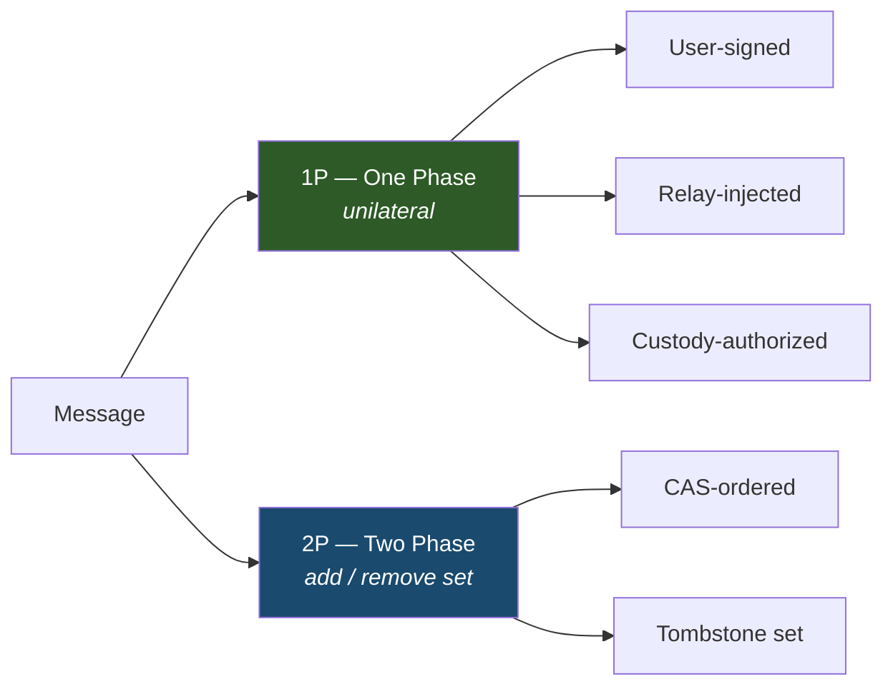
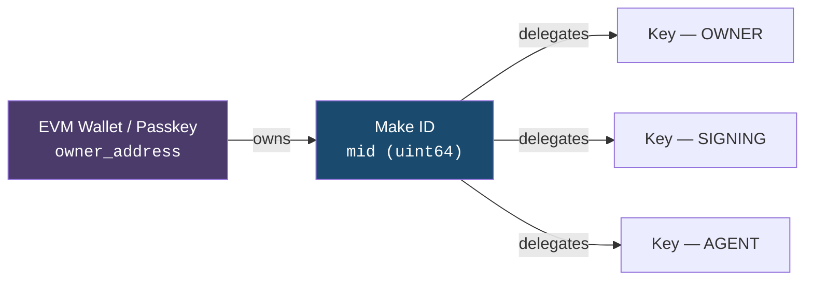
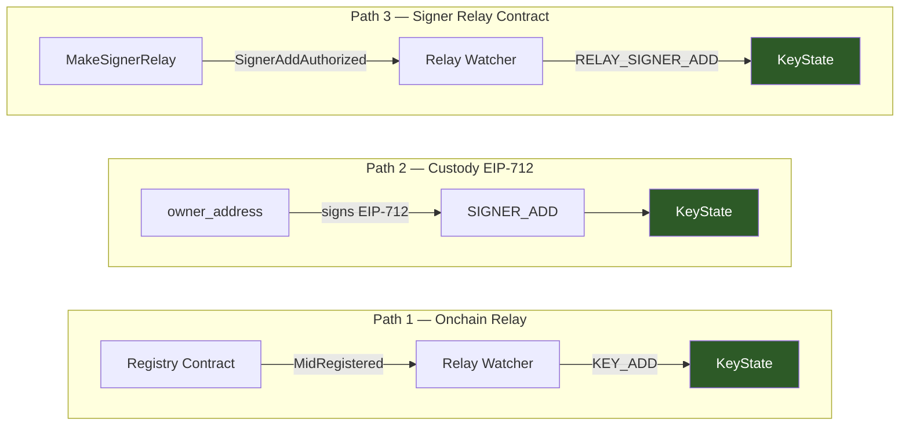
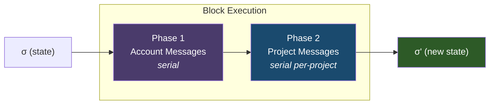
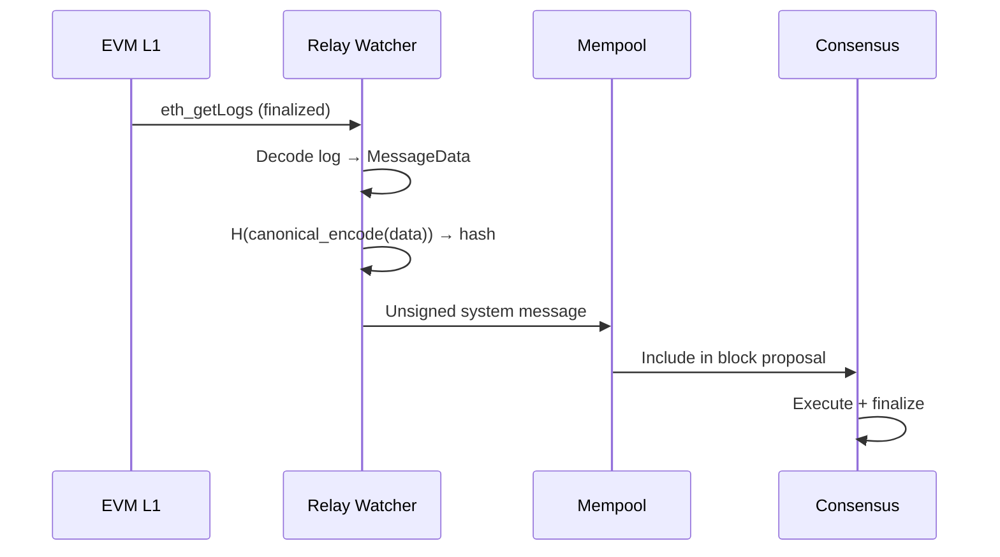

<picture>
  <source media="(prefers-color-scheme: dark)" srcset="assets/logo-shapes-dark.svg">
  <source media="(prefers-color-scheme: light)" srcset="assets/logo-shapes-light.svg">
  
</picture>

# Makechain

A specialized protocol built for making things.

**Version:** 2026.3.2

> Makechain orders and stores signed messages — project creation, commits, ref updates, access control — on a single-chain BFT ledger with sub-second finality. Consensus handles metadata; file content lives off-chain. Every message is self-authenticating: verifiable from canonical state alone, no external lookups required.

### Table of Contents

1. [Introduction](#1-introduction)
2. [Data Model](#2-data-model)
3. [Identity](#3-identity)
4. [State Transition Function](#4-state-transition-function)
5. [Authorization Model](#5-authorization-model)
6. [Storage Model](#6-storage-model)
7. [Validation Rules](#7-validation-rules)
8. [Consensus](#8-consensus)
9. [Onchain Integration](#9-onchain-integration)
10. [Networking](#10-networking)
11. [Storage Limits and Pruning](#11-storage-limits-and-pruning)
12. [Content Storage](#12-content-storage)
13. [Versioning](#13-versioning)
- [Appendix A: Protocol Constants](#appendix-a-protocol-constants)
- [Appendix B: Wire Format and Canonical Encoding](#appendix-b-wire-format-and-canonical-encoding)
- [Appendix C: Onchain Contract Summary](#appendix-c-onchain-contract-summary-non-normative)
- [Appendix D: Correctness Invariants](#appendix-d-correctness-invariants)
- [Appendix E: Genesis State](#appendix-e-genesis-state)
- [Appendix F: Changelog](#appendix-f-changelog)
- [References](#references)

---

## 1. Introduction

Makechain is a realtime decentralized protocol for ordering and storing git-like messages — project creation, commits, ref updates, access control — with permissionless publishing and cryptographic attribution.

### 1.1 Goals

1. **High throughput.** 10,000+ messages per second with sub-second finality.
2. **Permissionless publishing.** Anyone can create projects and push code.
3. **Cryptographically attributable messages.** Every message is verifiable from canonical state; relay-injected messages additionally depend on finalized host-chain events observed by validators.
4. **Thin consensus.** Consensus orders metadata and ref pointers. File content is stored externally, referenced by content digest.

### 1.2 Non-Goals

- General-purpose smart contracts.
- Permanent storage of all file content in the consensus layer.
- Git wire protocol compatibility (clients translate to/from Makechain messages).

### 1.3 Notation and Conventions

| Symbol | Meaning |
|--------|---------|
| `σ` | Global state (key-value store) |
| `B` | Block |
| `M` | Message |
| `H(x)` | BLAKE3 hash of `x`, producing a 32-byte digest |
| `Sign(sk, m)` | Ed25519 signature of `m` using secret key `sk` |
| `Verify(pk, m, sig)` | Ed25519 signature verification |
| `mid` | Make ID — unique `uint64` account identifier |
| `σ[k]` | Value at key `k` in state `σ` |
| `σ[k] ← v` | Assign value `v` to key `k` in state `σ` |
| `⊥` | Absent / not found |
| `\|` | Byte concatenation |
| `bytes(n)` | Exactly `n` bytes |
| `LE(x, n)` | `x` encoded as `n`-byte little-endian integer |
| `BE(x, n)` | `x` encoded as `n`-byte big-endian integer |

Throughout this document, "MUST", "MUST NOT", "SHOULD", and "MAY" follow [RFC 2119][rfc2119] semantics.

### 1.4 Threat Model

**Assumptions:**
- The network is asynchronous: messages may be delayed, reordered, or dropped.
- At most `f` of `3f + 1` validators are Byzantine.
- Cryptographic primitives (Ed25519, BLAKE3, secp256k1, P-256) are unbroken.
- The EVM L1 chain provides finality for relay events.

**Out of scope:**
- Denial-of-service at the network transport layer.
- Compromise of individual user keys (key management is a client concern).
- Content availability (the consensus layer does not store file content).

### 1.5 Cryptographic Primitives

| Primitive | Usage | Reference |
|-----------|-------|-----------|
| **Ed25519** | Message signing and validator identity | [RFC 8032][rfc8032] |
| **BLAKE3** | Message hashing, content addressing, Merkle trees | [BLAKE3 spec][blake3] |
| **secp256k1 ECDSA** | EIP-712 custody signatures (key type 0) | [SEC 2][sec2] |
| **P-256 ECDSA** | EIP-712 custody signatures (key type 1, 2) | [FIPS 186-5][fips186] |
| **EIP-712** | Typed structured data signing for custody and verification | [EIP-712][eip712] |

---

## 2. Data Model

### 2.1 Message Envelope

Every message on the network is wrapped in a [`Message`](proto/makechain.proto#L9) envelope. The canonical wire format is Protocol Buffers as defined in [`proto/makechain.proto`](proto/makechain.proto).

```
Message {
  data:       MessageData   // The operation payload
  hash:       bytes(32)     // H(canonical_encode(data))
  signature:  bytes(64)     // Sign(sk, hash) — empty for system messages
  signer:     bytes(32)     // Ed25519 public key — empty for system messages
  data_bytes: bytes         // Optional: cached canonical_encode(data) to skip re-encoding on verify
}
```

**`canonical_encode(data)`** is the Makechain canonical byte encoding of [`MessageData`](proto/makechain.proto#L17). For `2026.3.0`, this is defined by the reference Rust implementation described in Appendix B, not by generic Protocol Buffers serialization alone.

The `data_bytes` field (field 5 on [`Message`](proto/makechain.proto#L9)) caches `canonical_encode(data)` — the same bytes that were hashed. Verifiers re-encode `data` independently and reject the message if `data_bytes` does not match, then check the hash against the re-encoded bytes. `data_bytes` is never used as a hash input directly; it exists so intermediaries can forward the original encoding without re-serializing.

**Authenticated user messages** — `hash`, `signature`, and `signer` MUST all be present and valid:
```
hash = H(canonical_encode(data))
Verify(signer, hash, signature) = true
signer ∈ registered_keys(data.mid)
scope(signer) ≤ required_scope(data.type)
```

**System messages** (relay-injected: `KEY_ADD`, `OWNERSHIP_TRANSFER`, `STORAGE_RENT`, `RELAY_SIGNER_ADD`, `RELAY_SIGNER_REMOVE`) — `signer` and `signature` are empty (zero-length). The hash `H(canonical_encode(data))` is deterministic across all validators for the same onchain event. Authorization derives from onchain transaction finality, not from Ed25519 signatures.

**Custody-authorized user messages** (`SIGNER_ADD`, `SIGNER_REMOVE`) — the Ed25519 envelope provides integrity, but authorization comes from an EIP-712 custody signature verified against the account's `owner_address`. These messages bypass the `signer ∈ registered_keys(data.mid)` requirement.

### 2.2 MessageData

```
MessageData {
  type:       MessageType   // Operation discriminant
  mid:        uint64        // Acting account's Make ID
  timestamp:  uint32        // Unix seconds
  network:    Network       // MAINNET | TESTNET | DEVNET
  body:       <type-specific payload>
}
```

### 2.3 Message Types



Every message type follows one of two paradigms:

**1P (one-phase)** — creates or updates state unilaterally. No paired "undo" message.

| Sub-type | Conflict resolution | Types |
|----------|-------------------|-------|
| Singleton | Irreversible creation | `FORK` |
| LWW Register | Timestamp-based last-write-wins | `PROJECT_METADATA`, `ACCOUNT_DATA` |
| Append-only | Monotonic growth, protocol-pruned | `COMMIT_BUNDLE` |
| State transition | Terminal state change | `PROJECT_ARCHIVE` |
| Relay-injected | Authorization from onchain finality | `KEY_ADD`, `OWNERSHIP_TRANSFER`, `STORAGE_RENT`, `RELAY_SIGNER_ADD`, `RELAY_SIGNER_REMOVE` |
| Custody-authorized | Authorization from EIP-712 custody signature | `SIGNER_ADD`, `SIGNER_REMOVE` |

**2P (two-phase)** — Add/Remove pairs operating on a set.

| Sub-type | Conflict resolution | Types |
|----------|-------------------|-------|
| CAS-ordered | Compare-and-swap sequencing | `REF_UPDATE` / `REF_DELETE` |
| Set | Tombstone-backed remove-wins | All other Add/Remove pairs |

### 2.4 Complete Type Reference

| Type | Enum Value | Paradigm | Required Scope | Body Proto |
|------|-----------|----------|----------------|------------|
| `PROJECT_CREATE` | 1 | 2P Set † | SIGNING | [`ProjectCreateBody`](proto/makechain.proto#L147) |
| `PROJECT_METADATA` | 2 | 1P LWW | SIGNING + WRITE (`NAME`/`VISIBILITY` require ADMIN) | [`ProjectMetadataBody`](proto/makechain.proto#L181) |
| `PROJECT_ARCHIVE` | 3 | 1P Transition | SIGNING | [`ProjectArchiveBody`](proto/makechain.proto#L233) |
| `FORK` | 4 | 1P Singleton | SIGNING | [`ForkBody`](proto/makechain.proto#L168) |
| `PROJECT_REMOVE` | 5 | 2P Set | SIGNING | [`ProjectRemoveBody`](proto/makechain.proto#L155) |
| `REF_UPDATE` | 10 | 2P CAS | AGENT | [`RefUpdateBody`](proto/makechain.proto#L241) |
| `REF_DELETE` | 11 | 2P CAS | AGENT | [`RefDeleteBody`](proto/makechain.proto#L256) |
| `SIGNER_ADD` | 14 | Custody-auth | (custody sig) | [`SignerAddBody`](proto/makechain.proto#L397) |
| `SIGNER_REMOVE` | 15 | Custody-auth | (custody sig) | [`SignerRemoveBody`](proto/makechain.proto#L412) |
| `RELAY_SIGNER_ADD` | 16 | Relay | (onchain) | [`RelaySignerAddBody`](proto/makechain.proto#L422) |
| `RELAY_SIGNER_REMOVE` | 17 | Relay | (onchain) | [`RelaySignerRemoveBody`](proto/makechain.proto#L434) |
| `COMMIT_BUNDLE` | 20 | 1P Append | AGENT | [`CommitBundleBody`](proto/makechain.proto#L212) |
| `COLLABORATOR_ADD` | 30 | 2P Set | SIGNING (ADMIN) | [`CollaboratorAddBody`](proto/makechain.proto#L267) |
| `COLLABORATOR_REMOVE` | 31 | 2P Set | SIGNING (ADMIN) | [`CollaboratorRemoveBody`](proto/makechain.proto#L273) |
| `ACCOUNT_DATA` | 40 | 1P LWW | SIGNING | [`AccountDataBody`](proto/makechain.proto#L195) |
| `KEY_ADD` | 50 | Relay | (onchain) | [`KeyAddBody`](proto/makechain.proto#L289) |
| `VERIFICATION_ADD` | 60 | 2P Set | SIGNING | [`VerificationAddBody`](proto/makechain.proto#L325) |
| `VERIFICATION_REMOVE` | 61 | 2P Set | SIGNING | [`VerificationRemoveBody`](proto/makechain.proto#L332) |
| `OWNERSHIP_TRANSFER` | 70 | Relay | (onchain) | [`OwnershipTransferBody`](proto/makechain.proto#L308) |
| `STORAGE_RENT` | 71 | Relay | (onchain) | [`StorageRentBody`](proto/makechain.proto#L314) |
| `LINK_ADD` | 80 | 2P Set | SIGNING | [`LinkAddBody`](proto/makechain.proto#L346) |
| `LINK_REMOVE` | 81 | 2P Set | SIGNING | [`LinkRemoveBody`](proto/makechain.proto#L354) |
| `REACTION_ADD` | 82 | 2P Set | SIGNING | [`ReactionAddBody`](proto/makechain.proto#L372) |
| `REACTION_REMOVE` | 83 | 2P Set | SIGNING | [`ReactionRemoveBody`](proto/makechain.proto#L378) |

† `PROJECT_CREATE` is paired with `PROJECT_REMOVE` as a 2P Set, but does not follow the generic `apply_2p_add` re-add path because `project_id` is content-addressed (Section 2.5). See Section 4.2 for the specific semantics.

### 2.5 Content-Addressed Identifiers

- **`project_id`** = `Message.hash` = `H(canonical_encode(MessageData))` — the BLAKE3 hash of the `MessageData` contents of the `PROJECT_CREATE` message. This is the `hash` field in the message envelope, NOT a hash of the full envelope (which also includes `signer`, `signature`, and `data_bytes`). Two projects with the same name produce different IDs because the hash includes `mid`, `timestamp`, etc.
- **Forked project ID** = `Message.hash` of the `FORK` message — same principle.
- **`commit_hash`** = Client-computed BLAKE3 hash of the full commit object. Declared by the submitter, not recomputed by validators.

---

## 3. Identity

### 3.1 Ownership Hierarchy



The canonical owner of each Make ID is an **EVM wallet address** (`owner_address`, 20 bytes) on an EVM L1. The wallet controls:
- **Registration** — creating an account costs gas, providing spam resistance.
- **Storage funding** — renting storage units for project data.
- **Key management** — adding/removing Ed25519 signing keys via onchain or offchain paths.
- **Transfer & recovery** — MID ownership is transferable; a recovery address may be authorized.

Ed25519 keys are **delegated signing keys** for fast off-chain message signing. The wallet registers the initial key via the registry path and may later authorize signer add/remove operations either offchain with EIP-712 or onchain through `MakeSignerRelay`.

### 3.2 Accounts

An account is identified by a unique Make ID (`mid`, `uint64`) assigned by an onchain registry contract. Each account's state consists of:

| Field | Type | Description |
|-------|------|-------------|
| `owner_address` | `bytes(20)` | EVM wallet address. Set via first `KEY_ADD`; thereafter mutable only via `OWNERSHIP_TRANSFER`. |
| `keys` | Set of `KeyState` | Registered Ed25519 public keys with scopes. |
| `custody_nonce` | `uint64` | Replay counter for signer operations. |
| `metadata` | Map of `(field → (value, timestamp))` | Username, avatar, bio, website. LWW per field. |
| `verifications` | 2P Set | External address ownership proofs. |
| `links` | 2P Set | Follow/star relationships. |
| `reactions` | 2P Set | Commit reactions. |
| `storage_units` | `uint32` | Active rented storage capacity. |
| `project_count` | `uint32` | Number of owned projects. |
| `key_count` | `uint32` | Number of registered keys. |

### 3.3 Key Scopes

All delegated keys are Ed25519. Each key has an explicit scope:

| Scope | Value | Capabilities |
|-------|-------|-------------|
| `OWNER` | 0 | Full account control: manage keys, transfer projects |
| `SIGNING` | 1 | Push commits, update refs, manage collaborators on authorized projects |
| `AGENT` | 2 | Automated actions (CI/CD, AI agents) — optionally scoped to specific projects |

Privilege ordering: `OWNER < SIGNING < AGENT` (numerically). A key with scope `s` satisfies any requirement `r` where `s ≤ r`.

### 3.4 Key Registration Paths

Keys can be registered via three paths, all producing the same `KeyState` in consensus:



1. **Onchain (relay-injected):** A single registration key (Owner or Signing scope) is stored per MID via the registry contract. The `MidRegistered` event is relayed as a `KEY_ADD` system message by validators.

2. **Custody-authorized (EIP-712):** Additional keys added via `SIGNER_ADD` / `SIGNER_REMOVE` messages, authorized by an EIP-712 custody signature from `owner_address`. No onchain transaction required.

3. **Onchain signer relay:** Keys added/removed via the signer relay contract. Host chain finality replaces custody-signature verification. App attribution is still verified.

---

## 4. State Transition Function

### 4.1 Global State

The global state `σ` is a key-value store mapping byte strings to byte strings. All state objects (accounts, projects, keys, refs, commits, collaborators, verifications, links, reactions, tombstones, counters, storage grants) are serialized values under prefix-namespaced keys (see Section 6.1).

### 4.2 Block Execution



Given state `σ`, finalized block `B`, and the committed relay payload `R` associated with `B`:

```
apply_block(σ, B, R) → σ':
  require digest(R) is the proposal digest finalized by B.consensus_finalization
  let account_msgs = R.account_messages
  let project_groups = R.project_messages

  // Phase 1: Serial account pre-pass
  σ₁ = σ
  for M in account_msgs:
    if not timestamp_valid(M, B.timestamp):
      drop(M)
      continue
    match apply_message(σ₁, M):
      Ok(σ') → σ₁ = σ'
      Err(_) → drop(M)

  // Phase 2: Serial per-project execution
  σ₂ = σ₁
  for (project_id, msgs) in project_groups:  // lexicographic order of project_id
    for M in msgs:                           // proposer-determined order within group
      if not timestamp_valid(M, B.timestamp):
        drop(M)
        continue
      match apply_message(σ₂, M):
        Ok(σ') → σ₂ = σ'
        Err(_) → drop(M)

  return σ₂
```

`RelayPayload` is the canonical execution input. Verifiers MUST execute the exact `account_messages` and `project_messages` order carried in `R`. `Block.chunks[*].txns[*].user_messages` redundantly mirror the finalized per-project message groups for persisted verification, sync, and indexing; account-message order is carried only by `RelayPayload.account_messages`. Each `project_id` MUST appear at most once in `RelayPayload.project_messages`; duplicate entries make the payload invalid. If the block's mirrored per-project messages differ from `RelayPayload.project_messages`, the block is invalid.

**Account messages** (Phase 1, serial): `KEY_ADD`, `OWNERSHIP_TRANSFER`, `STORAGE_RENT`, `RELAY_SIGNER_ADD`, `RELAY_SIGNER_REMOVE`, `SIGNER_ADD`, `SIGNER_REMOVE`, `ACCOUNT_DATA`, `VERIFICATION_ADD`, `VERIFICATION_REMOVE`, `LINK_ADD`, `LINK_REMOVE`, `REACTION_ADD`, `REACTION_REMOVE`, `PROJECT_CREATE`, `PROJECT_REMOVE`, `FORK`.

`PROJECT_CREATE`, `PROJECT_REMOVE`, and `FORK` are classified as account messages because they modify `project_count` on the account.

**Project messages** (Phase 2, serial per-project group): `PROJECT_METADATA`, `PROJECT_ARCHIVE`, `REF_UPDATE`, `REF_DELETE`, `COMMIT_BUNDLE`, `COLLABORATOR_ADD`, `COLLABORATOR_REMOVE`. Grouped by `project_id`, groups iterated in byte-lexicographic order of the 32-byte `project_id`. Within each group, messages are processed in the order specified by the proposer and carried authoritatively in `RelayPayload.project_messages`; the block's `ShardChunk.txns[*].user_messages` copy MUST match.

Dropped messages are excluded from the committed block but do not halt execution.

> **Note:** Projects are independent state domains — operations on different projects never conflict. Future implementations MAY execute project groups in parallel. The current specification requires only that the result is equivalent to the serial execution order defined above.

#### Message Dispatch

`apply_message(σ, M)` dispatches to a type-specific handler. Each handler reads and writes specific state keys. The following table enumerates all keys modified by each message type (reads omitted for brevity — handlers read the keys they write plus authorization keys from Section 5):

| Message Type | Resolution | Keys Written |
|---|---|---|
| `PROJECT_CREATE` | 2P add | `project(id)`, `project_name(mid, name)`, `account(mid)` [project_count++] |
| `PROJECT_REMOVE` | 2P remove | `project(id)` [status], `tombstone(project(id))`, `account(mid)` [project_count--] |
| `FORK` | Singleton | `project(id)` [with `fork_source`], `project_name(mid, name)`, `account(mid)` [project_count++] |
| `PROJECT_METADATA` | LWW | `project_meta(id, field)`, optionally `project_name(mid, *)` for name changes |
| `ACCOUNT_DATA` | LWW | `account_meta(mid, field)` |
| `COMMIT_BUNDLE` | Append | `commit(project_id, hash)` per commit; triggers `prune_commits` if over limit |
| `PROJECT_ARCHIVE` | State transition | `project(id)` [status → Archived] |
| `REF_UPDATE` | CAS+nonce | `ref(project_id, ref_name)` |
| `REF_DELETE` | CAS+nonce | deletes `ref(project_id, ref_name)` |
| `COLLABORATOR_ADD` | 2P add | `collaborator(project_id, target_mid)`, optionally clears `tombstone(collaborator(...))` |
| `COLLABORATOR_REMOVE` | 2P remove | deletes `collaborator(project_id, target_mid)`, `tombstone(collaborator(...))` |
| `KEY_ADD` | Relay | `key(mid, pubkey)`, `key_reverse(pubkey)`, `account(mid)` [owner_address, key_count] |
| `OWNERSHIP_TRANSFER` | Relay | `account(mid)` [owner_address], `ownership_transfer_event(event_id)` |
| `STORAGE_RENT` | Relay | `storage_grant(mid, expires_at, event_id)`, `storage_rent_event(event_id)`, `account(mid)` [storage_units] |
| `SIGNER_ADD` | Custody-auth | `key(mid, pubkey)`, `key_reverse(pubkey)`, `account(mid)` [custody_nonce++, key_count++] |
| `SIGNER_REMOVE` | Custody-auth | deletes `key(mid, pubkey)`, `key_reverse(pubkey)`, `account(mid)` [custody_nonce++, key_count--] |
| `RELAY_SIGNER_ADD` | Relay | `key(mid, pubkey)`, `key_reverse(pubkey)`, `relay_signer_event(event_id)`, `account(mid)` [custody_nonce++, key_count++] |
| `RELAY_SIGNER_REMOVE` | Relay | deletes `key(mid, pubkey)`, `key_reverse(pubkey)`, `relay_signer_event(event_id)`, `account(mid)` [custody_nonce++, key_count--] |
| `VERIFICATION_ADD` | 2P add | `verification(mid, addr)`, `counter(mid, 0x03)`, optionally clears tombstone |
| `VERIFICATION_REMOVE` | 2P remove | deletes `verification(mid, addr)`, `tombstone(verification(...))`, `counter(mid, 0x03)` |
| `LINK_ADD` | 2P add | `link(mid, type, target)`, `link_reverse(type, target, mid)`, `counter(mid, 0x01)` |
| `LINK_REMOVE` | 2P remove | deletes `link(...)`, `link_reverse(...)`, `tombstone(link(...))`, `counter(mid, 0x01)` |
| `REACTION_ADD` | 2P add | `reaction(mid, type, proj, hash)`, `reaction_reverse(type, proj, hash, mid)`, `counter(mid, 0x02)` |
| `REACTION_REMOVE` | 2P remove | deletes `reaction(...)`, `reaction_reverse(...)`, `tombstone(reaction(...))`, `counter(mid, 0x02)` |

Key names reference Section 6.1 prefixes. 2P add/remove handlers also interact with prune markers (`0x15`) during quota pruning (Section 11.4). `MessageType::None` returns `Err`.

**Project identity and 2P set semantics.** Although `PROJECT_CREATE` and `PROJECT_REMOVE` are listed as 2P Set add/remove pairs, projects do not follow the generic `apply_2p_add` re-add path from Section 4.4.2. This is a consequence of content-addressed identity: `project_id = H(MessageData)` (Section 2.5), so every fresh `PROJECT_CREATE` message produces a unique `project_id`. There is no way to construct a new `PROJECT_CREATE` that targets an existing project's identity. A `PROJECT_CREATE` whose derived `project_id` matches an existing project entry MUST be rejected regardless of the project's current status. `PROJECT_ARCHIVE` is a terminal state transition — archived projects cannot be reverted to `Active`, but they can be forked or subsequently removed.

### 4.3 Timestamp Validation

```
timestamp_valid(M, block_timestamp) → bool:
  let ts = M.data.timestamp
  let drift = MAX_TIMESTAMP_DRIFT  // 300 seconds

  // Reject messages too far in the future (saturating subtraction to avoid underflow)
  if saturating_sub(ts, block_timestamp) > drift:
    return false

  // Reject storage-sensitive messages too far in the past
  if is_storage_sensitive(M.data.type):
    if ts < saturating_sub(block_timestamp, drift):
      return false

  return true
```

All arithmetic MUST use saturating subtraction (clamping to 0 on underflow) since timestamps are unsigned integers.

Storage-sensitive types (types that create or remove quota-affecting state): `PROJECT_CREATE`, `FORK`, `COLLABORATOR_ADD`, `COLLABORATOR_REMOVE`, `VERIFICATION_ADD`, `VERIFICATION_REMOVE`, `LINK_ADD`, `LINK_REMOVE`, `REACTION_ADD`, `REACTION_REMOVE`.

### 4.4 Conflict Resolution

#### 4.4.1 LWW Registers

For `PROJECT_METADATA` and `ACCOUNT_DATA`, each field is a Last-Write-Wins register keyed by `(entity_id, field)`:

```
apply_lww(σ, key, new_value, new_timestamp) → σ':
  let (current_value, current_ts) = σ[key]  // (⊥, 0) if absent

  if new_timestamp < current_ts:
    return σ  // stale — silently drop

  // Equal timestamps: last-inclusion-wins (consensus order within block)
  σ[key] ← (new_value, new_timestamp)
  return σ
```

**Note on commutativity:** LWW is commutative when timestamps differ. At equal timestamps, the result depends on consensus inclusion order within the block — this is intentional and deterministic (the proposer determines ordering). Because `MAX_TIMESTAMP_DRIFT` permits timestamps up to 300 seconds in the future, a writer who sets `timestamp = now + 299` will win all concurrent LWW conflicts for up to 5 minutes. This is an accepted trade-off: timestamp drift is bounded, and metadata fields are not security-critical.

#### 4.4.2 Tombstone-Backed 2P Sets

For all 2P Set types, conflict resolution uses durable tombstones with remove-wins-on-tie semantics.

Let `active_key` be the key for the active entry and `tombstone_key = [0x03 | active_key]`.

```
apply_2p_add(σ, active_key, add_timestamp) → σ':
  let active = σ[active_key]   // ⊥ if absent
  let tombstone_ts = σ[tombstone_key]    // ⊥ if no tombstone
  let prune_marker_ts = σ[prune_marker_key(active_key)]  // ⊥ if no prune marker
  let effective_tomb = max(tombstone_ts, prune_marker_ts)  // treating ⊥ as -∞

  if effective_tomb ≠ ⊥ and add_timestamp ≤ effective_tomb:
    return σ  // remove/prune wins on tie

  if active ≠ ⊥ and add_timestamp < active.timestamp:
    return σ  // stale add loses to newer active add

  // Equal-timestamp add/add remains last-inclusion-wins
  // per proposer-defined order.

  σ[active_key] ← entry_with_timestamp(add_timestamp)
  return σ

apply_2p_remove(σ, active_key, remove_timestamp) → σ':
  let active = σ[active_key]
  let tombstone_ts = σ[tombstone_key]

  // Decide what to do
  let should_record_tombstone =
    NOT (tombstone_ts ≠ ⊥ and remove_timestamp ≤ tombstone_ts)  // not blocked by newer tombstone

  let should_delete_active =
    active ≠ ⊥ and remove_timestamp ≥ active.timestamp

  // Case 1: Delete active and record tombstone
  if should_record_tombstone and should_delete_active:
    σ[tombstone_key] ← remove_timestamp
    delete σ[active_key]
    return σ

  // Case 2: Update existing tombstone only (no active to delete)
  //         Only allowed when a tombstone already exists — prevents phantom tombstones
  if should_record_tombstone and not should_delete_active and tombstone_ts ≠ ⊥:
    σ[tombstone_key] ← remove_timestamp
    return σ

  // Case 3: Ignore — no active, no tombstone (phantom), or tombstone already newer
  return σ
```

**Correctness properties:**
- **Monotone add resolution:** A newer add supersedes an older add. Equal-timestamp add/add remains last-inclusion-wins.
- **Commutativity for distinct timestamps:** For tombstone-backed 2P Set add/remove operations with distinct timestamps, final state is independent of arrival order.
- **Remove-wins-on-tie:** An add at time `t` and remove at time `t` results in the entry being removed.
- **No phantom tombstones:** A remove targeting an identity that was never active and has no existing tombstone produces no persistent state. Specifically: a tombstone is only created in conjunction with deleting an active entry, or by advancing an already-existing tombstone. This prevents unbounded state growth from adversarial removes.
- **Bounded tombstones:** `|tombstones| ≤ |unique identities ever actively added|`.
- **Prune marker subsumption:** Prune markers (Section 11.4) act as pseudo-tombstones for 2P add resolution. `apply_2p_add` uses `effective_tomb = max(tombstone_ts, prune_marker_ts)`, ensuring pruned entries cannot be re-added with stale timestamps.

#### 4.4.3 CAS-Ordered Refs

`REF_UPDATE` and `REF_DELETE` use compare-and-swap with monotonic nonces rather than timestamp-based or tombstone-based resolution. Refs do NOT use 2P tombstones — a deleted ref can be recreated with the same name.

```
apply_ref_update(σ, project_id, ref_name, old_hash, new_hash, nonce, force) → σ':
  let current = σ[ref_key(project_id, ref_name)]

  if current = ⊥:
    // Creating new ref
    require old_hash = ∅
    require nonce = 1
  else:
    // Updating existing ref
    require nonce = current.nonce + 1
    if old_hash ≠ ∅:
      require old_hash = current.hash  // CAS check — force does NOT bypass this
    if not force:
      require is_ancestor(σ, project_id, current.hash, new_hash, MAX_FF_DEPTH)

  σ[ref_key(project_id, ref_name)] ← RefState { hash: new_hash, nonce: nonce, ... }
  return σ

apply_ref_delete(σ, project_id, ref_name, expected_hash, nonce) → σ':
  let current = σ[ref_key(project_id, ref_name)]
  require current ≠ ⊥
  require nonce = current.nonce + 1
  if expected_hash ≠ ∅:
    require expected_hash = current.hash
  delete σ[ref_key(project_id, ref_name)]
  return σ
```

The `ref_type` field (Branch or Tag) is set only when creating a new ref. Subsequent updates preserve the original ref type.

Because deletion removes the stored ref state entirely, recreating a deleted ref starts a new nonce sequence at `1`.

Fast-forward check: when `force = false` and the ref already exists, the validator MUST verify that the current commit hash is a reachable ancestor of `new_hash` by traversing parent links, bounded to `MAX_FF_DEPTH` (10,000) commits.

---

## 5. Authorization Model

### 5.1 Key Scope Checks

```
check_key_scope(σ, mid, signer, required_scope) → Ok | Err:
  let key_state = σ[key_entry_key(mid, signer)]
  require key_state ≠ ⊥                    // key must exist
  require key_state.scope ≤ required_scope  // lower value = higher privilege
  return Ok
```

### 5.2 Project Access Control

```
check_project_access(σ, mid, project_id, required_permission) → Ok | Err:
  let project = σ[project_key(project_id)]
  require project ≠ ⊥ and project.status = Active

  if project.owner_mid = mid:
    return Ok  // owner has full access

  let collab = σ[collaborator_key(project_id, mid)]
  require collab ≠ ⊥ and collab.permission ≥ required_permission
  return Ok
```

### 5.3 Agent Project Scope

```
check_agent_project_scope(σ, mid, signer, project_id) → Ok | Err:
  let key_state = σ[key_entry_key(mid, signer)]
  if key_state.scope ≠ Agent: return Ok
  if key_state.allowed_projects is empty: return Ok  // unrestricted
  require project_id ∈ key_state.allowed_projects
  return Ok
```

### 5.4 System Message Authorization

System messages (`KEY_ADD`, `OWNERSHIP_TRANSFER`, `STORAGE_RENT`, `RELAY_SIGNER_ADD`, `RELAY_SIGNER_REMOVE`) bypass Ed25519 scope checks. Authorization derives from finalized host-chain events, not from Ed25519 signatures.

System messages MUST only enter the mempool via the local relay watcher — never from external gRPC submission or P2P gossip. All external ingress points MUST reject system message types.

Verifier-side relay cross-checking is a recommended hardening measure for this draft. A verifier SHOULD confirm that each system message in the proposed `RelayPayload` corresponds to a finalized watched event in its local relay view of the host chain:
- For `OWNERSHIP_TRANSFER`, `STORAGE_RENT`, `RELAY_SIGNER_ADD`, and `RELAY_SIGNER_REMOVE`, the verifier SHOULD match `relay_event_id` and verify that the projected payload fields match.
- For `KEY_ADD`, the verifier SHOULD confirm that a finalized watched event exists whose canonical projection equals the proposed `MessageData` (matched by deterministic message hash).

If no such finalized event exists in the verifier's local relay view, the verifier SHOULD treat the proposal as suspicious and MAY reject it after a bounded wait for relay-view convergence. Verifiers SHOULD NOT blindly re-execute the proposer's system messages without cross-checking when host-chain evidence is available — a Byzantine proposer who controls its own RPC endpoint could otherwise fabricate system messages that honest verifiers would accept by re-execution alone.

**Handling relay view lag:** If a verifier's relay watcher has not yet observed a proposed system message's underlying host-chain event (e.g., due to RPC latency), the verifier SHOULD wait for a bounded interval (for example, one relay poll cycle) before rejecting. This preserves liveness under transient RPC delays while still allowing implementations to harden against fabricated relay events.

> **Implementation note:** The current reference implementation does not yet perform verifier-side relay cross-checking during `verify()`. In `2026.3.0`, the re-execution model trusts the proposer's message set once those system messages have entered through the local relay watcher and normal ingress filters. Implementations SHOULD add relay event cross-checking as a priority defense-in-depth hardening measure.

### 5.5 Custody-Authorized Message Authorization

`SIGNER_ADD` and `SIGNER_REMOVE` bypass the Ed25519 signer-is-registered check. Authorization comes from an EIP-712 custody signature verified against `owner_address`:

```
authorize_signer_op(σ, data, body) → Ok | Err:
  let acct = σ[account_key(data.mid)]
  require acct ≠ ⊥ and acct.owner_address ≠ ∅
  require body.valid_after ≤ data.timestamp ≤ body.valid_before
  require body.valid_before - body.valid_after ≤ MAX_VALIDITY_WINDOW
  require body.nonce = acct.custody_nonce
  let hash = eip712_signing_hash(...)
  require verify_custody(hash, body.custody_signature, body.custody_key_type, acct.owner_address)
  return Ok  // caller increments custody_nonce by 1 on success
```

**EIP-712 Domain:** `{ name: "Makechain", version: "1", chainId: 0 }`

`chainId: 0` is a protocol-defined domain separator, not the host chain's [EIP-155][eip155] chain ID.

**`SignerAdd` type declaration** (mirrors [`SignerAddBody`](proto/makechain.proto#L397)):
```
SignerAdd(uint64 mid, bytes32 key, uint32 scope, uint64 validAfter,
          uint64 validBefore, uint64 nonce, bytes32[] allowedProjects, uint32 network)
```

**`SignerRemove` type declaration** (mirrors [`SignerRemoveBody`](proto/makechain.proto#L412)):
```
SignerRemove(uint64 mid, bytes32 key, uint64 validAfter,
             uint64 validBefore, uint64 nonce, uint32 network)
```

**Custody Signature Types:**

| `custody_key_type` | Curve | Format | Size |
|----|-------|--------|------|
| 0 | secp256k1 | `r:32 \| s:32 \| v:1` | 65 bytes |
| 1 | P256 (ECDSA) | `r:32 \| s:32 \| v:1` | 65 bytes |
| 2 | WebAuthn (P256) | Variable-length envelope | 107–2048 bytes |

- `valid_after` / `valid_before` bound [`MessageData.timestamp`](proto/makechain.proto#L20).
- `nonce` MUST match the account's current `custody_nonce`.
- `allowedProjects` binds the key's project allowlist into the `SignerAdd` signature, preventing allowlist manipulation before finalization.
- `network` binds the signature to [`MessageData.network`](proto/makechain.proto#L21), preventing cross-network replay.

**[WebAuthn][webauthn] Envelope Wire Format (custody_key_type=2):**
```
[auth_data_len:LE(2) | authenticatorData | client_json_len:LE(2) | clientDataJSON | sig:64 | v:1]
```

- `authenticatorData` — Flags byte (offset 32) MUST have UP (bit 0) and UV (bit 2) set.
- `clientDataJSON` — MUST contain `"type": "webauthn.get"`, a `"challenge"` that is the base64url encoding of the EIP-712 signing hash, and a canonical secure `"origin"`. `crossOrigin` MUST be absent or `false`.
- `sig` — Raw P256 ECDSA (`r:32 | s:32`, low-S normalized).
- `v` — Recovery ID hint (0 or 1); values > 1 are rejected.

### 5.6 App Attribution

Every `SIGNER_ADD` and `RELAY_SIGNER_ADD` MUST include app attribution in [`SignerAddBody`](proto/makechain.proto#L397) and [`RelaySignerAddBody`](proto/makechain.proto#L422):

- `request_mid` — MID of the requesting app (MUST be non-zero).
- `request_signature` — EIP-712 `SignerRequest` signature from the requesting app's `owner_address`.

**SignerRequest type declaration:**
```
SignerRequest(uint64 requestMid, bytes32 key, uint64 validAfter, uint64 validBefore, uint32 network)
```

For `SIGNER_ADD` and `RELAY_SIGNER_ADD`, verifiers MUST resolve `request_mid` to an account with a non-empty `owner_address` and MUST verify `request_signature` over `SignerRequest` against that account's owner key. `SIGNER_REMOVE` and `RELAY_SIGNER_REMOVE` carry no app attribution.

For self-request, `request_mid = mid` and the same owner key signs both signatures.

### 5.7 Custody Nonce Sharing

The `custody_nonce` counter is shared across all four signer operations: `SIGNER_ADD`, `SIGNER_REMOVE`, `RELAY_SIGNER_ADD`, and `RELAY_SIGNER_REMOVE`. Each successful operation increments the nonce by 1. This means a `RELAY_SIGNER_ADD` event landing from the host chain will advance the nonce, potentially invalidating a pending offchain `SIGNER_ADD` that was prepared against the previous nonce value. Clients MUST re-sign against the updated nonce after any relay signer event for the same account.

**Known griefing vector:** Because relay signer events advance the shared nonce without a custody signature, an attacker who can trigger `MakeSignerRelay` contract calls targeting a victim's MID can repeatedly invalidate the victim's pending offchain custody operations. The victim's fallback is to use the relay path exclusively (onchain signer management via `MakeSignerRelay`). This attack requires the attacker to pay host-chain gas per nonce advance. Deployments SHOULD ensure that the `MakeSignerRelay` contract restricts who may call `removeAuthorizedSigner` (e.g., only the original adder or the MID owner) to limit this attack surface.

**Idempotency for relay signer remove:** `RELAY_SIGNER_REMOVE` targeting a key that was already removed (e.g., via an earlier offchain `SIGNER_REMOVE`) MUST still record the `relay_event_id` and increment `custody_nonce`, then return success. Failing with an error before recording the event would cause infinite retry loops from the relay watcher.

### 5.8 Visibility

The [`Visibility`](proto/makechain.proto#L159) enum (`PUBLIC` / `PRIVATE`) is defined on [`ProjectCreateBody`](proto/makechain.proto#L147), [`ForkBody`](proto/makechain.proto#L168), and [`ProjectMetadataBody`](proto/makechain.proto#L181). In the current protocol version, visibility does not gate general read access to canonical project state, but it does constrain `FORK`: a private source project MAY be forked only by its owner or by a collaborator with at least `READ` permission. `PRIVATE` visibility is otherwise reserved for future access control extensions. Implementations MUST store and return the visibility value and MUST enforce the `FORK` access rule above.

---

## 6. Storage Model

### 6.1 Key Schema

State is stored in a merkleized key-value store with prefix-byte namespacing. All multi-byte integers in keys use big-endian encoding.

| Prefix | Entity | Key Layout |
|--------|--------|-----------|
| `0x01` | MSG (reserved) | Reserved for future message-oriented authenticated structures |
| `0x02` | Block | `[0x02 \| block_number:8]` |
| `0x03` | Tombstone | `[0x03 \| active_key:*]` |
| `0x04` | Account | `[0x04 \| mid:8]` |
| `0x05` | Account metadata | `[0x05 \| mid:8 \| field:1]` |
| `0x06` | Key | `[0x06 \| mid:8 \| pubkey:32]` |
| `0x07` | Key reverse index | `[0x07 \| pubkey:32]` |
| `0x08` | Relay signer event | `[0x08 \| relay_event_id:32]` |
| `0x09` | Verification | `[0x09 \| mid:8 \| address:*]` |
| `0x0A` | Project | `[0x0A \| project_id:32]` |
| `0x0B` | Project metadata | `[0x0B \| project_id:32 \| field:1]` |
| `0x0C` | Project name index | `[0x0C \| mid:8 \| name:*]` |
| `0x0D` | Ref | `[0x0D \| project_id:32 \| ref_name:*]` |
| `0x0E` | Commit | `[0x0E \| project_id:32 \| commit_hash:32]` |
| `0x0F` | Collaborator | `[0x0F \| project_id:32 \| mid:8]` |
| `0x10` | Link (forward) | `[0x10 \| mid:8 \| link_type:1 \| target:*]` |
| `0x11` | Link (reverse) | `[0x11 \| link_type:1 \| target:* \| mid:8]` |
| `0x12` | Reaction (forward) | `[0x12 \| mid:8 \| reaction_type:1 \| project_id:32 \| commit_hash:32]` |
| `0x13` | Reaction (reverse) | `[0x13 \| reaction_type:1 \| project_id:32 \| commit_hash:32 \| mid:8]` |
| `0x14` | Counter | `[0x14 \| mid:8 \| counter_type:1]` |
| `0x15` | Prune marker | `[0x15 \| active_key:*]` |
| `0x16` | Storage grant | `[0x16 \| mid:8 \| expires_at:4 \| relay_event_id:32]` |
| `0x17` | Storage rent event | `[0x17 \| relay_event_id:32]` |
| `0x18` | Finalized message (non-merkleized) | `[0x18 \| hash:32]` |
| `0x19` | Replay metadata (non-merkleized) | `[0x19 \| 0x01]` |
| `0x1A` | Ownership transfer marker | `[0x1A \| relay_event_id:32]` |

Prefixes `0x07`, `0x0C`, `0x11`, and `0x13` are internal or reverse indexes: `0x07` maps `pubkey` → `mid` for O(1) account-by-key lookups during message verification; `0x0C` maps `(mid, project_name)` → `project_id` for unique name enforcement within an account; `0x11` and `0x13` support efficient reverse social queries. Prefix `0x02` stores committed block data for persistence and replay. Prefix `0x03` stores 2P set tombstones — each tombstone key is `[0x03 | active_key]` mapping to the remove timestamp (`u32`), enabling durable remove-wins resolution. Prefix `0x08` stores processed signer-relay `relay_event_id` markers, prefix `0x17` stores processed storage-rent `relay_event_id` markers, and prefix `0x1A` stores processed ownership-transfer `relay_event_id` markers so duplicate finalized relay events are idempotent after restart or GC. Prefix `0x16` stores the expiring storage grants that drive effective quota. Ownership-transfer markers are internal state only and are not part of the public proof allowlist.

**Counter types** for prefix `0x14`:

| `counter_type` | Entity |
|-----------------|--------|
| `0x01` | Links |
| `0x02` | Reactions |
| `0x03` | Verifications |

**Merkleized prefixes:** `0x01`, `0x03`–`0x17`, `0x1A`. These participate in the state root computation. Prefix `0x02` (blocks) is persisted but non-merkleized (block data is authenticated via the chain of block hashes, not the state root). Prefixes `0x18` and `0x19` are non-merkleized operational state used for replay deduplication and crash recovery. Implementations MUST include exactly the merkleized prefixes in state root computation — including or excluding the wrong prefixes causes state root divergence.

**Index keys** (not direct protocol state, but merkleized): `0x07` (key reverse), `0x0C` (project name), `0x11` (link reverse), `0x13` (reaction reverse).

### 6.2 Fixed-Size Key Encoding

Variable-length keys are stored as fixed 289-byte keys using a 2-byte big-endian length footer:

```
[key_data | 0x00 padding | BE(key_len, 2)]
```

This leaves 287 usable bytes. The maximum `ref_name` length is 254 bytes (prefix:1 + project_id:32 + ref_name:254 = 287).

### 6.3 State Proofs

The state store supports two proof types, both anchored to a committed state root:

The public proof RPC surface for these queries is [`GetOperationProof`](proto/makechain.proto#L635), [`GetExclusionProof`](proto/makechain.proto#L636), [`VerifyOperationProof`](proto/makechain.proto#L637), and [`GetStorageQuotaProof`](proto/makechain.proto#L638).

- **Operation proof** — proves a key-value pair exists at a given root (Merkle inclusion path).
- **Exclusion proof** — proves a key does NOT exist at a given root (neighboring key boundary).

A proof is valid only when its embedded root matches the current committed state root. Stale proofs MUST be rejected.

Active membership in 2P sets requires two proofs against the same root: an operation proof that the entry exists, and an exclusion proof that the corresponding tombstone does not exist.

The statement above describes the protocol-level proof model. In `2026.3.1`, the public proof RPC surface is intentionally narrower: it exposes collaborator, project-name, relay-signer-event, storage-grant, and storage-rent-event namespaces only. Generic tombstone exclusion proofs for all 2P-set active keys are not currently available through the public RPC allowlist.

**Storage quota proof:** Authenticates the complete active storage-grant suffix for an MID at an explicit `as_of_unix_time` against the current root. A grant is **active** at time `T` if and only if `expires_at > T`. Because the storage grant key layout (Section 6.1, prefix `0x16`) embeds `expires_at` in big-endian immediately after the MID, all grants for a given MID are sorted by expiration time in ascending order, enabling efficient range-based proof construction. Not a historical-state proof — it proves quota implied by the current root evaluated at the given time. Future timestamps MUST be rejected.

### 6.4 Merkle State

Committed state is stored in a merkleized key-value store. Validators execute each block against a copy-on-write overlay, then merkleize the resulting write-set to produce the committed `state_root`.

The canonical state root authenticates all durable protocol state and secondary indexes. It does **not** commit to a per-message history index.

---

## 7. Validation Rules

### 7.1 Structural Validation (Stateless)

These checks require no state lookups and MUST be performed before any state access:

| Type | Constraints |
|------|------------|
| `PROJECT_CREATE` | `name`: 1-100 chars, `[a-zA-Z0-9-]`, no leading/trailing hyphens; `description` ≤ 500 bytes; `license` ≤ 100 bytes |
| `PROJECT_REMOVE`, `PROJECT_ARCHIVE` | `project_id`: 32 bytes |
| `PROJECT_METADATA` | `project_id`: 32 bytes; `field ≠ NONE`; `value` ≤ 500 chars; `NAME` values follow project-name syntax; `VISIBILITY` values are exactly `public` or `private` |
| `ACCOUNT_DATA` | `field ≠ NONE`; `value` ≤ 500 chars; `USERNAME`: `[a-zA-Z0-9_-]`, max 30 chars |
| `REF_UPDATE` | `project_id`: 32 bytes; `ref_name`: 1-254 bytes, no `0x00`; `new_hash`: 32 bytes; `old_hash`: 32 bytes when set; `ref_type`: valid enum; `nonce ≥ 1` |
| `REF_DELETE` | `project_id`: 32 bytes; `ref_name`: 1-254 bytes, no `0x00`; `expected_hash`: 32 bytes when set; `nonce ≥ 1` |
| `COMMIT_BUNDLE` | `project_id`: 32 bytes; 1-1000 commits; `content_digest`: 32 bytes when set; `url` ≤ 2048 chars, no control chars; each commit: `hash` 32 bytes, `tree_root` 32 bytes, `message_hash` 32 bytes, each parent hash 32 bytes; `title` ≤ 200 chars |
| `FORK` | `source_project_id`: 32 bytes; `source_commit_hash`: 32 bytes; `name`: 1-100 chars |
| `COLLABORATOR_ADD` | `project_id`: 32 bytes; `target_mid ≠ 0`; `permission`: valid enum |
| `COLLABORATOR_REMOVE` | `project_id`: 32 bytes; `target_mid ≠ 0` |
| `KEY_ADD` | `key`: 32 bytes; `owner_address`: 20 bytes when set; `allowed_projects`: max 100 entries, each 32 bytes |
| `OWNERSHIP_TRANSFER` | `new_owner_address`: 20 bytes; `previous_owner_address`: 20 bytes; `relay_event_id`: 32 bytes |
| `VERIFICATION_ADD` | `type ≠ NONE`; `address`: 1-128 bytes; `chain_id` ≤ 32 bytes; `claim_signature`: 1-1024 bytes |
| `VERIFICATION_REMOVE` | `address`: 1-128 bytes |
| `LINK_ADD/REMOVE` | `type ≠ NONE`; exactly one target set; target matches type; FOLLOW: `target_mid ≠ 0`; STAR: `target_project_id`: 32 bytes |
| `SIGNER_ADD` | `key`: 32 bytes; valid scope; custody sig: 65 bytes (type 0/1) or 107-2048 bytes (type 2); `valid_after/before` non-zero, ordered, window ≤ max; `custody_key_type` ≤ 2; `request_mid ≠ 0`; request sig: 65 bytes (type 0/1) or 107-2048 bytes (type 2); `request_key_type` ≤ 2; `allowed_projects`: max 100 entries, each 32 bytes (agent scope only) |
| `SIGNER_REMOVE` | `key`: 32 bytes; custody sig size; `valid_after/before` non-zero, ordered, window ≤ max; `custody_key_type` ≤ 2 |
| `RELAY_SIGNER_ADD` | `key`: 32 bytes; valid scope; `request_mid ≠ 0`; request sig size; `relay_event_id`: 32 bytes; validity window checks; `allowed_projects`: max 100 entries, each 32 bytes (agent scope only) |
| `RELAY_SIGNER_REMOVE` | `key`: 32 bytes; `relay_event_id`: 32 bytes |
| `REACTION_ADD/REMOVE` | `type ≠ NONE`; `target_project_id`: 32 bytes; `target_commit_hash`: 32 bytes |
| `STORAGE_RENT` | `actor`: 20 bytes; `units > 0`; `relay_event_id`: 32 bytes; `expires_at` = `timestamp + STORAGE_TOTAL_PERIOD` |

### 7.2 State Validation (Stateful)

These checks require state lookups:

- **`REF_UPDATE`:** `nonce` is 1 (new ref) or `current_nonce + 1` (update); `old_hash` matches current when set; `new_hash` references known commit; fast-forward within `MAX_FF_DEPTH` unless `force`.
- **`COMMIT_BUNDLE`:** Each commit's parents are known or earlier in the same bundle. If `(project_id, commit_hash)` already exists, the message MUST NOT overwrite stored metadata; duplicate submissions are idempotent no-ops.
- **`COLLABORATOR_ADD`:** Signer has ADMIN+ on project; target account exists. Only the project's canonical owner (`project.owner_mid`) MAY grant OWNER-level access. Only the canonical owner MAY modify or remove a collaborator who currently holds OWNER permission. ADMIN-scoped signers MAY grant at most ADMIN permission. Note: ADMIN collaborators can grant ADMIN to others, creating delegation chains — removing an ADMIN does not revoke the chain of ADMIN collaborators they created.
- **`FORK`:** `source_commit_hash` exists. If the source project is private, the signer is the owner or a collaborator with at least `READ` permission.
- **`PROJECT_REMOVE`:** Signer must be the project's canonical owner (`project.owner_mid == data.mid`).
- **`PROJECT_ARCHIVE`:** Signer must be the project's canonical owner (`project.owner_mid == data.mid`).
- **`PROJECT_CREATE`:** Account has available storage capacity; name is unique within owner's namespace.
- **`PROJECT_METADATA`:** Signer has at least WRITE permission on the target project. `NAME` and `VISIBILITY` updates additionally require ADMIN permission.
- **`VERIFICATION_ADD`:** `claim_signature` is valid for the given address, type, and network.
- **`OWNERSHIP_TRANSFER`:** Account exists; `previous_owner_address` matches current.
- **`LINK_ADD`:** FOLLOW target must have a registered key; STAR target must exist and not be removed.
- **`SIGNER_ADD/REMOVE`:** See Section 5.5. `SIGNER_ADD` MUST also satisfy the app-attribution checks in Section 5.6.
- **`RELAY_SIGNER_ADD`:** Account exists with `owner_address`; relay event not already processed; validity window; app attribution.
- **`RELAY_SIGNER_REMOVE`:** Account exists with `owner_address`; relay event not already processed. No validity window or app attribution fields are carried on the wire for remove.
- **`REACTION_ADD`:** Target project exists and not removed; target commit exists.
- **`STORAGE_RENT`:** Account exists; relay event not already processed. For this rule, a MID with an existing `account(mid)` row or at least one registered key counts as an existing logical account.

---

## 8. Consensus

### 8.1 Engine

**Engine:** [Simplex BFT][simplex] via [Commonware][commonware] consensus.
**Namespace:** `b"makechain-v0"` — used as the Simplex namespace for finalization certificate signing and verification. Follower nodes MUST use this namespace to verify finalization certificates.
**Block time:** Deployment target of ~200ms under expected operating conditions.
**Finality:** Single voting round in the deployed configuration; end-to-end latency is deployment-dependent.
**Fault tolerance:** Byzantine fault tolerant up to `f` of `3f + 1` validators.
**Elector:** Deterministic round-robin leader rotation.

Validators are initially a permissioned set.

### 8.2 Block Structure

```
Block {
  header:     BlockHeader
  hash:       bytes(32)             // H(canonical_encode(header))
  witness:    ShardWitness
  commits:    Commits               // Validator signatures
  chunks:     ShardChunk[]          // Transaction data (single chunk)
  consensus_finalization: bytes     // Simplex finalization certificate
}

BlockHeader {
  height:      { shard_index: 0, block_number: uint64 }
  timestamp:   uint64               // Proposer's wall-clock time (unix seconds)
  version:     uint32
  chain_id:    Network
  parent_hash: bytes(32)            // H(previous block header)
  state_root:  bytes(32)            // Merkle root after execution
}
```

The canonical wire format is Protocol Buffers as defined in [`proto/makechain.proto`](proto/makechain.proto). The corresponding protobuf messages are [`Block`](proto/makechain.proto#L497), [`BlockHeader`](proto/makechain.proto#L506), and [`RelayPayload`](proto/makechain.proto#L448).

`consensus_finalization` commits to the digest of the associated [`RelayPayload`](proto/makechain.proto#L448), which is the canonical execution input:

```
RelayPayload {
  digest:            bytes(32)        // Proposer-computed post-execution state root
  account_messages:  Message[]        // Serial execution order
  project_messages:  ProjectMessages[]// Per-project message groups in canonical order; unique by project_id
  timestamp:         uint64
  block_number:      uint64
  parent_hash:       bytes(32)
  chain_id:          uint32
  version:           uint32
}
```

The finalized block header authenticates the post-execution state root; the finalized payload authenticates the exact executed message sequence. `proposal_digest(R)` refers to the hash of the canonical [`RelayPayload`](proto/makechain.proto#L448) encoding, not to the `digest` field inside `R`.

#### Proposal Digest Construction

`proposal_digest(R)` is computed as:

```
let wire = canonical_encode(RelayPayload_proto(R))
proposal_digest(R) = H(b"makechain:relay-payload:v1" || len(wire) as uint64 LE || wire)
```

Where:
- `RelayPayload_proto(R)` converts the logical `RelayPayload` to its Protocol Buffers message form (field numbers as defined on [`RelayPayload`](proto/makechain.proto#L448) in [`proto/makechain.proto`](proto/makechain.proto): `digest`=1, `account_messages`=2, `project_messages`=3, `timestamp`=4, `block_number`=5, `parent_hash`=6, `chain_id`=7, `version`=8).
- `canonical_encode` follows the determinism rules in Appendix B.1.
- `len(wire)` is the byte length of the encoded protobuf, serialized as an 8-byte unsigned little-endian integer.
- The domain separator `b"makechain:relay-payload:v1"` prevents cross-protocol hash collisions.

The [`ProjectMessages`](proto/makechain.proto#L443) entries in `project_messages` MUST be ordered by byte-lexicographic `project_id`, matching the `BTreeMap` iteration order in the reference implementation.

Persisted block verification therefore requires both the finalized [`Block`](proto/makechain.proto#L497) and the associated ordered message stream sufficient to reconstruct the committed [`RelayPayload`](proto/makechain.proto#L448). A sync provider serving historical blocks MUST also serve the corresponding message stream, and a syncing node MUST verify that reconstructing `RelayPayload` from `(Block, messages)` yields the payload digest committed by `consensus_finalization`.

The `proposal_digest(R)` value is what validators sign in finalization certificates. The domain separator `b"makechain:relay-payload:v1"` serves as the commitment version identifier. Future commitment format changes MUST use a new domain separator (e.g., `v2`) and require explicit activation semantics. A future protocol version SHOULD define a dedicated, transport-independent commitment structure rather than deriving the consensus commitment from the protobuf wire encoding of `RelayPayload`. A stable commitment schema would make the consensus-critical surface explicitly versioned, transport-independent, and clearer to evolve safely.

> **Protocol Upgrade Activation:** Introducing a dedicated consensus commitment type improves the stability and evolvability of consensus-critical hashing, but this is orthogonal to protocol upgrade/reset activation. Any block-version or reset cutover still requires explicit activation semantics and rollout coordination. This specification does not define an upgrade mechanism; upgrades are out-of-band coordinated among validators.

### 8.3 Empty Blocks

Empty blocks (containing zero messages) MAY be produced periodically to advance the chain height and finalize idle periods. An empty block's `state_root` equals the previous block's `state_root`. The proposer SHOULD throttle empty block production to avoid unnecessary chain growth (e.g., minimum interval between empty blocks).

### 8.4 Mempool

Pending messages are held in a mempool with:
- Deduplication by message hash.
- Configurable capacity limit (default: 100,000).
- Per-project message cap per block (default: 500).
- Total message cap per block (default: 10,000).
- Separation of account vs. project messages for the two-phase execution model.
- Network validation (reject messages for wrong network).
- Timestamp validation (reject future messages; reject stale storage-sensitive messages).
- System message type rejection (system messages MUST only enter via the relay watcher, never from external submission or P2P gossip).

---

## 9. Onchain Integration

### 9.1 Relay Model



Each validator runs a relay watcher that monitors finalized events on the host chain:

1. Poll `eth_getLogs` for watched contract addresses.
2. Merge logs into canonical order: `(block_number, transaction_index, log_index)`.
3. Decode events into `MessageData`.
4. Build **unsigned system messages** — empty `signer`/`signature`, hash is `H(canonical_encode(data))`.
5. Submit to local mempool with replay protection.

Relay messages derive trust from chain finality and state root consensus, not from validator signatures. Because the hash is deterministic (no signer variance), all validators produce identical messages for the same onchain event, ensuring consensus agreement. `KEY_ADD` continues to collapse semantically under message-hash deduplication when finalized payloads are identical. `OWNERSHIP_TRANSFER`, `STORAGE_RENT`, `RELAY_SIGNER_ADD`, and `RELAY_SIGNER_REMOVE` include a deterministic `relay_event_id = BLAKE3(domain || block_number || transaction_index || log_index)`, so same-payload finalized logs at different chain positions remain distinct and preserve the intended per-log state transitions. Validators also persist `relay_event_id` after first successful application so duplicate delivery of the same finalized ownership transfer, rent, or signer relay event becomes a no-op.

**System message timestamps:** The `timestamp` field on system messages MUST be the host-chain block timestamp of the event being relayed. Relay watchers MUST NOT substitute any alternative timestamp (e.g., wall-clock time) — doing so breaks cross-validator hash determinism. If the host-chain block timestamp cannot be resolved (RPC failure), the event MUST be retried, not submitted with an approximation. System messages are subject to the future-drift check (Section 4.3) but are NOT subject to the storage-sensitive past-age check (they are not user-submitted types).

### 9.2 Relay Event Types

| Onchain Event | System Message Type |
|---------------|-------------------|
| `MidRegistered(mid, to, key, scope)` | `KEY_ADD` ([`KeyAddBody`](proto/makechain.proto#L289)) |
| `OwnershipTransferred(mid, prev, new)` | `OWNERSHIP_TRANSFER` ([`OwnershipTransferBody`](proto/makechain.proto#L308)) |
| `Rent(actor, mid, units)` | `STORAGE_RENT` ([`StorageRentBody`](proto/makechain.proto#L314)) |
| `SignerAddAuthorized(mid, key, scope, ...)` | `RELAY_SIGNER_ADD` ([`RelaySignerAddBody`](proto/makechain.proto#L422)) |
| `SignerRemoveAuthorized(mid, key)` | `RELAY_SIGNER_REMOVE` ([`RelaySignerRemoveBody`](proto/makechain.proto#L434)) |

### 9.3 Determinism and Replay Protection

`KEY_ADD` continues to collapse under message-hash deduplication when payloads are identical. `OWNERSHIP_TRANSFER`, `STORAGE_RENT`, `RELAY_SIGNER_ADD`, and `RELAY_SIGNER_REMOVE` include a deterministic `relay_event_id`:

```
relay_event_id = H(b"relay-log-v1" | BE(block_number, 8) | BE(tx_index, 8) | BE(log_index, 8))
```

Validators persist `relay_event_id` after first successful application so duplicate delivery of the same finalized ownership transfer, rent, or signer relay event is idempotent.

### 9.4 Verification Claims

**ETH_ADDRESS** — EIP-712 typed-data signature:
```
VerificationClaim(uint64 mid, address ethAddress, uint256 chainId, uint32 verificationType, string network)
```
Domain: `{ name: "Makechain", version: "1", chainId: 0 }`.

**SOL_ADDRESS** — Ed25519 signature over `"makechain:verify:<network>:<mid>"`.

---

## 10. Networking

### 10.1 Transport

Authenticated encrypted P2P connections between peers identified by Ed25519 public keys.

### 10.2 Gossip

Messages accepted into the local mempool are forwarded to all connected validators. Inbound messages are validated (hash, signature, structure) before mempool insertion. Duplicates are silently dropped.

### 10.3 Sync

New nodes joining the network:
1. **State sync** — proof-verified download of the current state from a peer via [`GetSyncTarget`](proto/makechain.proto#L628) and [`SyncFetch`](proto/makechain.proto#L629).
2. **Block sync** — replay missed finalized `(Block, messages)` pairs from the state sync height to the current tip via [`SyncBlocks`](proto/makechain.proto#L632). The `messages` sidecar is consensus-critical because it carries the account-message order and, together with the block's project transactions, reconstructs the committed `RelayPayload`.

### 10.4 Follower Nodes

A **follower node** is a non-validator node that tracks the chain by streaming finalized blocks from one or more validators, replaying state transitions, and serving read queries. Followers do not participate in consensus.

**Block acquisition:** Followers stream blocks from a validator via [`SubscribeBlocks`](proto/makechain.proto#L625) or fall back to polling with [`GetBlock`](proto/makechain.proto#L594). Each received block includes the finalized `Block` structure and its associated message sidecar.

**Block verification:** For each received block, a follower MUST:
1. Verify that `consensus_finalization` is a valid finalization certificate from 2f+1 validators over the expected `proposal_digest`.
2. Reconstruct `RelayPayload` from `(Block, messages)`.
3. Verify that `proposal_digest(RelayPayload)` matches the digest committed by the finalization certificate.
4. Execute the block's messages through the state transition function (Section 4.2).
5. Verify that the resulting state root matches the block header's `state_root`.

**State replay:** After verification, the follower applies the block's state changeset to its local state store. Followers MUST use the same two-phase commit protocol as validators (apply state changeset, then persist block entry) with crash-safe journaling.

**Write forwarding:** A follower MAY proxy write requests (message submission) to an upstream validator via `--write-forward-to`. This is a deployment concern — the upstream validator performs mempool insertion and consensus participation. The follower remains an external ingress point and therefore MUST still reject system message types locally before forwarding the rest of the batch or request upstream.

**Trusted snapshot import:** When bootstrapping from a snapshot or archive, the follower MUST track import provenance (source, block height, reported state root, import timestamp). After import, the follower MUST replay blocks from the snapshot height to the chain tip, verifying each block's finalization certificate and state root, before serving queries in a production capacity.

**Reconnection:** On connection loss, followers SHOULD reconnect with exponential backoff. Followers MUST detect and recover from gaps in the block stream by falling back to [`GetBlock`](proto/makechain.proto#L594) polling from the last verified height.

---

## 11. Storage Limits and Pruning

### 11.1 Effective Limits

Limits scale with active rented storage units:

| Resource | Effective Limit |
|----------|-----------------|
| Projects per account | `10 + storage_units × 10` |
| Commit metadata per project | 10,000 |
| Refs per project | 200 |
| Collaborators per project | `50 + storage_units × 50` |
| Keys per account | 1,000 |
| Verifications per account | `50 + storage_units × 50` |
| Links per account | `5,000 + storage_units × 5,000` |
| Reactions per account | `10,000 + storage_units × 10,000` |
| Commits per bundle | 1,000 |

### 11.2 Storage Grant Expiry

Each `STORAGE_RENT` event creates a grant that expires at `timestamp + STORAGE_TOTAL_PERIOD` (395 days). Expiry is enforced lazily on mutation paths that consume or free quota: when an MID is touched by a quota-enforcing state transition, expired grants are swept, active units recomputed, and pruning re-run if capacity dropped.

Non-quota project-level operations (`REF_UPDATE`, `REF_DELETE`, `COMMIT_BUNDLE`, `PROJECT_METADATA`, `PROJECT_ARCHIVE`) do NOT trigger storage-grant sweeps. Quota-enforcing paths such as `PROJECT_CREATE`, `FORK`, and collaborator/link/verification/reaction mutations MUST sweep before enforcement.

Read-only queries MAY derive effective quota from currently active grants without mutating persisted state.

**Project count overflow after grant expiry:** When an account's storage grants expire and the effective project limit drops below the current project count, existing projects are **grandfathered** — they remain active and functional. The account is blocked from creating new projects until the count is back within the effective limit (either by removing projects or renting additional storage). Projects are never auto-pruned or auto-archived due to grant expiry.

### 11.3 Commit Pruning

When a project exceeds its commit metadata limit, the oldest entries are pruned subject to one invariant:

**A commit referenced by any active ref is never pruned.** Protected commits include ref heads and their parent chains up to the nearest unpruned ancestor.

In practice, active ref tips and the ancestry needed to preserve reachability from those refs are retained, while commits unreachable from any active ref are pruned first. Pruning removes only `CommitMeta` from validator state; full history remains recoverable from external content storage.

```
prune_commits(σ, project_id, max_commits):
  let all_commits = scan(σ, commit_prefix(project_id))
  if |all_commits| ≤ max_commits: return σ

  let protected = {}
  for ref in active_refs(σ, project_id):
    bfs_ancestors(σ, project_id, ref.hash, protected, MAX_PROTECTED_SET)
    if |protected| = MAX_PROTECTED_SET:
      return σ  // abort pruning for this project in this block

  let prunable = all_commits \ protected
  sort prunable by indexed_at ascending, then commit_hash lexicographically
  let to_prune = prunable[0 .. |all_commits| - max_commits]

  for commit in to_prune:
    delete σ[commit_key(project_id, commit.hash)]
```

### 11.4 Quota Pruning

For links, verifications, reactions, and collaborators, quota accounting includes active entries plus tombstones. When a scoped family exceeds its effective limit, oldest entries are pruned first, ordered by entry timestamp ascending and then by active-key lexicographic order. A prune marker stores the pruned entry's timestamp and acts as a pseudo-tombstone during later add resolution.

---

## 12. Content Storage

The consensus layer stores only message metadata (~100-500 bytes per message). File content is stored externally.

A `COMMIT_BUNDLE` message ([`CommitBundleBody`](proto/makechain.proto#L212)) may include:
- `content_digest` — optional 32-byte integrity hash.
- `url` — optional content locator (max 2048 characters).

Both fields are self-attested. Validators do not fetch or verify referenced content. Clients verify integrity offline using `content_digest`.

Common deployment options include content-addressed blob stores (for example R2 or S3), IPFS/Filecoin/Arweave, or self-hosted storage paired with `content_digest` for integrity verification.

---

## 13. Versioning

Specification versions use [CalVer](https://calver.org/) (`YYYY.M.PATCH`). Each version is a snapshot of the protocol rules; implementations MUST target a specific version.

**Specification releases** are cut when consensus-critical semantics change (new message types, modified state transitions, key schema changes). Non-consensus changes (clarifications, formatting, appendix additions) do not require a new version.

**Protocol upgrades** are coordinated out-of-band among validators. This specification does not define an onchain upgrade mechanism. A new version activates when all validators in the permissioned set agree to run the updated rules at a coordinated block height.

**Backwards compatibility:** Within the same major year, implementations SHOULD support verifying historical blocks produced under prior versions. Cross-version state replay requires the verifier to apply the rules that were active at each block's height.

---

## Appendix A: Protocol Constants

| Constant | Value | Description |
|----------|-------|-------------|
| `MAX_TIMESTAMP_DRIFT` | 300 seconds | Maximum future timestamp drift |
| `MAX_VALIDITY_WINDOW` | 3,600 seconds | Maximum signer custody validity window |
| `MAX_FF_DEPTH` | 10,000 commits | Maximum fast-forward ancestor traversal depth |
| `MAX_PROTECTED_SET` | 100,000 commits | Maximum BFS protected set during commit pruning |
| `MAX_REF_NAME_LEN` | 254 bytes | Maximum ref name length |
| `MAX_PROJECT_NAME_LEN` | 100 chars | Maximum project name length |
| `MAX_COMMITS_PER_BUNDLE` | 1,000 | Maximum commits in a single bundle |
| `MAX_COMMITS_PER_PROJECT` | 10,000 | Commit metadata limit before pruning |
| `MAX_REFS_PER_PROJECT` | 200 | Maximum refs per project |
| `MAX_KEYS_PER_ACCOUNT` | 1,000 | Maximum keys per account |
| `MAX_DESCRIPTION_LEN` | 500 bytes | Maximum project description length |
| `MAX_LICENSE_LEN` | 100 bytes | Maximum project license length |
| `MAX_VALUE_LEN` | 500 chars | Maximum metadata value length |
| `MAX_TITLE_LEN` | 200 chars | Maximum commit title length |
| `MAX_URL_LEN` | 2,048 chars | Maximum content URL length |
| `MAX_CLAIM_SIGNATURE_LEN` | 1,024 bytes | Maximum verification claim signature |
| `MAX_ADDRESS_LEN` | 128 bytes | Maximum verification address length |
| `MAX_CHAIN_ID_LEN` | 32 bytes | Maximum verification chain ID length |
| `MEMPOOL_CAPACITY` | 100,000 | Default mempool capacity |
| `MAX_BLOCK_MESSAGES` | 10,000 | Default max messages per block |
| `MAX_PROJECT_MESSAGES` | 500 | Default max messages per project per block |
| `STORAGE_RENTAL_PERIOD` | 365 days | Base storage rental period |
| `STORAGE_GRACE_PERIOD` | 30 days | Grace period after rental expiry |
| `STORAGE_TOTAL_PERIOD` | 395 days | `STORAGE_RENTAL_PERIOD + STORAGE_GRACE_PERIOD` |
| `MAX_ALLOWED_PROJECTS` | 100 | Maximum allowed_projects entries per key |
| `QMDB_KEY_SIZE` | 289 bytes | Fixed key size (287 usable + 2-byte length footer) |
| `SIMPLEX_NAMESPACE` | `b"makechain-v0"` | Simplex BFT namespace for finalization certificates |

## Appendix B: Wire Format and Canonical Encoding

The canonical wire format for all protocol messages is [Protocol Buffers v3][protobuf] as defined in [`proto/makechain.proto`](proto/makechain.proto). This file is the normative reference for field numbers, types, and encoding of core structures such as [`Message`](proto/makechain.proto#L9), [`RelayPayload`](proto/makechain.proto#L448), and [`Block`](proto/makechain.proto#L497).

### B.1 Canonical Encoding Rules

The `canonical_encode` function used for hashing (`H(canonical_encode(data))`) MUST produce deterministic output. For `2026.3.0`, the reference Rust implementation is normative. Independent implementations SHOULD match published conformance vectors rather than infer canonicalization from generic Protocol Buffers behavior alone.

The reference encoding follows these rules:

1. Fields MUST be serialized in ascending field-number order.
2. Proto3 default values (0 for integers, empty for strings/bytes, 0 for enums) MUST be omitted from the wire format.
3. `oneof` variant presence MUST be encoded even when all sub-fields of the selected variant are default-valued, because the presence of the variant is semantically meaningful.
4. `map` fields are not used in this protocol.
5. Unknown fields MUST NOT be present in canonical encodings.
6. Varint encoding MUST use the minimum number of bytes (no leading zero bytes beyond what the standard encoding requires).
7. The reference implementation uses [prost][prost] `Message::encode_to_vec()` after enforcing the above constraints. This draft does not claim that arbitrary Protocol Buffers implementations will serialize canonically without conformance testing.

### B.2 State Value Encoding

State values stored under the key schema (Section 6.1) are serialized as JSON using the following conventions. For `2026.3.0`, the Rust reference implementation is normative; cross-language canonical JSON is deferred to a later version.

- Fields are serialized in struct declaration order.
- `u32`, `u64`, `i32`, `i64` are serialized as JSON numbers.
- `Vec<u8>` and `[u8; N]` are serialized as JSON arrays of integers (e.g., `[66,66,66]`), NOT as hex strings or base64.
- `Option<T>` is serialized as `null` when absent, or the inner value when present.
- `String` is serialized as a JSON string.
- `Vec<[u8; 32]>` (e.g., `allowed_projects`) is serialized as a JSON array of arrays.
- Boolean fields are serialized as JSON `true`/`false`.
- Fields with `#[serde(default)]` MUST be present when writing (not conditionally omitted).

The reference implementation uses Rust's `serde_json` library. Independent implementations SHOULD verify exact byte compatibility against conformance vectors before claiming consensus compatibility.

### B.3 Block Hash

Block hash: `H(canonical_encode(BlockHeader))` where `canonical_encode` follows the same protobuf determinism rules as [`MessageData`](proto/makechain.proto#L17) encoding; see [`BlockHeader`](proto/makechain.proto#L506).

### B.4 Proposal Digest

The proposal digest committed by `consensus_finalization` is a domain-separated BLAKE3 hash of the canonical protobuf encoding of [`RelayPayload`](proto/makechain.proto#L448):

```
proposal_digest(R) = H(b"makechain:relay-payload:v1" || len(wire) as uint64 LE || wire)
```

where `wire = canonical_encode(RelayPayload_proto(R))` following the rules in B.1. The length prefix prevents ambiguity between the domain separator and the payload bytes.

Field ordering within the [`ProjectMessages`](proto/makechain.proto#L443) entries in `project_messages` is consensus-critical: entries MUST appear in byte-lexicographic order of their 32-byte `project_id`. Implementations that do not guarantee this ordering will produce a different digest and fail verification.

## Appendix C: Onchain Contract Summary (Non-Normative)

The following contracts on the host chain manage MID lifecycle and storage funding. These are deployment-specific and not part of the core protocol. Validators need only watch for the events listed in Section 9.2.

- **MakeRegistry** — MID registration, ownership transfer, recovery configuration.
- **MakeIdGateway** — Registration policy (OPEN / INVITE_ONLY / CLOSED), EIP-712 meta-tx support.
- **MakeBundler** — Atomic registration with optional recovery setup.
- **MakeSignerRelay** — Onchain signer add/remove authorization.
- **StorageRelay** — ERC20 storage rental with expiring grants.
- **RecoveryRouter** — Multisig-owned social recovery proxy.

See `contracts/src/` for implementation details and `contracts/src/interfaces/` for ABIs.

## Appendix D: Correctness Invariants

The following invariants MUST hold for any compliant implementation:

### INV-1: Deterministic State Root
For any two validators that apply the same sequence of blocks `B₁, B₂, ..., Bₙ` starting from the same genesis state `σ₀`, the resulting state root after `Bₙ` is identical.

### INV-2: Tombstone-Backed 2P Set Determinism
Given a fixed block sequence, tombstone-backed 2P Set resolution is deterministic — all compliant implementations produce the same state. For an identity that has been previously active or tombstoned, add/remove operations with distinct timestamps additionally produce the same result regardless of execution order. The phantom-tombstone guard (INV-7) means that a remove targeting a never-before-seen identity is a no-op; consequently, bare mathematical CRDT commutativity does not hold for all cases, but consensus total ordering ensures determinism. Equal-timestamp add/add remains proposer-order-dependent.

### INV-3: Project Isolation
For any two project-level messages `M₁`, `M₂` targeting different `project_id` values, `apply(apply(σ, M₁), M₂) = apply(apply(σ, M₂), M₁)`. This is the property that enables future parallel execution.

### INV-4: Custody Nonce Monotonicity
For each account, `custody_nonce` is strictly monotonically increasing. Each successful `SIGNER_ADD`, `SIGNER_REMOVE`, `RELAY_SIGNER_ADD`, or `RELAY_SIGNER_REMOVE` increments the nonce by exactly 1.

### INV-5: Owner Address Immutability
`owner_address` on an account, once set via the first `KEY_ADD`, can only be changed by an `OWNERSHIP_TRANSFER` system message relayed from the host chain. No user-submitted message can modify `owner_address`.

### INV-6: Content Address Binding
`project_id` is immutable after creation. No message can change which `MessageData` a `project_id` refers to. Two distinct `PROJECT_CREATE` messages produce distinct project IDs (collision resistance of BLAKE3).

### INV-7: No Phantom Tombstones
`|tombstones| ≤ |unique identities ever actively added|`. A remove targeting an identity that was never active and has no existing tombstone produces no persistent state.

### INV-8: Transition Function Totality
`apply_message(σ, M)` is defined for every valid `(MessageType, σ)` pair. The function returns either `Ok(σ')` or `Err(reason)`. No valid input produces undefined behavior or a panic.

### INV-9: Counter Consistency
For each account, `counter(mid, 0x01)` equals the count of active link entries for that MID. Similarly for `counter(mid, 0x02)` (reactions) and `counter(mid, 0x03)` (verifications). Handlers MUST maintain counter accuracy across add, remove, and prune operations.

### INV-10: Reverse Index Consistency
For every forward entry under prefixes `0x06`, `0x10`, `0x12`, the corresponding reverse index entry under `0x07`, `0x11`, `0x13` (respectively) MUST exist, and vice versa. Handlers MUST atomically maintain both forward and reverse entries.

### INV-11: Relay Event Idempotence
Once a `relay_event_id` is persisted under prefix `0x08`, `0x17`, or `0x1A`, any subsequent system message carrying the same `relay_event_id` MUST be a no-op. This prevents duplicate application of finalized host-chain events after restart, GC, or backfill.

## Appendix E: Genesis State

The genesis state `σ₀` is the empty key-value store. No pre-registered accounts, projects, or validator identities exist in protocol state. The genesis block (block 0) has:
- `parent_hash = [0; 32]` (all zeros)
- `state_root` = the merkle root of the empty store
- `timestamp = 0`
- No messages

Validator identity is configured out-of-band via node configuration, not via genesis state.

## Appendix F: Changelog

| Version | Date | Changes |
|---------|------|---------|
| 2026.3.2 | 2026-03-30 | Add missing structural validation limits. Clarify project content-addressed identity and 2P semantics. Clarify storage quota proof active-grant definition and key ordering property. |
| 2026.3.1 | 2026-03-26 | Add versioning policy, diagrams, references section. |
| 2026.3.0 | 2026-03-01 | Restructure for protocol-level rigor. Add relay payload commitment, follower nodes, storage rent, quota pruning, correctness invariants, canonical encoding appendix. |
| 2026.2.0 | 2026-02-01 | Initial draft. |

---

## References

[rfc2119]: https://datatracker.ietf.org/doc/html/rfc2119
[rfc8032]: https://datatracker.ietf.org/doc/html/rfc8032
[blake3]: https://github.com/BLAKE3-team/BLAKE3-specs
[sec2]: https://www.secg.org/sec2-v2.pdf
[fips186]: https://csrc.nist.gov/pubs/fips/186-5/final
[eip712]: https://eips.ethereum.org/EIPS/eip-712
[eip155]: https://eips.ethereum.org/EIPS/eip-155
[simplex]: https://eprint.iacr.org/2023/463
[commonware]: https://commonware.xyz
[protobuf]: https://protobuf.dev/programming-guides/proto3/
[webauthn]: https://www.w3.org/TR/webauthn-3/
[prost]: https://github.com/tokio-rs/prost

| Label | Reference |
|-------|-----------|
| RFC 2119 | S. Bradner, "Key words for use in RFCs to Indicate Requirement Levels," March 1997. |
| RFC 8032 | S. Josefsson and I. Liusvaara, "Edwards-Curve Digital Signature Algorithm (EdDSA)," January 2017. |
| BLAKE3 | J. O'Connor, J.-P. Aumasson, S. Neves, Z. Wilcox-O'Hearn, "BLAKE3 — one function, fast everywhere," 2020. |
| SEC 2 | Certicom Research, "Recommended Elliptic Curve Domain Parameters," Version 2.0, January 2010. |
| FIPS 186-5 | NIST, "Digital Signature Standard (DSS)," February 2023. |
| EIP-712 | R. Bloemen, L. Logvinov, J. Evans, "Typed structured data hashing and signing." |
| EIP-155 | V. Buterin, "Simple replay attack protection," October 2016. |
| Simplex | B. Y. Chan and R. Pass, "Simplex Consensus: A Simple and Fast Consensus Protocol," 2023. |
| Commonware | Commonware Library — consensus, p2p, storage, and cryptography primitives. |
| Protocol Buffers | Google, "Protocol Buffers v3 Language Guide." |
| WebAuthn | W3C, "Web Authentication: An API for accessing Public Key Credentials," Level 3. |
| prost | tokio-rs, "Protocol Buffers implementation for Rust." |
