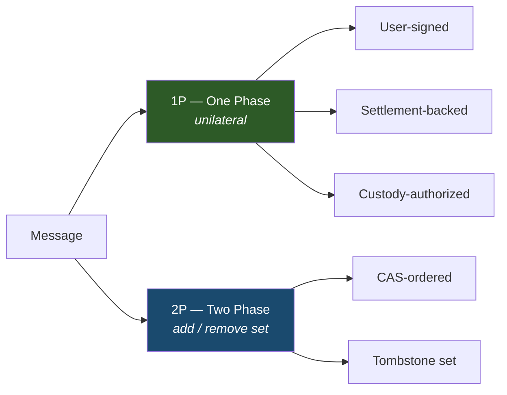
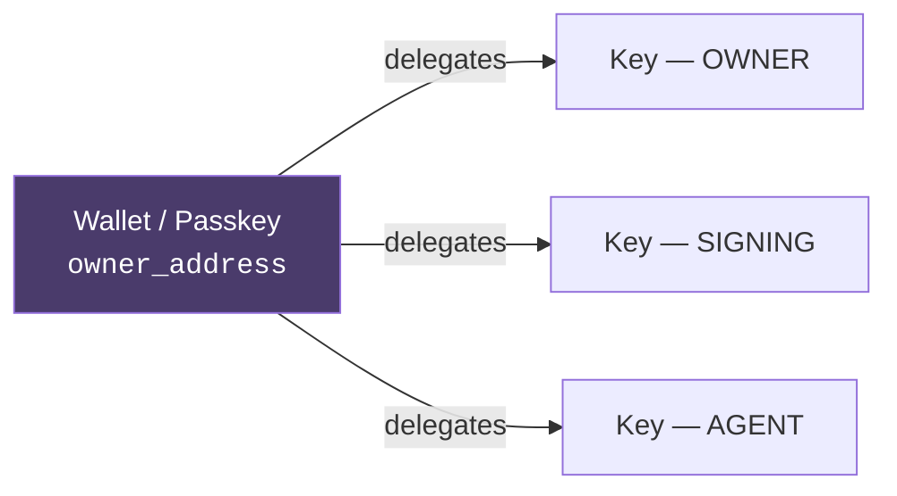
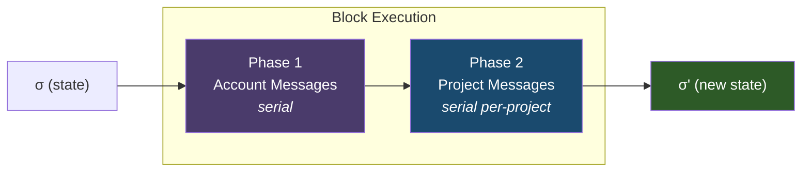

<picture>
  <source media="(prefers-color-scheme: dark)" srcset="assets/logo-shapes-dark.svg">
  <source media="(prefers-color-scheme: light)" srcset="assets/logo-shapes-light.svg">
  
</picture>

# Makechain

A specialized protocol built for making things.

**Version:** 2026.6.1

> Makechain orders and stores signed messages — project creation, commits, ref updates, access control — on a single-chain BFT ledger with sub-second finality. Consensus handles metadata; file content lives off-chain. Every committed message is verifiable from canonical state and, where applicable, finalized message-local external evidence.

### Table of Contents

1. [Introduction](#1-introduction)
2. [Data Model](#2-data-model)
3. [Identity](#3-identity)
4. [State Transition Function](#4-state-transition-function)
5. [Authorization Model](#5-authorization-model)
6. [Storage Model](#6-storage-model)
7. [Validation Rules](#7-validation-rules)
8. [Consensus](#8-consensus)
9. [Onchain Integration](#9-onchain-integration)
10. [Networking](#10-networking)
11. [Storage Limits and Pruning](#11-storage-limits-and-pruning)
12. [Content Storage](#12-content-storage)
13. [Versioning](#13-versioning)
- [Appendix A: Protocol Constants](#appendix-a-protocol-constants)
- [Appendix B: Wire Format and Canonical Encoding](#appendix-b-wire-format-and-canonical-encoding)
- [Appendix C: Onchain Contract Summary](#appendix-c-onchain-contract-summary-non-normative)
- [Appendix D: Correctness Invariants](#appendix-d-correctness-invariants)
- [Appendix E: Genesis State](#appendix-e-genesis-state)
- [References](#references)

---

## 1. Introduction

Makechain is a realtime decentralized protocol for ordering and storing git-like messages — project creation, commits, ref updates, access control — with permissionless publishing and cryptographic attribution.

### 1.1 Goals

1. **High throughput.** 10,000+ messages per second with sub-second finality.
2. **Permissionless publishing.** Anyone can create projects and push code.
3. **Cryptographically attributable messages.** Every committed message is verifiable from canonical state and, where applicable, finalized message-local external evidence.
4. **Thin consensus.** Consensus orders metadata and ref pointers. File content is stored externally, referenced by content digest.

### 1.2 Non-Goals

- General-purpose smart contracts.
- Permanent storage of all file content in the consensus layer.
- Git wire protocol compatibility (clients translate to/from Makechain messages).

### 1.3 Notation and Conventions

| Symbol | Meaning |
|--------|---------|
| `σ` | Global state (key-value store) |
| `B` | Block |
| `M` | Message |
| `H(x)` | BLAKE3 hash of `x`, producing a 32-byte digest |
| `Sign(sk, m)` | Ed25519 signature of `m` using secret key `sk` |
| `Verify(pk, m, sig)` | Ed25519 signature verification |
| `owner_address` | Canonical 20-byte account identifier |
| `σ[k]` | Value at key `k` in state `σ` |
| `σ[k] ← v` | Assign value `v` to key `k` in state `σ` |
| `⊥` | Absent / not found |
| `\|` | Byte concatenation |
| `bytes(n)` | Exactly `n` bytes |
| `LE(x, n)` | `x` encoded as `n`-byte little-endian integer |
| `BE(x, n)` | `x` encoded as `n`-byte big-endian integer |

Throughout this document, "MUST", "MUST NOT", "SHOULD", and "MAY" follow [RFC 2119][rfc2119] semantics.

### 1.4 Threat Model

**Assumptions:**
- The network is asynchronous: messages may be delayed, reordered, or dropped.
- At most `f` of `3f + 1` validators are Byzantine.
- Cryptographic primitives (Ed25519, BLAKE3, secp256k1, P-256) are unbroken.
- The settlement chain (used for storage-claim verification) provides finality for message-local external evidence.

**Out of scope:**
- Denial-of-service at the network transport layer.
- Compromise of individual user keys (key management is a client concern).
- Content availability (the consensus layer does not store file content).

### 1.5 Cryptographic Primitives

| Primitive | Usage | Reference |
|-----------|-------|-----------|
| **Ed25519** | Message signing and validator identity | [RFC 8032][rfc8032] |
| **BLAKE3** | Message hashing, content addressing, Merkle trees | [BLAKE3 spec][blake3] |
| **secp256k1 ECDSA** | AccountKeychain custody signatures; recovered-EOA key ids | [SEC 2][sec2] |
| **P-256 ECDSA** | AccountKeychain custody signatures (direct and WebAuthn) | [FIPS 186-5][fips186] |
| **Keccak-256** | AccountKeychain custody/signer authorization digests; key-id derivation | Ethereum `keccak256` |
| **EIP-712** | Typed structured data signing for external `ETH_ADDRESS` verification claims only | [EIP-712][eip712] |

---

## 2. Data Model

### 2.1 Message Envelope

Every message on the network is wrapped in a [`Message`](../proto/makechain.proto) envelope. The canonical wire format is Protocol Buffers as defined in [`proto/makechain.proto`](../proto/makechain.proto).

```
Message {
  data:       MessageData   // The operation payload
  hash:       bytes(32)     // H(canonical_encode(data))
  signature:  bytes(64)     // Sign(sk, hash)
  signer:     bytes(32)     // Ed25519 public key
  data_bytes: bytes         // Optional: cached canonical_encode(data) to skip re-encoding on verify
}
```

**`canonical_encode(data)`** is the Makechain canonical byte encoding of [`MessageData`](../proto/makechain.proto). It is defined by the canonical encoding rules in Appendix B and is not Protocol Buffers serialization; it is the distinct canonical encoding those rules define.

The `data_bytes` field (field 5 on [`Message`](../proto/makechain.proto)) caches `canonical_encode(data)` — the same bytes that were hashed. Verifiers re-encode `data` independently and reject the message if `data_bytes` does not match, then check the hash against the re-encoded bytes. `data_bytes` is never used as a hash input directly; it exists so intermediaries can forward the original encoding without re-serializing.

**Authenticated user messages** — `hash`, `signature`, and `signer` MUST all be present and valid:
```
hash = H(canonical_encode(data))
Verify(signer, hash, signature) = true
signer ∈ registered_keys(data.owner_address)
scope(signer) ≤ required_scope(data.type)
```

**Custody-authorized user messages** (`SIGNER_ADD`, `SIGNER_REMOVE`, `KEYCHAIN_AUTHORIZE`, `KEYCHAIN_REVOKE`) — the Ed25519 envelope provides integrity, but authorization comes from an AccountKeychain custody signature over a native Keccak-256 digest, verified by `verify_keychain_admin` against the account's `owner_address` (Section 5.5). These messages bypass the delegated-key registration lookup entirely.

**Settlement-verified storage-funding messages** (`STORAGE_CLAIM`) — the Ed25519 envelope provides integrity, while authorization derives from finalized settlement verification against the claim coordinates and payload. If the claim marker already exists after successful settlement verification, execution is an idempotent no-op.

For `STORAGE_CLAIM`, validators MUST first verify finalized settlement evidence against `owner_address`, `actor`, and `units`. If the claim marker already exists, execution is an idempotent no-op. First successful application does not require delegated-key authorization.

### 2.2 MessageData

```
MessageData {
  type:       MessageType   // Operation discriminant
  owner_address: bytes(20)  // Acting account's wallet address
  timestamp:  uint32        // Unix seconds
  network:    Network       // MAINNET | TESTNET | DEVNET
  body:       <type-specific payload>
}
```

A valid `MessageData` MUST select exactly one body variant, that body MUST match `type`, and `MESSAGE_TYPE_NONE` is invalid for admitted, replayed, or committed messages.

The canonical protobuf includes the following body variants and type discriminants for storage claims and usernames:

```proto
message MessageData {
  oneof body {
    StorageClaimBody storage_claim = 18;
    UsernameCreateBody username_create = 19;
    UsernameUpdateBody username_update = 20;
  }
}

enum MessageType {
  MESSAGE_TYPE_STORAGE_CLAIM = 16;
  MESSAGE_TYPE_USERNAME_CREATE = 17;
  MESSAGE_TYPE_USERNAME_UPDATE = 18;
}
```

### 2.3 Message Types


```mermaid
graph LR
    M[Message] --> ONE["1P — One Phase<br/><i>unilateral</i>"]
    M --> TWO["2P — Two Phase<br/><i>add / remove set</i>"]

    ONE --> U[User-signed]
    ONE --> SETTLE[Settlement-backed]
    ONE --> CUS[Custody-authorized]
    TWO --> CAS[CAS-ordered]
    TWO --> TS[Tombstone set]

    style ONE fill:#2d5a27,color:#fff
    style TWO fill:#1a4a6e,color:#fff
```

Every message type follows one of two paradigms:

**1P (one-phase)** — creates or updates state unilaterally. No paired "undo" message.

| Sub-type | Conflict resolution | Types |
|----------|-------------------|-------|
| Singleton | Irreversible creation | `FORK` |
| LWW Register | Timestamp-based last-write-wins | `PROJECT_METADATA`, `ACCOUNT_DATA` |
| Append-only | Monotonic growth, protocol-pruned | `COMMIT_BUNDLE` |
| State transition | Deterministic preconditioned state rewrite | `PROJECT_ARCHIVE`, `USERNAME_CREATE`, `USERNAME_UPDATE` |
| Settlement-verified storage-funding message | Finalized settlement verification and marker-idempotent replay | `STORAGE_CLAIM` |
| Custody-authorized | Authorization from AccountKeychain custody signature (`verify_keychain_admin`) | `SIGNER_ADD`, `SIGNER_REMOVE`, `KEYCHAIN_AUTHORIZE`, `KEYCHAIN_REVOKE` |

**2P (two-phase)** — Add/Remove pairs operating on a set.

| Sub-type | Conflict resolution | Types |
|----------|-------------------|-------|
| CAS-ordered | Compare-and-swap sequencing | `REF_UPDATE` / `REF_DELETE` |
| Set | Tombstone-backed remove-wins | All other Add/Remove pairs, including `MERGE_REQUEST_ADD` / `MERGE_REQUEST_REMOVE` |

### 2.4 Complete Type Reference

| Type | Enum Value | Paradigm | Required Scope | Body Proto |
|------|-----------|----------|----------------|------------|
| `PROJECT_CREATE` | 1 | 2P Set † | SIGNING | [`ProjectCreateBody`](../proto/makechain.proto) |
| `PROJECT_METADATA` | 2 | 1P LWW | SIGNING + WRITE (`NAME`/`VISIBILITY` require ADMIN) | [`ProjectMetadataBody`](../proto/makechain.proto) |
| `PROJECT_ARCHIVE` | 3 | 1P Transition | SIGNING | [`ProjectArchiveBody`](../proto/makechain.proto) |
| `FORK` | 4 | 1P Singleton | SIGNING | [`ForkBody`](../proto/makechain.proto) |
| `PROJECT_REMOVE` | 5 | 2P Set | SIGNING | [`ProjectRemoveBody`](../proto/makechain.proto) |
| `REF_UPDATE` | 6 | 2P CAS | AGENT | [`RefUpdateBody`](../proto/makechain.proto) |
| `REF_DELETE` | 7 | 2P CAS | AGENT | [`RefDeleteBody`](../proto/makechain.proto) |
| `SIGNER_ADD` | 8 | Custody-auth | (custody sig) | [`SignerAddBody`](../proto/makechain.proto) |
| `SIGNER_REMOVE` | 9 | Custody-auth | (custody sig) | [`SignerRemoveBody`](../proto/makechain.proto) |
| `COMMIT_BUNDLE` | 10 | 1P Append | AGENT | [`CommitBundleBody`](../proto/makechain.proto) |
| `COLLABORATOR_ADD` | 11 | 2P Set | SIGNING (ADMIN) | [`CollaboratorAddBody`](../proto/makechain.proto) |
| `COLLABORATOR_REMOVE` | 12 | 2P Set | SIGNING (ADMIN) | [`CollaboratorRemoveBody`](../proto/makechain.proto) |
| `ACCOUNT_DATA` | 13 | 1P LWW | SIGNING | [`AccountDataBody`](../proto/makechain.proto) |
| `VERIFICATION_ADD` | 14 | 2P Set | SIGNING | [`VerificationAddBody`](../proto/makechain.proto) |
| `VERIFICATION_REMOVE` | 15 | 2P Set | SIGNING | [`VerificationRemoveBody`](../proto/makechain.proto) |
| `STORAGE_CLAIM` | 16 | Settlement-verified storage-funding message | none; duplicate replay short-circuits after settlement verification | [`StorageClaimBody`](../proto/makechain.proto) |
| `USERNAME_CREATE` | 17 | 1P State transition | SIGNING | [`UsernameCreateBody`](../proto/makechain.proto) |
| `USERNAME_UPDATE` | 18 | 1P State transition | SIGNING | [`UsernameUpdateBody`](../proto/makechain.proto) |
| `LINK_ADD` | 19 | 2P Set | SIGNING | [`LinkAddBody`](../proto/makechain.proto) |
| `LINK_REMOVE` | 20 | 2P Set | SIGNING | [`LinkRemoveBody`](../proto/makechain.proto) |
| `REACTION_ADD` | 21 | 2P Set | SIGNING | [`ReactionAddBody`](../proto/makechain.proto) |
| `REACTION_REMOVE` | 22 | 2P Set | SIGNING | [`ReactionRemoveBody`](../proto/makechain.proto) |
| `MERGE_REQUEST_ADD` | 23 | 2P Set | SIGNING | [`MergeRequestAddBody`](../proto/makechain.proto) |
| `MERGE_REQUEST_REMOVE` | 24 | 2P Set | SIGNING | [`MergeRequestRemoveBody`](../proto/makechain.proto) |
| `KEYCHAIN_AUTHORIZE` | 25 | Custody-auth | (keychain admin sig) | [`KeychainAuthorizeBody`](../proto/makechain.proto) |
| `KEYCHAIN_REVOKE` | 26 | Custody-auth | (keychain admin sig) | [`KeychainRevokeBody`](../proto/makechain.proto) |

† `PROJECT_CREATE` is paired with `PROJECT_REMOVE` as a 2P Set, but does not follow the generic `apply_2p_add` re-add path because `project_id` is content-addressed (Section 2.5). See Section 4.2 for the specific semantics.

### 2.5 Content-Addressed Identifiers

- **`project_id`** = `Message.hash` = `H(canonical_encode(MessageData))` — the BLAKE3 hash of the `MessageData` contents of the `PROJECT_CREATE` message. This is the `hash` field in the message envelope, NOT a hash of the full envelope (which also includes `signer`, `signature`, and `data_bytes`). Two projects with the same name produce different IDs because the hash includes `owner_address`, `timestamp`, and the rest of the canonical payload.
- **Forked project ID** = `Message.hash` of the `FORK` message — same principle.
- **`request_id`** = `Message.hash` of the `MERGE_REQUEST_ADD` message — the merge request identity is content-addressed, so re-opening a closed request always yields a fresh ID.
- **`commit_hash`** = Client-computed BLAKE3 hash of the full commit object. Declared by the submitter, not recomputed by validators.

---

## 3. Identity

### 3.1 Canonical Identity


```mermaid
graph LR
    W["Wallet / Passkey<br/><code>owner_address</code>"] -->|delegates| K1["Key — OWNER"]
    W -->|delegates| K2["Key — SIGNING"]
    W -->|delegates| K3["Key — AGENT"]

    style W fill:#4a3b6b,color:#fff
```

`owner_address` is the sole canonical account identifier. MID does not exist.

Any valid 20-byte address is a valid Makechain principal even if it has no persisted account row, no delegated keys, and no active storage grants. Missing account state implies default-zero bookkeeping, not invalid identity.

### 3.2 Accounts

An account is identified by `owner_address` (`bytes(20)`). Each account's state consists of:

| Field | Type | Description |
|-------|------|-------------|
| `owner_address` | `bytes(20)` | Canonical account identifier and project owner identity. |
| `keys` | Set of `KeyState` | Registered Ed25519 public keys with scopes. |
| `custody_nonce` | `uint64` | Monotonic replay counter for keychain and signer-management mutations (`KEYCHAIN_AUTHORIZE`, `KEYCHAIN_REVOKE`, `SIGNER_ADD`, `SIGNER_REMOVE`). Burned only on the mutated account; never on a request owner. |
| `custody_keys` | Set of `CustodyKeyState` | AccountKeychain custody keys under family `0x01` (Section 6.1). Each carries `signature_type`, `public_key`, `admin`, `expires_at`, lifecycle status, `added_at`, `revoked_at`. |
| `metadata` | Map of `(field → (value, timestamp))` | Display name, avatar, bio, website. LWW per field. |
| `verifications` | 2P Set | External address ownership proofs. |
| `links` | 2P Set | Follow/star relationships. |
| `reactions` | 2P Set | Commit reactions. |
| `storage_units` | `uint32` | Raw active storage grants derived from unexpired storage-grant rows. |
| `project_count` | `uint32` | Number of owned projects. |
| `key_count` | `uint32` | Number of registered delegated keys. |
| `username` | `string \| null` | Canonical lowercase username when the account has completed username registration and still has active storage. |
| `username_last_set_at` | `uint32` | Consensus timestamp of the most recent successful `USERNAME_CREATE` or `USERNAME_UPDATE`. |

There is no onchain account allocation, transfer, or recovery flow.

### 3.3 Key Scopes

All delegated keys are Ed25519. Each key has an explicit scope:

| Scope | Value | Capabilities |
|-------|-------|-------------|
| `OWNER` | 0 | Full account control: manage keys and act with any delegated-key privilege |
| `SIGNING` | 1 | Account-scoped operations plus project create/fork and project administration on authorized projects |
| `AGENT` | 2 | Automated actions (CI/CD, AI agents) — optionally scoped to specific projects |

Privilege ordering: `OWNER < SIGNING < AGENT` (numerically). A key with scope `s` satisfies any requirement `r` where `s ≤ r`.

### 3.4 Key Registration and Storage Funding Paths

There are no relay-injected identity or signer-management messages.

The only live delegated-key (envelope, family `0x00`) management flow is custody-authorized `SIGNER_ADD` / `SIGNER_REMOVE`. The AccountKeychain custody-key family (family `0x01`) is mutated by `KEYCHAIN_AUTHORIZE` / `KEYCHAIN_REVOKE`. All four are authorized by `verify_keychain_admin` against `owner_address` (Section 5.5): the root `owner_address` is the implicit admin forever, and any active admin custody key may also authorize, via a keychain wrapper.

The only settlement-chain-backed storage ingress is `STORAGE_CLAIM`, a settlement-verified user-submitted message that funds raw storage grants. Username control is handled separately by delegated-key-authorized `USERNAME_CREATE` and `USERNAME_UPDATE` messages. Duplicate replay remains anchored to settled claim coordinates.

### 3.5 Storage-Backed Usernames

Accounts may hold at most one active username.

- A username is a globally unique human-readable handle layered on top of canonical `owner_address` identity.
- Usernames are created by `USERNAME_CREATE` once the account has active raw storage grants and no active username.
- Usernames are changed by `USERNAME_UPDATE` while the account still has active raw storage grants.
- `USERNAME_UPDATE` is subject to `USERNAME_CHANGE_COOLDOWN`: the message timestamp MUST be at least 7 days after the account's most recent successful username set.
- Successful `USERNAME_CREATE` and `USERNAME_UPDATE` both reset the cooldown clock by writing `username_last_set_at = MessageData.timestamp`.
- Raw storage grants MAY exist while the account has no active username.
- Quota-bearing storage use is gated on an active username; if the account has no active username, usable quota is zero.
- When required sweep reconciles an account to zero effective active storage, the username reservation is released.
- The cooldown applies only to `USERNAME_UPDATE`; releasing a username due to sweep does not block a later fresh `USERNAME_CREATE`.

Canonical username form:

- lowercase ASCII only
- length `3` through `32` inclusive
- allowed characters: `a-z`, `0-9`, `-`
- first and last characters MUST be alphanumeric

Canonical regex:

```text
^[a-z0-9][a-z0-9-]{1,30}[a-z0-9]$
```

Clients MAY accept mixed-case ASCII input for UX, but they MUST lowercase and validate it before signing or submission. Validators MUST reject non-canonical usernames on the wire rather than silently normalizing them during execution.

---

## 4. State Transition Function

### 4.1 Global State

The global state `σ` is a key-value store mapping byte strings to byte strings. All state objects (accounts, projects, retained fork-lineage rows, merge requests, keys, refs, commits, collaborators, verifications, links, reactions, tombstones, counters, storage grants) are serialized values under prefix-namespaced keys (see Section 6.1).

### 4.2 Block Execution


```mermaid
graph LR
    σ["σ (state)"] --> P1

    subgraph Block Execution
        P1["Phase 1<br/>Account Messages<br/><i>serial</i>"] --> P2["Phase 2<br/>Project Messages<br/><i>serial per-project</i>"]
    end

    P2 --> σ2["σ' (new state)"]

    style P1 fill:#4a3b6b,color:#fff
    style P2 fill:#1a4a6e,color:#fff
    style σ2 fill:#2d5a27,color:#fff
```

Given state `σ`, finalized block `B`, and the committed execution payload `R` associated with `B`:

```
apply_block(σ, B, R) → σ':
  require proposal_digest(R) is the canonical block hash finalized by B.consensus_finalization
  let account_msgs = R.account_messages
  let project_groups = R.project_messages

  // Phase 1: Serial account pre-pass
  σ₁ = σ
  for M in account_msgs:
    if not timestamp_valid(M, B.timestamp):
      drop(M)
      continue
    match apply_message(σ₁, M):
      Ok(σ') → σ₁ = σ'
      Err(_) → drop(M)

  // Phase 2: Serial per-project execution
  σ₂ = σ₁
  for (project_id, msgs) in project_groups:  // lexicographic order of project_id
    for M in msgs:                           // proposer-determined order within group
      if not timestamp_valid(M, B.timestamp):
        drop(M)
        continue
      match apply_message(σ₂, M):
        Ok(σ') → σ₂ = σ'
        Err(_) → drop(M)

  return σ₂
```

`ExecutionPayload` is the canonical execution input. Verifiers MUST execute the exact `account_messages` and `project_messages` order carried in `R`. `Block.body.user_messages` is a flat stream that redundantly mirrors the finalized user messages for persisted verification, sync, and indexing; per-project groups are recovered on demand from each message's `project_id`. Account-message order is carried only by `ExecutionPayload.account_messages` (mirrored in `Block.body.account_messages`). Each `project_id` MUST appear at most once in `ExecutionPayload.project_messages`; duplicate entries make the payload invalid. If the block body's per-project grouping differs from `ExecutionPayload.project_messages`, the block is invalid.

**Account messages** (Phase 1, serial): `STORAGE_CLAIM`, `SIGNER_ADD`, `SIGNER_REMOVE`, `ACCOUNT_DATA`, `VERIFICATION_ADD`, `VERIFICATION_REMOVE`, `USERNAME_CREATE`, `USERNAME_UPDATE`, `LINK_ADD`, `LINK_REMOVE`, `REACTION_ADD`, `REACTION_REMOVE`, `PROJECT_CREATE`, `PROJECT_REMOVE`, `FORK`.

`PROJECT_CREATE`, `PROJECT_REMOVE`, and `FORK` are classified as account messages because they modify `project_count` on the account.

**Project messages** (Phase 2, serial per-project group): `PROJECT_METADATA`, `PROJECT_ARCHIVE`, `REF_UPDATE`, `REF_DELETE`, `COMMIT_BUNDLE`, `COLLABORATOR_ADD`, `COLLABORATOR_REMOVE`, `MERGE_REQUEST_ADD`, `MERGE_REQUEST_REMOVE`. Grouped by target `project_id`, groups iterated in byte-lexicographic order of the 32-byte `project_id`. Within each group, messages are processed in the order specified by the proposer and carried authoritatively in `ExecutionPayload.project_messages`; the grouping recovered from `Block.body.user_messages` (by `project_id`) MUST match.

Dropped messages are excluded from the committed block but do not halt execution.

Projects are usually independent state domains, but `MERGE_REQUEST_ADD` includes requester-global Layer 1 quota checks that can couple adds by the same requester across different target projects (see the INV-3 exception in Appendix D). Project groups MAY be executed in parallel only if the scheme preserves equivalence to the canonical serial execution order, including these requester-global dependencies.

#### Message Dispatch

`apply_message(σ, M)` dispatches to a type-specific handler. Each handler reads and writes specific state keys. The following table enumerates all keys modified by each message type (reads omitted for brevity — handlers read the keys they write plus authorization keys from Section 5):

| Message Type | Resolution | Keys Written |
|---|---|---|
| `PROJECT_CREATE` | 2P add | `project(id)`, `project_name(owner_address, name)`, `account(owner_address)` [project_count++] |
| `PROJECT_REMOVE` | 2P remove | `project(id)` [status], `tombstone(project(id))`, `account(owner_address)` [project_count--] |
| `FORK` | Singleton | `project(id)` [with `fork_source`], `fork_parent(id)`, `project_name(owner_address, name)`, `account(owner_address)` [project_count++] |
| `PROJECT_METADATA` | LWW | `project_meta(id, field)`, optionally `project_name(owner_address, *)` for name changes |
| `ACCOUNT_DATA` | LWW | `account_meta(owner_address, field)` |
| `COMMIT_BUNDLE` | Append | `commit(project_id, hash)` per commit; triggers `prune_commits` if over limit |
| `PROJECT_ARCHIVE` | State transition | `project(id)` [status → Archived] |
| `REF_UPDATE` | CAS+nonce | `ref(project_id, ref_name)` |
| `REF_DELETE` | CAS+nonce | deletes `ref(project_id, ref_name)` |
| `COLLABORATOR_ADD` | 2P add | `collaborator(project_id, target_owner_address)`, optionally clears `tombstone(collaborator(...))` |
| `COLLABORATOR_REMOVE` | 2P remove | deletes `collaborator(project_id, target_owner_address)`, `tombstone(collaborator(...))` |
| `STORAGE_CLAIM` | Settlement-verified storage-funding message | `storage_grant(owner_address, expires_at, claim_id)`, `storage_claim_marker(claim_id)`, `account(owner_address)` [`storage_units`] |
| `USERNAME_CREATE` | 1P State transition | `account(owner_address)` [`username`, `username_last_set_at`], `username_index(username)` |
| `USERNAME_UPDATE` | 1P State transition | `account(owner_address)` [`username`, `username_last_set_at`], deletes old `username_index(current)`, writes `username_index(next)` |
| `SIGNER_ADD` | Custody-auth | `key(owner_address, pubkey)`, `key_reverse(pubkey)`, `account(owner_address)` [custody_nonce++, key_count++] |
| `SIGNER_REMOVE` | Custody-auth | deletes `key(owner_address, pubkey)`, `key_reverse(pubkey)`, `account(owner_address)` [custody_nonce++, key_count--] |
| `VERIFICATION_ADD` | 2P add | `verification(owner_address, addr)`, `counter(owner_address, 0x03)`, optionally clears tombstone |
| `VERIFICATION_REMOVE` | 2P remove | deletes `verification(owner_address, addr)`, `tombstone(verification(...))`, `counter(owner_address, 0x03)` |
| `LINK_ADD` | 2P add | `link(owner_address, type, target)`, `link_reverse(type, target, owner_address)`, `counter(owner_address, 0x01)` |
| `LINK_REMOVE` | 2P remove | deletes `link(...)`, `link_reverse(...)`, `tombstone(link(...))`, `counter(owner_address, 0x01)` |
| `REACTION_ADD` | 2P add | `reaction(owner_address, type, proj, hash)`, `reaction_reverse(type, proj, hash, owner_address)`, `counter(owner_address, 0x02)` |
| `REACTION_REMOVE` | 2P remove | deletes `reaction(...)`, `reaction_reverse(...)`, `tombstone(reaction(...))`, `counter(owner_address, 0x02)` |
| `MERGE_REQUEST_ADD` | 2P add | `merge_request(project_id, request_id)`, `merge_request_reverse(owner_address, project_id, request_id)`, `project(project_id)` [merge_request_count++] |
| `MERGE_REQUEST_REMOVE` | 2P remove | deletes `merge_request(...)`, deletes `merge_request_reverse(...)`, `tombstone(merge_request(...))`, `project(project_id)` [merge_request_count--] |

Key names reference Section 6.1 prefixes. 2P add/remove handlers also interact with prune markers (`0x15`) during quota pruning (Section 11.4). `MessageType::None` returns `Err`.

`STORAGE_CLAIM`, `USERNAME_CREATE`, and `USERNAME_UPDATE` remain Phase 1 account messages. Validators execute them in the ordinary serial account-message order, so an earlier successful `STORAGE_CLAIM` may enable a later `USERNAME_CREATE` in the same block, an earlier successful username set may start or reset the cooldown before a later same-block `USERNAME_UPDATE`, and an earlier `USERNAME_UPDATE` may free a username before a later same-block claim attempts to take it. Later conflicting messages are dropped as ordinary invalid account messages; they do not invalidate the whole block.

**Project identity and 2P set semantics.** Although `PROJECT_CREATE` and `PROJECT_REMOVE` are listed as 2P Set add/remove pairs, projects do not follow the generic `apply_2p_add` re-add path from Section 4.4.2. This is a consequence of content-addressed identity: `project_id = H(MessageData)` (Section 2.5), so every fresh `PROJECT_CREATE` message produces a unique `project_id`. There is no way to construct a new `PROJECT_CREATE` that targets an existing project's identity. A `PROJECT_CREATE` whose derived `project_id` matches an existing project entry MUST be rejected regardless of the project's current status. `PROJECT_ARCHIVE` is a terminal state transition — archived projects cannot be reverted to `Active`, but they can be forked or subsequently removed.

### 4.3 Timestamp Validation

```
timestamp_valid(M, block_timestamp) → bool:
  let ts = M.data.timestamp
  let drift = MAX_TIMESTAMP_DRIFT  // 300 seconds

  // Reject messages too far in the future (saturating subtraction to avoid underflow)
  if saturating_sub(ts, block_timestamp) > drift:
    return false

  // Reject storage-sensitive messages too far in the past
  if is_storage_sensitive(M.data.type):
    if ts < saturating_sub(block_timestamp, drift):
      return false

  return true
```

All arithmetic MUST use saturating subtraction (clamping to 0 on underflow) since timestamps are unsigned integers.

Storage-sensitive types (types that create or remove quota-affecting state): `PROJECT_CREATE`, `PROJECT_REMOVE`, `FORK`, `COLLABORATOR_ADD`, `COLLABORATOR_REMOVE`, `VERIFICATION_ADD`, `VERIFICATION_REMOVE`, `USERNAME_CREATE`, `USERNAME_UPDATE`, `LINK_ADD`, `LINK_REMOVE`, `REACTION_ADD`, `REACTION_REMOVE`, `STORAGE_CLAIM`, `MERGE_REQUEST_ADD`, `MERGE_REQUEST_REMOVE`.

### 4.4 Conflict Resolution

#### 4.4.1 LWW Registers

For `PROJECT_METADATA` and `ACCOUNT_DATA`, each field is a Last-Write-Wins register keyed by `(entity_id, field)`:

```
apply_lww(σ, key, new_value, new_timestamp) → σ':
  let (current_value, current_ts) = σ[key]  // (⊥, 0) if absent

  if new_timestamp < current_ts:
    return σ  // stale — silently drop

  // Equal timestamps: last-inclusion-wins (consensus order within block)
  σ[key] ← (new_value, new_timestamp)
  return σ
```

**Note on commutativity:** LWW is commutative when timestamps differ. At equal timestamps, the result depends on consensus inclusion order within the block — this is intentional and deterministic (the proposer determines ordering). Because `MAX_TIMESTAMP_DRIFT` permits timestamps up to 300 seconds in the future, a writer who sets `timestamp = now + 299` will win all concurrent LWW conflicts for up to 5 minutes. This is an accepted trade-off: timestamp drift is bounded, and metadata fields are not security-critical.

#### 4.4.2 Tombstone-Backed 2P Sets

For all 2P Set types, conflict resolution uses durable tombstones with remove-wins-on-tie semantics.

Let `active_key` be the key for the active entry and `tombstone_key = [0x03 | active_key]`.

```
apply_2p_add(σ, active_key, add_timestamp) → σ':
  let active = σ[active_key]   // ⊥ if absent
  let tombstone_ts = σ[tombstone_key]    // ⊥ if no tombstone
  let prune_marker_ts = σ[prune_marker_key(active_key)]  // ⊥ if no prune marker
  let effective_tomb = max(tombstone_ts, prune_marker_ts)  // treating ⊥ as -∞

  if effective_tomb ≠ ⊥ and add_timestamp ≤ effective_tomb:
    return σ  // remove/prune wins on tie

  if active ≠ ⊥ and add_timestamp < active.timestamp:
    return σ  // stale add loses to newer active add

  // Equal-timestamp add/add remains last-inclusion-wins
  // per proposer-defined order.

  σ[active_key] ← entry_with_timestamp(add_timestamp)
  return σ

apply_2p_remove(σ, active_key, remove_timestamp) → σ':
  let active = σ[active_key]
  let tombstone_ts = σ[tombstone_key]

  // Decide what to do
  let should_record_tombstone =
    NOT (tombstone_ts ≠ ⊥ and remove_timestamp ≤ tombstone_ts)  // not blocked by newer tombstone

  let should_delete_active =
    active ≠ ⊥ and remove_timestamp ≥ active.timestamp

  // Case 1: Delete active and record tombstone
  if should_record_tombstone and should_delete_active:
    σ[tombstone_key] ← remove_timestamp
    delete σ[active_key]
    return σ

  // Case 2: Update existing tombstone only (no active to delete)
  //         Only allowed when a tombstone already exists — prevents phantom tombstones
  if should_record_tombstone and not should_delete_active and tombstone_ts ≠ ⊥:
    σ[tombstone_key] ← remove_timestamp
    return σ

  // Case 3: Ignore — no active, no tombstone (phantom), or tombstone already newer
  return σ
```

**Correctness properties:**
- **Monotone add resolution:** A newer add supersedes an older add. Equal-timestamp add/add remains last-inclusion-wins.
- **Commutativity for distinct timestamps:** For tombstone-backed 2P Set add/remove operations with distinct timestamps, final state is independent of arrival order.
- **Remove-wins-on-tie:** An add at time `t` and remove at time `t` results in the entry being removed.
- **No phantom tombstones:** A remove targeting an identity that was never active and has no existing tombstone produces no persistent state. Specifically: a tombstone is only created in conjunction with deleting an active entry, or by advancing an already-existing tombstone. This prevents unbounded state growth from adversarial removes.
- **Bounded tombstones:** `|tombstones| ≤ |unique identities ever actively added|`.
- **Prune marker subsumption:** Prune markers (Section 11.4) act as pseudo-tombstones for 2P add resolution. `apply_2p_add` uses `effective_tomb = max(tombstone_ts, prune_marker_ts)`, ensuring pruned entries cannot be re-added with stale timestamps.

#### 4.4.3 CAS-Ordered Refs

`REF_UPDATE` and `REF_DELETE` use compare-and-swap with monotonic nonces rather than timestamp-based or tombstone-based resolution. Refs do NOT use 2P tombstones — a deleted ref can be recreated with the same name.

```
apply_ref_update(σ, project_id, ref_name, old_hash, new_hash, nonce, force) → σ':
  let current = σ[ref_key(project_id, ref_name)]

  if current = ⊥:
    // Creating new ref
    require old_hash = ∅
    require nonce = 1
  else:
    // Updating existing ref
    require nonce = current.nonce + 1
    if old_hash ≠ ∅:
      require old_hash = current.hash  // CAS check — force does NOT bypass this
    if not force:
      require is_ancestor(σ, project_id, current.hash, new_hash, MAX_FF_DEPTH)

  σ[ref_key(project_id, ref_name)] ← RefState { hash: new_hash, nonce: nonce, ... }
  return σ

apply_ref_delete(σ, project_id, ref_name, expected_hash, nonce) → σ':
  let current = σ[ref_key(project_id, ref_name)]
  require current ≠ ⊥
  require nonce = current.nonce + 1
  if expected_hash ≠ ∅:
    require expected_hash = current.hash
  delete σ[ref_key(project_id, ref_name)]
  return σ
```

The `ref_type` field (Branch or Tag) is set only when creating a new ref. Subsequent updates preserve the original ref type.

Because deletion removes the stored ref state entirely, recreating a deleted ref starts a new nonce sequence at `1`.

Fast-forward check: when `force = false` and the ref already exists, the validator MUST verify that the current commit hash is a reachable ancestor of `new_hash` by traversing parent links, bounded to `MAX_FF_DEPTH` (10,000) commits.

---

## 5. Authorization Model

### 5.1 Key Scope Checks

```
check_key_scope(σ, owner_address, signer, required_scope) → Ok | Err:
  let key_state = σ[key_entry_key(owner_address, signer)]
  require key_state ≠ ⊥                    // key must exist
  require key_state.scope ≤ required_scope  // lower value = higher privilege
  return Ok
```

### 5.2 Project Access Control

```
check_project_access(σ, owner_address, project, project_id, required_permission) → Ok | Err:
  require project ≠ ⊥

  if project.owner_address = owner_address:
    return Ok  // owner has full access

  let collab = σ[collaborator_key(project_id, owner_address)]
  require collab ≠ ⊥ and collab.permission ≥ required_permission
  return Ok
```

`check_project_access` takes the already-resolved `project` record rather than looking it up and gating on `status` itself; which statuses are acceptable is the caller's decision (e.g. `get_project_active` for `Active`-only contexts, `get_project_not_removed` where `Archived` is also valid), so the same permission check applies uniformly across those contexts.

### 5.3 Agent Project Scope

```
check_agent_project_scope(σ, owner_address, signer, project_id) → Ok | Err:
  let key_state = σ[key_entry_key(owner_address, signer)]
  if key_state.scope ≠ Agent: return Ok
  if key_state.allowed_projects is empty: return Ok  // unrestricted
  require project_id ∈ key_state.allowed_projects
  return Ok
```

### 5.4 Authorization Bypass Rules

There is no generic unsigned system-message path.

All committed block messages are user-submitted envelope-bearing messages. The only bypass rules are:

- `SIGNER_ADD`, `SIGNER_REMOVE`, `KEYCHAIN_AUTHORIZE`, and `KEYCHAIN_REVOKE` bypass delegated-key lookup; authority derives exclusively from AccountKeychain custody signatures accepted by `verify_keychain_admin` against `owner_address` (Section 5.5).
- `STORAGE_CLAIM` bypasses delegated-key lookup; authority derives exclusively from finalized settlement verification plus claim-marker idempotence.

The identifiers `KEY_ADD`, `OWNERSHIP_TRANSFER`, `STORAGE_RENT`, `RELAY_SIGNER_ADD`, and `RELAY_SIGNER_REMOVE` are not defined in the protobuf. Any message bearing one of these type values MUST fail structural validation as an invalid `MessageType`.

### 5.4A `STORAGE_CLAIM` Authorization

`STORAGE_CLAIM` is the settlement-verified raw storage-funding ingress.

```
authorize_storage_claim(σ, data, body) → FirstApply | DuplicateReplay | Err:
  require finalized settlement verification succeeds and matches
          (owner_address, actor, units)

  let claim_id = storage_claim_id(body.settlement_chain_id,
                                  body.settlement_tx_hash,
                                  body.settlement_log_index)

  if storage_claim_marker(claim_id) exists:
    return DuplicateReplay

  return FirstApply
```

Duplicate replay remains settlement-first and marker-idempotent: once the claim marker exists, no later delegated-key state can affect the replay outcome because no delegated-key lookup is performed.

### 5.4B Username Message Authorization

`USERNAME_CREATE` and `USERNAME_UPDATE` are authenticated delegated-key account messages.

```
authorize_username_message(σ, data, signer) → Ok | Err:
  check_key_scope(σ, data.owner_address, signer, SIGNING)
  return Ok
```

Under the existing scope ordering, `OWNER` and `SIGNING` satisfy the username-message requirement and `AGENT` does not.

### 5.5 Custody-Authorized Message Authorization

`SIGNER_ADD`, `SIGNER_REMOVE`, `KEYCHAIN_AUTHORIZE`, and `KEYCHAIN_REVOKE` bypass
the Ed25519 signer-is-registered check. Authorization is an AccountKeychain
custody signature over a native Keccak-256 authorization digest, accepted by
`verify_keychain_admin` against `owner_address`. This model has no EIP-712 typed
data, no ERC-1271, and no `custody_key_type` / validation-block-hash fields.

#### 5.5.1 Authorization Digests

Each authorization digest is `Keccak256(canonical_encode(payload))`, where the
payload begins with a one-byte operation discriminant and — for the family-bound
operations — a one-byte target key family:

| Op byte | Operation | Target family byte |
|---------|-----------|--------------------|
| `0x01` | `KEYCHAIN_AUTHORIZE` | `0x01` (custody) |
| `0x02` | `KEYCHAIN_REVOKE` | `0x01` (custody) |
| `0x03` | `SIGNER_ADD` | `0x00` (envelope) |
| `0x04` | `SIGNER_REMOVE` | `0x00` (envelope) |
| `0x05` | `SIGNER_REQUEST` | (none) |

The family byte binds each signed payload to the keyspace family it mutates
(Section 6.1), so a signature for an envelope operation cannot be replayed
against the custody family or vice versa.

Each payload is encoded with `canonical_encode` (canonical, byte-stable) in the
field order below, then hashed with Keccak-256. The `KEYCHAIN_AUTHORIZE` and
`KEYCHAIN_REVOKE` digests additionally commit to a `witness` field — optional
app-challenge binding bytes that change the digest but are never persisted.

```
keychain_authorize_digest = Keccak256(canonical_encode(
  0x01 | 0x01 | network:i32 | owner_address:20 | key_id:20 |
  signature_type:u8 | public_key:bytes | admin:bool | expires_at:u64 |
  valid_after:u64 | valid_before:u64 | nonce:u64 | witness:bytes))

keychain_revoke_digest = Keccak256(canonical_encode(
  0x02 | 0x01 | network:i32 | owner_address:20 | key_id:20 |
  valid_after:u64 | valid_before:u64 | nonce:u64 | witness:bytes))

signer_add_digest = Keccak256(canonical_encode(
  0x03 | 0x00 | network:i32 | owner_address:20 | request_owner_address:20 |
  key:32 | scope:u32 | valid_after:u64 | valid_before:u64 | nonce:u64 |
  allowed_projects:[32]))

signer_remove_digest = Keccak256(canonical_encode(
  0x04 | 0x00 | network:i32 | owner_address:20 | key:32 |
  valid_after:u64 | valid_before:u64 | nonce:u64))

signer_request_digest = Keccak256(canonical_encode(
  0x05 | network:i32 | owner_address:20 | request_owner_address:20 |
  key:32 | scope:u32 | valid_after:u64 | valid_before:u64 | nonce:u64 |
  allowed_projects:[32]))
```

`network` is the [`MessageData.network`](../proto/makechain.proto) enum value,
binding each digest to a single Makechain network and preventing cross-network
replay. `canonical_encode` length-prefixes variable-length `bytes` and `[32]`
lists.

#### 5.5.2 Authorization Predicate (`verify_keychain_admin`)

```
verify_keychain_admin(σ, owner_address, digest, signature, effective_time) → Ok | Err:
  let v = verify_account_signature(digest, signature)   // parses unified envelope (5.5.3)
  if v.wrapper_account is Some(a) and a ≠ owner_address:
    return Err   // wrapper account must equal owner_address

  // Root path: signer recovered to the owner_address itself.
  if v.key_id == owner_address:
    return Ok

  // Delegated path: MUST be a keychain-wrapped signature.
  if v.wrapper_account is None:
    return Err   // delegated custody-key signatures require a 0x03 wrapper

  let k = σ[custody_key_entry_key(owner_address, v.key_id)]
  require k ≠ ⊥
  require k.status == Active
  require k.admin == true
  require k.expires_at == 0 OR effective_time ≤ k.expires_at
  require k.signature_type == v.signature_type
  return Ok
```

`effective_time` is the consensus block timestamp under real execution, so
expiry and the validity window cannot be bypassed by backdating the
attacker-chosen [`MessageData.timestamp`](../proto/makechain.proto).

#### 5.5.3 Unified Self-Describing Signature Envelope

A custody/claim signature selects its primitive by length or leading byte; a
keychain wrapper prefixes a primitive with `0x03 | account:20`. Nested wrappers
are rejected, and secp256k1 and P256 signatures MUST be low-S normalized
(high-S rejected).

| Form | Layout | Size | Primitive |
|------|--------|------|-----------|
| secp256k1 direct | `r:32 \| s:32 \| v:1` | 65 bytes | secp256k1 ECDSA (recovered EOA = key id) |
| P256 direct | `0x01 \| r:32 \| s:32 \| pub_x:32 \| pub_y:32 \| pre_hash:1` | 130 bytes | P256 ECDSA; `pre_hash` MUST equal `1` |
| WebAuthn P256 | `0x02 \| authenticatorData \|\| clientDataJSON \| sig:64 \| pub_x:32 \| pub_y:32` | variable | WebAuthn P256 assertion |
| Keychain wrapper | `0x03 \| account:20 \| <primitive>` | 21 + inner | Delegated; `account` MUST equal `owner_address` |

A bare 65-byte input is always parsed as secp256k1 even if its first byte is
`0x03`; the parser is length-first, so the `0x03` wrapper tag is only honored
for inputs longer than 65 bytes.

**Key-id derivation:**
- secp256k1: `keccak256(uncompressed_pubkey[1:65])[12:32]` (standard Ethereum address)
- P256 / WebAuthn P256: `keccak256(pub_x:32 \| pub_y:32)[12:32]` (settlement-chain P256 address)

P256 and WebAuthn therefore share the same 20-byte key-id space for the same
underlying P256 keypair.

**WebAuthn P256 assertion rules:**
- `authenticatorData` — the flags byte (offset 32) MUST have UP (bit 0) and UV (bit 2) set.
- `clientDataJSON` — `"type"` MUST be `"webauthn.get"`; `"challenge"` MUST be the
  base64url encoding (unpadded, URL alphabet) of the authorization digest.
- `origin` and `rpIdHash` are NOT enforced (Section 5.5.5).
- `sig` — raw P256 ECDSA `r:32 \| s:32`, low-S normalized.
- The signed message is `SHA-256(authenticatorData \|\| SHA-256(clientDataJSON))`.
- The embedded P256 public key determines the key id; there is no recovery byte.
- The total WebAuthn envelope MUST NOT exceed 2048 bytes.

#### 5.5.4 Custody Preamble (validity window and nonce)

Before digest verification, every custody/keychain operation checks:

```
verify_custody_preamble(σ, owner_address, valid_after, valid_before, effective_time, nonce):
  let acct = σ[account(owner_address)]                       // default-zero if absent
  require valid_after ≤ effective_time ≤ valid_before
  require valid_before - valid_after ≤ MAX_VALIDITY_WINDOW    // 3,600 seconds
  require nonce == acct.custody_nonce
```

On success the handler increments `acct.custody_nonce` by exactly 1 on the
mutated account. For `SIGNER_ADD`, the `request_signature` is verified by
`verify_keychain_admin(request_owner_address, signer_request_digest, …)`; the
request owner's nonce is never burned.

#### 5.5.5 WebAuthn Origin / RP-ID Not Enforced

Makechain treats a WebAuthn assertion as portable custody-signature material.
Validators MUST NOT check `rpIdHash` in `authenticatorData` or `origin` in
`clientDataJSON`, and there is no relying-party allowlist. Authority comes
entirely from the challenge binding (challenge == authorization digest), the
`webauthn.get` type, the UP/UV flags, the P256 signature, and the embedded
public key.

### 5.6 App Attribution

Every `SIGNER_ADD` MUST include app attribution:

- `request_owner_address` — requesting app wallet address (20 bytes). It is not a Makechain account lookup key.
- `request_signature` — an AccountKeychain custody signature over the `SIGNER_REQUEST` digest (Section 5.5.1), accepted by `verify_keychain_admin(request_owner_address, signer_request_digest, request_signature)`.

The request owner authorizes either with its root key signing directly
(`key_id == request_owner_address`) or with an active admin custody key of the
request owner signing through a keychain wrapper whose `account ==
request_owner_address`. Verifying the request signature consults the request
owner's custody-key state but never burns its `custody_nonce`.

For self-request, `request_owner_address == owner_address` and the same key
authorizes both the custody and app-attribution digests. `SIGNER_REMOVE`,
`KEYCHAIN_AUTHORIZE`, and `KEYCHAIN_REVOKE` carry no app attribution.

### 5.7 Custody Nonce Sharing

The `custody_nonce` counter is shared across all four custody operations on a single account: `KEYCHAIN_AUTHORIZE`, `KEYCHAIN_REVOKE`, `SIGNER_ADD`, and `SIGNER_REMOVE`. Each successful operation increments the mutated account's nonce by exactly 1. A `SIGNER_ADD` request signature consults but never increments the request owner's nonce.

### 5.7A Address Derivation

Recovered wallet addresses are signature-family specific:

- secp256k1 uses standard Ethereum address derivation from the recovered uncompressed public key
- P256 and WebAuthn P256 use settlement-chain address derivation `keccak256(pub_key_x || pub_key_y)[12:32]`

P256 and WebAuthn therefore share the same 20-byte address space for the same underlying P256 keypair.

### 5.8 Visibility

The [`Visibility`](../proto/makechain.proto) enum (`PUBLIC` / `PRIVATE`) is defined on [`ProjectCreateBody`](../proto/makechain.proto), [`ForkBody`](../proto/makechain.proto), and [`ProjectMetadataBody`](../proto/makechain.proto). In the current protocol version, visibility does not gate general read access to canonical project state, but it does constrain `FORK`: a private source project MAY be forked only by its owner or by a collaborator with at least `READ` permission. `PRIVATE` visibility is otherwise reserved for future access control extensions. Implementations MUST store and return the visibility value and MUST enforce the `FORK` access rule above.

### 5.9 Merge Request Authorization

Both merge-request message types require a registered delegated key with `SIGNING` scope or stronger.

#### 5.9.1 `MERGE_REQUEST_ADD`

`MERGE_REQUEST_ADD` authorization is:

```
authorize_merge_request_add(σ, data, body, signer) -> Ok | Err:
  check_key_scope(σ, data.owner_address, signer, SIGNING)

  let target = get_project_active(σ, body.project_id)
  if target.visibility == PRIVATE:
    check_project_access(σ, data.owner_address, target, body.project_id, READ)

  let source = get_project_not_removed(σ, body.source_project_id)
  if source.visibility == PRIVATE and source.owner_address != data.owner_address:
    check_project_access(σ, data.owner_address, source, body.source_project_id, READ)

  require body.source_project_id != body.project_id
  require fork_lineage(body.source_project_id) reaches body.project_id within MAX_FORK_LINEAGE_DEPTH using retained 0x1A lineage rows
  require σ[ref_key(body.source_project_id, body.source_ref)] exists
  require σ[ref_key(body.source_project_id, body.source_ref)].commit_hash == body.source_commit_hash
  require σ[commit_key(body.source_project_id, body.source_commit_hash)] exists
  return Ok
```

Public targets do not require project membership. Private targets require `READ+`. Private sources require source ownership or `READ+`. The target project MUST be `Active`; the source project MAY be `Active` or `Archived`, but not `Removed`.

#### 5.9.2 `MERGE_REQUEST_REMOVE`

`MERGE_REQUEST_REMOVE` uses the protocol's first dual authorization path:

```
authorize_merge_request_remove(σ, data, signer, body, mr) -> Ok | Err:
  check_key_scope(σ, data.owner_address, signer, SIGNING)

  if data.owner_address == mr.requester_owner_address:
    return Ok

  let target = get_project_not_removed(σ, body.project_id)

  if target.owner_address == data.owner_address:
    return Ok

  let collab = σ[collaborator_key(body.project_id, data.owner_address)]
  require collab != ⊥ and collab.permission >= WRITE
  return Ok
```

The original requester MAY withdraw without current target-project membership, including when the target project has become `Removed`, provided the active merge-request row still exists. The target project owner or any collaborator with `WRITE+` MAY close any request targeting that project only while the target project is not `Removed`. The maintainer-close path allows `Active` and `Archived` targets.

#### 5.9.3 Retained Fork Lineage Helper

`fork_lineage(source_project_id)` is the chain formed by repeatedly following retained `ForkParentState.parent_project_id` rows under prefix `0x1A`.

`MAX_FORK_LINEAGE_DEPTH = 256`.

Validation succeeds iff the chain starting from `source_project_id` reaches the target `project_id` within at most `256` hops. Implementations MUST fail the check if the chain terminates early, a cycle is detected, an intermediate retained ancestor is missing, or reaching the target would exceed the bound.

---

## 6. Storage Model

### 6.1 Key Schema

State is stored in a merkleized key-value store with prefix-byte namespacing. All multi-byte integers in keys use big-endian encoding.

| Prefix | Entity | Key Layout |
|--------|--------|-----------|
| `0x02` | Block | `[0x02 \| block_number:8]` |
| `0x03` | Tombstone | `[0x03 \| active_key:*]` |
| `0x04` | Account | `[0x04 \| owner_address:20]` |
| `0x05` | Account metadata | `[0x05 \| owner_address:20 \| field:1]` |
| `0x06` | Key (two families) | `[0x06 \| owner_address:20 \| family:1 \| key_id]` |
| `0x07` | Envelope-key reverse index | `[0x07 \| pubkey:32] -> owner_address` |
| `0x08` | Username index | `[0x08 \| username:*] -> owner_address` |
| `0x09` | Verification | `[0x09 \| owner_address:20 \| address:*]` |
| `0x0A` | Project | `[0x0A \| project_id:32]` |
| `0x0B` | Project metadata | `[0x0B \| project_id:32 \| field:1]` |
| `0x0C` | Project name index | `[0x0C \| owner_address:20 \| name:*]` |
| `0x0D` | Ref | `[0x0D \| project_id:32 \| ref_name:*]` |
| `0x0E` | Commit | `[0x0E \| project_id:32 \| commit_hash:32]` |
| `0x0F` | Collaborator | `[0x0F \| project_id:32 \| target_owner_address:20]` |
| `0x10` | Link (forward) | `[0x10 \| owner_address:20 \| link_type:1 \| target:*]` |
| `0x11` | Link (reverse) | `[0x11 \| link_type:1 \| target:* \| owner_address:20]` |
| `0x12` | Reaction (forward) | `[0x12 \| owner_address:20 \| reaction_type:1 \| project_id:32 \| commit_hash:32]` |
| `0x13` | Reaction (reverse) | `[0x13 \| reaction_type:1 \| project_id:32 \| commit_hash:32 \| owner_address:20]` |
| `0x14` | Counter | `[0x14 \| owner_address:20 \| counter_type:1]` |
| `0x15` | Prune marker | `[0x15 \| active_key:*]` |
| `0x16` | Storage grant | `[0x16 \| owner_address:20 \| expires_at:4 \| claim_id:32]` |
| `0x17` | Storage claim marker | `[0x17 \| claim_id:32]` |
| `0x18` | Finalized message (non-merkleized) | `[0x18 \| hash:32]` |
| `0x19` | Replay metadata (non-merkleized) | `[0x19 \| 0x01]` |
| `0x1A` | Fork parent (retained lineage) | `[0x1A \| project_id:32]` |
| `0x1B` | Merge request (forward) | `[0x1B \| project_id:32 \| request_id:32]` |
| `0x1C` | Merge request (reverse) | `[0x1C \| requester_owner_address:20 \| project_id:32 \| request_id:32]` |

Prefix `0x08` stores the canonical lowercase username index used to enforce global uniqueness while storage-backed reservations remain active. Prefixes `0x07`, `0x0C`, `0x11`, `0x13`, and `0x1C` are reverse indexes. Prefix `0x02` stores committed block data for persistence and replay. Prefix `0x03` stores 2P set tombstones — each tombstone key is `[0x03 | active_key]` mapping to the remove timestamp (`u32`), enabling durable remove-wins resolution. Prefix `0x16` stores the expiring storage grants that drive effective quota. Prefix `0x17` stores consumed storage-claim markers so settlement-backed claims are idempotent after restart or replay. Prefix `0x1A` stores retained immediate fork ancestry independently from prunable project rows so merge-request lineage validation remains stable across project cleanup.

**Counter types** for prefix `0x14`:

| `counter_type` | Entity |
|-----------------|--------|
| `0x01` | Links |
| `0x02` | Reactions |
| `0x03` | Verifications |

MIP 5 does not allocate a new per-account counter family for merge requests. Requester-scoped reads use the reverse index at `0x1C`.

**Key families** for prefix `0x06`:

| `family` | Family | `key_id` | Total key length | Value |
|----------|--------|----------|------------------|-------|
| `0x00` | Envelope (delegated Ed25519 signer) | Ed25519 `pubkey:32` | 54 bytes | `KeyState` (scope, allowed_projects, request_owner_address, added_at) |
| `0x01` | Custody (AccountKeychain key) | EVM-derived `address:20` | 42 bytes | `CustodyKeyState` (status, signature_type, public_key, admin, expires_at, added_at, revoked_at) |

The owner-first layout keeps every key for an account contiguous under
`[0x06 | owner_address]`, and the family byte separates envelope signers from
custody keys. The reverse index `0x07` covers only the envelope family
(`pubkey:32 -> owner_address`); custody keys have no reverse index. The root
`owner_address` is the implicit admin and is never stored as a custody key.

**Custody-key lifecycle.** A custody key is `never seen → active → revoked`.
`KEYCHAIN_AUTHORIZE` writes an `Active` row (rejecting an already-`Active` or
already-`Revoked` key id). `KEYCHAIN_REVOKE` flips an `Active` row to `Revoked`,
sets `revoked_at`, and retains the row as a permanent tombstone; re-authorizing
a revoked `key_id` fails closed. `admin` custody keys MUST have `expires_at == 0`.

**Merkleized prefixes:** exactly `0x03` through `0x17` inclusive, plus `0x1A`, `0x1B`, and `0x1C`. Prefix `0x02` (blocks) is persisted but non-merkleized. Prefixes `0x18` and `0x19` are non-merkleized operational state used for replay deduplication and crash recovery. `0x01` message-state storage is not part of the state schema or state root.

**Index keys** (not direct protocol state, but merkleized): `0x07` (key reverse), `0x08` (username), `0x0C` (project name), `0x11` (link reverse), `0x13` (reaction reverse), `0x1C` (merge request reverse).

`ProjectState` includes `merge_request_count: u32`, which MUST equal the number of active merge-request forward rows under `[0x1B | project_id]`. Implementations MUST maintain the counter across add, remove, and active-entry prune operations, and the field MUST be serialized even when its value is `0`.

### 6.2 Fixed-Size Key Encoding

Variable-length keys are stored as fixed 289-byte keys using a 2-byte big-endian length footer:

```
[key_data | 0x00 padding | BE(key_len, 2)]
```

This leaves 287 usable bytes. The maximum `ref_name` length is 254 bytes (prefix:1 + project_id:32 + ref_name:254 = 287).

### 6.3 State Proofs

The state store supports operation (inclusion) and exclusion proofs anchored to committed state roots, plus light-client message-inclusion proofs.

Proof generation is a single polymorphic RPC, [`GetStateProof`](../proto/makechain.proto): it takes a set of keys and returns, per key, an operation proof (key present, with value) or an exclusion proof (key absent) — all against one shared committed root. Compound and storage-quota assertions are **composed by the caller** by requesting the relevant keys together in a single `GetStateProof` call so they share that root. Verification RPCs [`VerifyOperationProof`](../proto/makechain.proto) / [`VerifyExclusionProof`](../proto/makechain.proto) check against the current committed root, and [`VerifyOperationProofAtBlock`](../proto/makechain.proto) / [`VerifyExclusionProofAtBlock`](../proto/makechain.proto) against the retained finalized root of an explicit `block_number`. Light clients prove message inclusion against `BlockHeader.transactions_root` via [`GetMessageInclusionProof`](../proto/makechain.proto).

- **Operation proof** — proves a key-value pair exists at a given root (Merkle inclusion path).
- **Exclusion proof** — proves a key does NOT exist at a given root (neighboring key boundary).
- **Compound assertion** — a 2P-set member's active key, tombstone key, and prune-marker key proven together (one `GetStateProof` call, one root).

`VerifyOperationProof` and `VerifyExclusionProof` verify against the current committed root only. Stale proofs MUST be rejected.

`VerifyOperationProofAtBlock` and `VerifyExclusionProofAtBlock` verify against the retained finalized root of an explicit `block_number`. They MUST fail if the requested block is unknown, unavailable, or no longer retained, and MUST NOT silently fall back to the current root.

Active membership in 2P sets is established by proving the active key, tombstone key, and prune-marker key together against the same root — requested in one `GetStateProof` call. The entry is active iff the active key exists and `added_at > max(tombstone_at, prune_marker_at)`, with missing removal timestamps treated as absent.

The statement above describes the protocol-level proof model. The public proof allowlists are intentionally narrower than the full state namespace and must match the current proof contract.

The public operation/exclusion proof allowlist is limited to:

- username-index keys under prefix `0x08`, where the suffix is the canonical lowercase username bytes and satisfies the username grammar from Section 3.5
- project-name index keys under prefix `0x0C`
- collaborator keys under prefix `0x0F`
- storage-grant keys under prefix `0x16`
- merge-request active keys under prefix `0x1B`

The public compound-proof allowlist is limited to active keys under prefixes `0x09`, `0x0A`, `0x0F`, `0x10`, `0x12`, and `0x1B`.

Reverse merge-request rows under `0x1C` are not part of the public proof surface. Retained fork-lineage rows under `0x1A` are canonical state but are not part of the public proof surface.

Proofs over username-index keys prove persisted state only. Inclusion or exclusion of `[0x08 | username]` does not by itself prove effective current ownership or availability under lazy expiry, because reclaimability remains sweep-dependent.

**Storage quota proof:** Authenticates the complete active storage-grant suffix for an `owner_address` at an explicit `as_of_unix_time` against the current root, authenticates the account row used to derive username-gated usable quota, and, when raw active grants are positive and the account row carries a username, authenticates the matching username-index row. A grant is **active** at time `T` if and only if `expires_at > T`. Because the storage grant key layout (Section 6.1, prefix `0x16`) embeds `expires_at` in big-endian immediately after `owner_address`, all grants for a given account are sorted by expiration time in ascending order, enabling efficient range-based proof construction. It is not a historical-state proof — it proves raw active grants and quota implied by the current root evaluated at the given time. Future timestamps MUST be rejected.

A storage-quota proof is composed as a single `GetStateProof` over the active grant-suffix keys (prefix `0x16`) together with the account key and, when applicable, the username-index key, all against one `root`. From that proof set the caller derives and verifies:

- `account_value` — the encoded `AccountState` for `account(owner_address)`
- `account_proof` — an operation proof authenticating `account(owner_address)` at `root`
- `username_proof` — empty iff `AccountState.username == null` or `storage_units == 0`; otherwise an operation proof authenticating `[0x08 | username] -> owner_address` at `root`
- `usable_storage_units` — the quota-bearing storage units derived from raw grants plus username activation

Quota-proof verification is:

1. verify `lower_bound_proof`, every grant proof, and `upper_bound_proof` against `root`
2. derive raw `storage_units` from the proven grant set with `expires_at > as_of_unix_time`
3. verify `account_proof` authenticates `account(owner_address)` with `account_value` at `root`
4. decode `account_value` as `AccountState`
5. if `AccountState.username == null`, require `username_proof` empty and derive `usable_storage_units = 0`
6. if `AccountState.username != null` and `storage_units == 0`, require `username_proof` empty and derive `usable_storage_units = 0`
7. if `AccountState.username != null` and `storage_units > 0`, require `username_proof` authenticates `[0x08 | username] -> owner_address` at `root` and derive `usable_storage_units = storage_units`
8. require all returned `max_*` fields match the canonical limits derived from `usable_storage_units`

### 6.4 Merkle State

Committed state is stored in a merkleized key-value store — the state store. Validators execute each block against a copy-on-write overlay, then merkleize the resulting write-set to produce the committed `state_root`. `BlockHeader.state_root` is this canonical post-execution state root.

`BlockHeader.ops_root` (with `ops_range_start` / `ops_range_end`) is a **separate** ops-only Merkle Mountain Range (MMR) root and op-count range that serves as the witness-free, proof-verified **sync target** — the values a syncing node needs to reconstruct a state-sync target from a block header alone. It is additional to `state_root`, not a replacement, and is zero on blocks built without a merkleized batch (genesis, tests, sync-replayed bodies).

The canonical state root authenticates all durable protocol state and secondary indexes. It does **not** commit to a per-message history index.

---

## 7. Validation Rules

### 7.1 Structural Validation (Stateless)

These checks require no state lookups and MUST be performed before any state access:

- `MessageData.owner_address` MUST be exactly 20 bytes
- `MessageData.network` MUST be a supported network identifier
- at external admission points, `MessageData.network` MUST match the local configured network
- during replay and block execution, `MessageData.network` MUST equal the network the node is validating — chain identity is bound by the chainspec and the network-scoped consensus signing namespace, not a per-block header field
- exactly one `MessageData.body` variant MUST be present and MUST match `MessageData.type`
- `MESSAGE_TYPE_NONE` is invalid

| Type | Constraints |
|------|------------|
| `PROJECT_CREATE` | `name`: 1-100 chars, `[a-zA-Z0-9-]`, no leading/trailing hyphens; `description` ≤ 500 bytes; `license` ≤ 100 bytes |
| `PROJECT_REMOVE`, `PROJECT_ARCHIVE` | `project_id`: 32 bytes |
| `PROJECT_METADATA` | `project_id`: 32 bytes; `field ≠ NONE`; `value` ≤ 500 chars; `NAME` values follow project-name syntax; `VISIBILITY` values are exactly `public` or `private` |
| `ACCOUNT_DATA` | `field ≠ NONE`; `value` ≤ 500 chars; `DISPLAY_NAME` ≤ 32 bytes |
| `REF_UPDATE` | `project_id`: 32 bytes; `ref_name`: 1-254 bytes, no `0x00`; `new_hash`: 32 bytes; `old_hash`: 32 bytes when set; `ref_type`: valid enum; `nonce ≥ 1` |
| `REF_DELETE` | `project_id`: 32 bytes; `ref_name`: 1-254 bytes, no `0x00`; `expected_hash`: 32 bytes when set; `nonce ≥ 1` |
| `COMMIT_BUNDLE` | `project_id`: 32 bytes; 1-1000 commits; `content_digest`: 32 bytes when set; `url` ≤ 2048 chars, no control chars; each commit: `hash` 32 bytes, `tree_root` 32 bytes, `message_hash` 32 bytes, ≤ 64 parents (each parent hash 32 bytes), `author_address` 20 bytes; `title` ≤ 200 chars |
| `FORK` | `source_project_id`: 32 bytes; `source_commit_hash`: 32 bytes; `name`: 1-100 chars; `visibility`: valid enum |
| `COLLABORATOR_ADD` | `project_id`: 32 bytes; `target_owner_address`: 20 bytes; `permission`: valid enum |
| `COLLABORATOR_REMOVE` | `project_id`: 32 bytes; `target_owner_address`: 20 bytes |
| `VERIFICATION_ADD` | `type ≠ NONE`; `address`: 1-128 bytes; for `ETH_ADDRESS`, `address` is raw 20-byte address bytes, `chain_id` is the minimal unsigned big-endian encoding of `host_chain_id(network)`, and `claim_signature` (1 byte–16,384 bytes) MUST parse as a *direct* unified-envelope signature (secp256k1 65 bytes, P256 `0x01`-prefixed, or WebAuthn `0x02`-prefixed; keychain `0x03` wrappers rejected); for `SOL_ADDRESS`, `address` is the raw 32-byte Ed25519 public key, `chain_id` is empty, and `claim_signature` is exactly 64 bytes |
| `VERIFICATION_REMOVE` | `address`: 1-128 bytes |
| `LINK_ADD/REMOVE` | `type ≠ NONE`; exactly one target set; target matches type; FOLLOW: `target_owner_address`: 20 bytes; STAR: `target_project_id`: 32 bytes |
| `SIGNER_ADD` | `key`: 32 bytes; valid scope; `custody_signature`: 1 byte–16,384 bytes and MUST parse as a unified-envelope signature; `valid_after`/`valid_before` non-zero, ordered, window ≤ `MAX_VALIDITY_WINDOW`; `request_owner_address`: 20 bytes; `request_signature`: 1 byte–16,384 bytes and MUST parse as a unified-envelope signature; `allowed_projects`: max 100 entries, each 32 bytes (agent scope only). No `custody_key_type` / `request_key_type` / block-hash fields exist. |
| `SIGNER_REMOVE` | `key`: 32 bytes; `custody_signature`: 1 byte–16,384 bytes and MUST parse as a unified-envelope signature; `valid_after`/`valid_before` non-zero, ordered, window ≤ `MAX_VALIDITY_WINDOW`. No `custody_key_type` / block-hash field exists. |
| `KEYCHAIN_AUTHORIZE` | `key_id`: 20 bytes; `public_key`: 64 or 65 bytes; valid `signature_type`; `admin` keys MUST have `expires_at == 0`; `valid_after`/`valid_before` non-zero, ordered, window ≤ `MAX_VALIDITY_WINDOW`; `authorization_signature`: 1 byte–16,384 bytes and MUST parse as a unified-envelope signature; `witness` ≤ 1,024 bytes |
| `KEYCHAIN_REVOKE` | `key_id`: 20 bytes; `valid_after`/`valid_before` non-zero, ordered, window ≤ `MAX_VALIDITY_WINDOW`; `revocation_signature`: 1 byte–16,384 bytes and MUST parse as a unified-envelope signature; `witness` ≤ 1,024 bytes |
| `REACTION_ADD/REMOVE` | `type ≠ NONE`; `target_project_id`: 32 bytes; `target_commit_hash`: 32 bytes |
| `STORAGE_CLAIM` | `owner_address`: 20 bytes; `actor`: 20 bytes; `units > 0`; `settlement_tx_hash`: 32 bytes; `settlement_chain_id = host_chain_id(network)`; `settlement_block_timestamp > 0` |
| `USERNAME_CREATE` | `username` MUST already be canonical lowercase ASCII and match `^[a-z0-9][a-z0-9-]{1,30}[a-z0-9]$` |
| `USERNAME_UPDATE` | `username` MUST already be canonical lowercase ASCII and match `^[a-z0-9][a-z0-9-]{1,30}[a-z0-9]$` |
| `MERGE_REQUEST_ADD` | `project_id`: 32 bytes; `source_project_id`: 32 bytes and not equal to `project_id`; `source_ref`: 1-254 bytes, no `0x00`; `source_commit_hash`: 32 bytes; `target_ref`: 1-254 bytes, no `0x00`; `title`: 1-200 bytes when UTF-8 encoded |
| `MERGE_REQUEST_REMOVE` | `project_id`: 32 bytes; `request_id`: 32 bytes |

### 7.2 State Validation (Stateful)

These checks require state lookups:

- **`REF_UPDATE`:** `nonce` is 1 (new ref) or `current_nonce + 1` (update); `old_hash` matches current when set; `new_hash` references known commit; fast-forward within `MAX_FF_DEPTH` unless `force`.
- **`COMMIT_BUNDLE`:** Each commit's parents are known or earlier in the same bundle. If `(project_id, commit_hash)` already exists, the message MUST NOT overwrite stored metadata; duplicate submissions are idempotent no-ops.
- **`COLLABORATOR_ADD`:** Signer has ADMIN+ on project; target address is valid. Only the project's canonical owner (`project.owner_address`) MAY grant OWNER-level access. Only the canonical owner MAY modify or remove a collaborator who currently holds OWNER permission. ADMIN-scoped signers MAY grant at most ADMIN permission.
- **`FORK`:** `source_commit_hash` exists. If the source project is private, the signer is the owner or a collaborator with at least `READ` permission. The account has available usable storage capacity for the forked project.
- **`PROJECT_REMOVE`:** Signer must be the project's canonical owner (`project.owner_address == data.owner_address`).
- **`PROJECT_ARCHIVE`:** Signer must be the project's canonical owner (`project.owner_address == data.owner_address`).
- **`PROJECT_CREATE`:** Account has available usable storage capacity; name is unique within owner's namespace.
- **`VERIFICATION_ADD`:** `claim_signature` is valid for the given address, type, and network. For `ETH_ADDRESS`, the signed payload is the EIP-712 `VerificationClaim` typed-data hash (Section 9.6); the signature is verified locally as a direct secp256k1, P256, or WebAuthn P256 signature whose derived key id equals the claimed 20-byte address, and `VerificationAddBody.chain_id` MUST equal the minimal unsigned big-endian encoding of `host_chain_id(MessageData.network)`. For `SOL_ADDRESS`, `VerificationAddBody.chain_id` MUST be empty. There is no ERC-1271 path and no contract signature type.
- **`LINK_ADD`:** FOLLOW target must be a valid `owner_address`; STAR target must exist and not be removed.
- **`SIGNER_ADD/REMOVE/KEYCHAIN_AUTHORIZE/KEYCHAIN_REVOKE`:** See Section 5.5. The custody preamble (validity window bound to consensus block time, and `nonce == custody_nonce`) MUST pass, and `verify_keychain_admin` MUST accept the operation digest. `SIGNER_ADD` MUST also satisfy the app-attribution checks in Section 5.6. `KEYCHAIN_AUTHORIZE` MUST reject `key_id == owner_address`, MUST verify `key_id` is derived from `public_key`, and MUST reject an already-active or previously-revoked `key_id`. `KEYCHAIN_REVOKE` MUST reject `key_id == owner_address` and MUST reject an already-revoked key. No external-evidence or block-hash check applies to any of these operations.
- **`PROJECT_METADATA`:** Signer has at least WRITE permission on the target project. `NAME` and `VISIBILITY` updates additionally require ADMIN permission.
- **`REACTION_ADD`:** Target project exists and not removed; target commit exists.
- **`STORAGE_CLAIM`:** Finalized settlement evidence must match `owner_address`, `actor`, and `units`; expiry derives from the finalized settlement block timestamp. Validators MUST verify that the submitter-signed `settlement_block_timestamp` equals the canonical settlement-chain block's timestamp, and the committed `expires_at` MUST equal `settlement_block_timestamp + STORAGE_TOTAL_PERIOD` so non-validators reproduce the same state root from the signed body without querying the settlement chain. If the claim marker already exists, the message is a valid duplicate claim and execution is an idempotent no-op. Otherwise claimant expired storage grants MUST be swept at `MessageData.timestamp`, the raw storage grant MUST be added, and cached `AccountState.storage_units` MUST be refreshed. `STORAGE_CLAIM` does not assign or update usernames.
- **`USERNAME_CREATE`:** Delegated-key authorization with required scope `SIGNING` must pass. Claimant expired storage grants MUST be swept at `MessageData.timestamp`. The claimant must have active storage after sweep and must not already have an active username. The requested username must be available after mandatory stale-reservation reclamation. On success, execution MUST set `AccountState.username_last_set_at = MessageData.timestamp`.
- **`USERNAME_UPDATE`:** Delegated-key authorization with required scope `SIGNING` must pass. Claimant expired storage grants MUST be swept at `MessageData.timestamp`. The claimant must have active storage after sweep and must already have an active username. The current username index entry MUST authenticate `[0x08 | current_username] -> owner_address`, otherwise execution MUST fail closed. The requested username must differ from the current username and must be available after mandatory stale-reservation reclamation. The message timestamp MUST be at least `AccountState.username_last_set_at + USERNAME_CHANGE_COOLDOWN`, using saturating `uint32` arithmetic for the comparison. On success, execution MUST set `AccountState.username_last_set_at = MessageData.timestamp`.
- **`MERGE_REQUEST_ADD`:** Target project exists and is `Active`; source project exists and is not `Removed`; `source_project_id != project_id`; the source project's retained `0x1A` fork-parent chain reaches the target within `MAX_FORK_LINEAGE_DEPTH = 256`; private-target and private-source access checks pass; `source_ref` exists in the source project and resolves exactly to `source_commit_hash`; the referenced source commit exists; after expired-grant sweeping and pending-add reservation, the requester remains within the global active-entry merge-request limit, the requester remains within the requester-per-target active-entry cap of `usable_storage_units × 10` derived from the target owner's usable storage units, and the target project remains within its merge-request namespace ceiling.
- **`MERGE_REQUEST_REMOVE`:** An active merge request exists at `(project_id, request_id)`; if the remover is the original requester, closure remains valid even if the target project has become `Removed`, provided the active merge-request row still exists; otherwise the target project exists and is not `Removed`; either requester withdrawal or target-project `WRITE+` maintainer closure authorization succeeds; source project status is not checked.

Quota-bearing add and remove mutations are both gated on usable storage. Accordingly, an account without an active username cannot execute `PROJECT_CREATE`, `FORK`, `COLLABORATOR_ADD`, `COLLABORATOR_REMOVE`, `VERIFICATION_ADD`, `VERIFICATION_REMOVE`, `LINK_ADD`, `LINK_REMOVE`, `REACTION_ADD`, `REACTION_REMOVE`, `MERGE_REQUEST_ADD`, or `MERGE_REQUEST_REMOVE` through username-gated quota paths.

---

## 8. Consensus

### 8.1 Engine

**Engine:** [Simplex BFT][simplex] consensus.
**Namespace:** `b"makechain-v0"` — used as the Simplex namespace for finalization certificate signing and verification. Follower nodes MUST use this namespace to verify finalization certificates.
**Block time:** Deployment target of ~200ms under expected operating conditions.
**Finality:** Single voting round in the deployed configuration; end-to-end latency is deployment-dependent.
**Fault tolerance:** Byzantine fault tolerant up to `f` of `3f + 1` validators.
**Elector:** Deterministic round-robin leader rotation.

Validators are initially a permissioned set.

### 8.2 Block Structure

```
Block {
  header: BlockHeader   // chain-link fields; light clients verify headers alone
  body:   BlockBody     // application data
}

BlockHeader {
  height:            { block_number: uint64 }  // single-chain; no shard_index field on the wire
  timestamp:         uint64               // Proposer's wall-clock time (unix seconds)
  parent_hash:       bytes(32)            // parent block hash
  state_root:        bytes(32)            // canonical merkleized state root after executing this block
  ops_root:          bytes(32)            // ops-only Merkle Mountain Range (MMR) root
  ops_range_start:   uint64               // committed op range (sync target)
  ops_range_end:     uint64
  transactions_root: bytes                // BLAKE3 BMT root over message hashes (account first, then user); empty when no messages
  dkg_outcome_hash:  bytes(32)            // header-binds body.dkg_outcome
  dealer_log_hash:   bytes(32)            // header-binds body.dealer_log
  context:           ConsensusContext     // round epoch/view, leader, parent view
  // version and chain_id are not per-block fields — see Protocol Versioning below
}

BlockBody {
  user_messages:          Message[]   // flat user stream; per-project grouping recovered via project_id
  account_messages:       Message[]   // account-level messages (serial pre-pass)
  consensus_finalization: bytes       // canonically-encoded finalization certificate over the block digest
  dealer_log:             bytes        // raw SignedDealerLog bytes (late-phase non-boundary blocks); header-bound
  dkg_outcome:            bytes        // canonical OnchainDkgOutcome bytes (boundary blocks); header-bound
}

ConsensusContext {
  round_epoch:       uint64
  round_view:        uint64
  leader_public_key: bytes(32)
  parent_view:       uint64
}
```

The canonical wire format is Protocol Buffers as defined in [`proto/makechain.proto`](../proto/makechain.proto): [`Block`](../proto/makechain.proto), [`BlockHeader`](../proto/makechain.proto), [`BlockBody`](../proto/makechain.proto), [`ConsensusContext`](../proto/makechain.proto), and [`ExecutionPayload`](../proto/makechain.proto).

**Block hash.** The block hash is `keccak256(canonical_encode(header))` — keccak256 (not BLAKE3) so headers are compatible with Ethereum tooling, light clients, and EIP-1186 state proofs. Message-envelope and content hashing remain BLAKE3. The header carries the chain-link fields (height, timestamp, parent_hash, state_root, ops_root, transactions_root, dkg/dealer-log hashes, context), so header verification does not decode the body and light clients can fetch headers alone. The body is content-addressed by the header: `state_root` covers state, `transactions_root` covers the message set, and `dkg_outcome_hash` / `dealer_log_hash` cover the DKG/dealer-log bytes.

`body.consensus_finalization` commits to `proposal_digest(R)`, the canonical block hash reconstructed from the associated [`ExecutionPayload`](../proto/makechain.proto), the canonical execution input:

```
ExecutionPayload {
  digest:            bytes(32)        // Proposer-computed post-execution state root
  account_messages:  Message[]        // Serial execution order
  project_messages:  ProjectMessages[]// Per-project message groups in canonical order; unique by project_id
  timestamp:         uint64
  block_number:      uint64
  parent_hash:       bytes(32)
  chain_id:          uint32            // proto::Network enum value
  version:           uint32            // execution-payload version (= 6); see Protocol Versioning
  dealer_log:        bytes             // raw SignedDealerLog bytes (late-phase non-boundary blocks)
  dkg_outcome:       bytes             // canonical OnchainDkgOutcome bytes (boundary blocks)
  ops_root:          bytes(32)         // ops-only MMR root, stamped into BlockHeader.ops_root
  ops_range_start:   uint64
  ops_range_end:     uint64
}
```

There is no `reshare` / `ResharePayload`; DKG and dealer-log evidence travel as the separate `dealer_log` and `dkg_outcome` byte fields, each header-bound by its hash.

The finalized block header authenticates the post-execution state root and — via `transactions_root` — the exact executed message set; the associated payload carries the message sequence. `proposal_digest(R)` is the canonical block hash of the block reconstructed from `R` (see below), not the `digest` field inside `R`.

#### Proposal Digest Construction

The value validators sign in finalization certificates is the **canonical block hash** of the block reconstructed from the execution payload `R`:

```
block = reconstruct_block(R)   // header + body from R: parent_hash, height, timestamp,
                               // network, state_root, account + per-project messages,
                               // dealer_log, dkg_outcome, consensus context, then the
                               // ops-target fields (ops_root, ops_range_start/end)
proposal_digest(R) = keccak256(canonical_encode(block.header))   // == compute_block_hash(block) == block.digest()
```

Where:
- `reconstruct_block(R)` rebuilds the `proto::Block` the proposer assembled and stamps the `ops_root` / `ops_range_*` sync-target fields before hashing.
- The digest is the canonical block hash from Appendix B.3 (keccak256 over the canonically-encoded `BlockHeader`).
- Hashing the header alone commits to the full block: the header's `transactions_root` (BLAKE3 BMT over the block's message hashes), `state_root`, `dkg_outcome_hash`, and `dealer_log_hash` bind the message set, state, and DKG/dealer-log bytes respectively.
- Implementations retain a domain-separated BLAKE3 digest of the encoded `ExecutionPayload` — `H(b"makechain:execution-payload:v2" || len(wire) as uint64 LE || wire)` — **only** as a fallback when block reconstruction fails; it is not the signed consensus commitment.

The [`ProjectMessages`](../proto/makechain.proto) entries in `project_messages` MUST be ordered by byte-lexicographic `project_id`.

Persisted block verification therefore requires both the finalized [`Block`](../proto/makechain.proto) and the exact associated [`ExecutionPayload`](../proto/makechain.proto). A sync provider serving historical blocks MUST also serve that payload, and a syncing node MUST verify that the served `(Block, ExecutionPayload)` pair yields the canonical block hash committed by `consensus_finalization`.

The `proposal_digest(R)` value — the canonical block hash — is what validators sign in finalization certificates. Because it is the block hash, the finalization certificate commits to the block header (and, transitively, the full block content), giving light clients an Ethereum-compatible commitment.

The network uses a single canonical protocol rule set. Protocol-version dispatch is derived from block **height** via chainspec hardfork activation (`hardfork_at(height)`), not from any proposer-supplied field — `BlockHeader` carries no `version` field and no `chain_id` field. Today `Hardfork::Genesis` is the only variant. `ExecutionPayload.version` remains on the wire and MUST equal `6`, but it is a payload-format tag, not the dispatch source. Submit and dry-run do not yet know the final block timestamp, so they MUST use current node time as a best-effort admission check; block execution remains authoritative.

### 8.3 Empty Blocks

Empty blocks (containing zero messages) MAY be produced periodically to advance the chain height and finalize idle periods. An empty block's `state_root` equals the previous block's `state_root`. The proposer SHOULD throttle empty block production to avoid unnecessary chain growth (e.g., minimum interval between empty blocks).

### 8.4 Mempool

Pending messages are held in a mempool with:
- Deduplication by message hash.
- Configurable capacity limit (default: 100,000).
- Per-project message cap per block (default: 500).
- Total message cap per block (default: 10,000).
- Separation of account vs. project messages for the two-phase execution model.
- Network validation (reject messages for wrong network).
- Timestamp validation (reject future messages; reject stale storage-sensitive messages).
- Structural `MessageType` validation rejects undefined type values from external submission, P2P gossip, replay, and block execution.

---

## 9. Onchain Integration

### 9.1 Settlement Chain Integration Model

Makechain blocks do not include relay-derived system messages.

Settlement-chain integration is message-local only:

1. `STORAGE_CLAIM` verification fetches finalized settlement evidence for a specific claim. The submitter signs the settlement block's timestamp in `StorageClaimBody.settlement_block_timestamp`; validators MUST verify it against the canonical settlement-chain block at verify-time, and non-validators (followers/readers/exporters) read it from the signed body for deterministic replay without any settlement-chain RPC.
2. (Reserved.) There is no ERC-1271 verification path; custody and verification signatures are verified locally from self-describing signature bytes, with no `eth_call`.

No block-global checkpoint or settlement-chain frontier is committed, replayed, or published into consensus state. The per-message `settlement_block_timestamp` is narrower than a frontier: it authenticates only the single claim it travels with, validator-verified against the settlement chain and committed into `expires_at`.

### 9.2 Relay Integration Scope

There are no relay-derived consensus message families. Relay contracts and events are outside the protocol surface and do not become Makechain block messages.

### 9.3 Determinism and Replay Protection

`STORAGE_CLAIM` uses a deterministic `claim_id` derived from settlement coordinates so duplicate settlement-backed claims are idempotent:

```
claim_id = H("makechain:storage-claim:v1" || LE(settlement_chain_id, 8) ||
             settlement_tx_hash || LE(settlement_log_index, 4))
```

`settlement_log_index` is the zero-based log position within the referenced receipt, not Ethereum's block-global `logIndex`.

### 9.4 Replay Verification Semantics

Persisted-block replay verification is tri-state:

- `Valid` — structural validation, finalization binding, and any required external-evidence checks succeeded
- `Invalid` — the stored history is contradictory or malformed and must fail closed
- `NotYetVerifiable` — the block is structurally sound, but required finalized external evidence is not currently available locally or via configured RPC access

Replay verification is message-local. It applies only to message families that require external evidence, such as `STORAGE_CLAIM` settlement verification. Custody, signer-management, and verification-claim signatures require no external evidence and are fully verifiable from the message bytes alone.

For `STORAGE_CLAIM`, only validators query the settlement chain: they verify the submitter-signed `settlement_block_timestamp` against the canonical settlement-chain block at verify-time. Non-validators (followers, readers, exporters) read that timestamp from the signed body and replay deterministically without any RPC, so `STORAGE_CLAIM` replay can yield `NotYetVerifiable` only on a validator performing live settlement-chain verification — never on a non-validator.

Disabled relay-era message families remain invalid during replay and fail closed immediately.

### 9.5 Operator-Visible Status

Replay-verification blocking is surfaced additively through `GetHealth` and `GetNodeStatus` via `ReplayVerificationInfo`:

- `status`
- `detail`
- `blocked_block_number`
- `waiting_on_external_evidence`

`ReplayVerificationInfo.status` has three protocol-visible values:

- `VERIFIED` — replay verification is complete for the local durable state. This covers both a freshly verified node and a node that completed replay after trusted snapshot import.
- `TRUSTED_SNAPSHOT` — the node restored state from trusted snapshot provenance and still requires replay-backed verification before replay-sensitive trust is fully restored.
- `BLOCKED_WAITING_EXTERNAL_EVIDENCE` — replay verification is currently blocked because required finalized external evidence is not available through configured replay-verification RPC access.

Existing `GetHealth.ready` / `/readyz` semantics are preserved: `ready` still means the node has loaded local state and can serve ordinary queries. A node may therefore be `ready = true` while replay verification is `TRUSTED_SNAPSHOT` or `BLOCKED_WAITING_EXTERNAL_EVIDENCE`.

Replay-sensitive surfaces MUST still fail closed until replay verification is `VERIFIED`. This includes verified sync-target acquisition, verified snapshot or archive export, and snapshot-fence-backed `GetSnapshotInfo` responses.

### 9.6 Verification Claims

**ETH_ADDRESS** — an EIP-712 typed-data signature proving control of the exact claimed Ethereum address. The signer MAY be a secp256k1 EOA, a raw P256 signer, or a WebAuthn P256 passkey; the `claim_signature` is a *direct* unified-envelope signature (Section 5.5.3) — keychain `0x03` wrappers are rejected for claim signatures. There is no ERC-1271 path.
```
VerificationClaim(address owner, address ethAddress, uint256 chainId, uint32 verificationType, string network)
```
Domain: `{ name: "Makechain", version: "1", chainId: host_chain_id(network) }`.

For `ETH_ADDRESS`, both the typed-data field `VerificationClaim.chainId` and the wire field [`VerificationAddBody.chain_id`](../proto/makechain.proto) MUST equal `host_chain_id(MessageData.network)`. On the wire, `VerificationAddBody.chain_id` MUST use the minimal unsigned big-endian byte encoding of that host-chain ID. The typed-data field `VerificationClaim.network` MUST be the exact lowercase string form of `MessageData.network` with no `NETWORK_` prefix — `"mainnet"`, `"testnet"`, or `"devnet"` (Appendix A, Host Chain Mapping). A verifier MUST reject the claim if `chainId` or `network` does not match, or if the key id derived from the signature does not equal the claimed 20-byte address.

**SOL_ADDRESS** — Ed25519 signature over `"makechain:verify:<network>:<owner_address_hex>"`, where `<network>` is the exact lowercase string form of `MessageData.network` with no `NETWORK_` prefix (`"mainnet"`, `"testnet"`, or `"devnet"`) and `<owner_address_hex>` is the 20-byte `owner_address` encoded as lowercase hexadecimal without a `0x` prefix (40 characters total). On the wire, the verification address MUST be the raw 32-byte Ed25519 public key and `VerificationAddBody.chain_id` MUST be empty.

### 9.7 Public Query Surfaces

Merge-request queries are public, including for projects whose visibility is `PRIVATE`. This follows the protocol's read model, where visibility constrains mutation authorization rather than canonical state reads.

The public RPC surface includes:

- `GetMergeRequest(project_id, request_id)` — returns the active merge request summary or `NOT_FOUND` if the request is absent, removed, or pruned
- `ListMergeRequests(project_id, cursor, limit, requester_owner_address?)` — lists active merge requests for a target project, ordered by forward-key lexicographic order
- `ListMergeRequestsByRequester(owner_address, cursor, limit)` — lists active merge requests opened by a requester, ordered by reverse-key lexicographic order `(project_id, request_id)`

`MergeRequestSummary` includes `request_id`, `project_id`, `requester_owner_address`, `source_project_id`, `source_ref`, `source_commit_hash`, `target_ref`, `title`, and `added_at`.

Generic message surfaces keyed by `MessageType`, including `ListMessages`, the unified [`GetActivity`](../proto/makechain.proto) feed (`scope` = `PROJECT` / `ACCOUNT` / `GLOBAL`, with the matching identifier in `scope_id`), and `SubscribeMessages`, MUST recognize `MERGE_REQUEST_ADD` and `MERGE_REQUEST_REMOVE`. For project-scoped (`scope = PROJECT`) generic surfaces, both message types are associated with the target `project_id`.

Closure attribution is historical rather than canonical-state derived: clients that need to distinguish requester withdrawal from maintainer closure MUST inspect finalized `MERGE_REQUEST_REMOVE` history for the same `(project_id, request_id)` pair and compare the closer's `owner_address` with the original requester.

---

## 10. Networking

### 10.1 Transport

Authenticated encrypted P2P connections between peers identified by Ed25519 public keys.

### 10.2 Gossip

Messages accepted into the local mempool are forwarded to all connected validators. Inbound messages are validated (hash, signature, structure) before mempool insertion. Duplicates are silently dropped.

### 10.3 Sync

New nodes joining the network:
1. **State sync** — a cold-start node selects a finalized sync target via the [`GetSyncTarget`](../proto/makechain.proto) gRPC RPC (which returns the ops-only MMR root, the canonical state root, the finalization certificate, and the boundary block + execution payload), then proof-verifies and downloads state over the dedicated state-sync channel. The bulk state transfer is **not** a gRPC RPC; it runs on the p2p channel, so there is no `SyncFetch` service method.
2. **Block sync** — once state is in place, a node fills the gap to the tip by replaying finalized `(Block, ExecutionPayload)` pairs streamed via [`SubscribeBlocks`](../proto/makechain.proto) (falling back to polling [`GetBlock`](../proto/makechain.proto)); there is no dedicated `SyncBlocks` RPC. The execution payload is consensus-critical because it carries the exact committed account-message order and project-message grouping.

Auxiliary query surfaces support sync and verification: [`GetEpochState`](../proto/makechain.proto) returns the DKG group public key + verifier set for a late rejoin (no secrets), [`GetStateAttestation`](../proto/makechain.proto) returns a quorum certificate over the certified state root at a height, and [`GetFinalizationCertificate`](../proto/makechain.proto) returns the direct finalization certificate for a block by digest.

### 10.4 Follower Nodes

A **follower node** is a non-validator node that tracks the chain by streaming finalized blocks from one or more validators, replaying state transitions, and serving read queries. Followers do not participate in consensus.

**Block acquisition:** Followers stream blocks from a validator via [`SubscribeBlocks`](../proto/makechain.proto) or fall back to polling with [`GetBlock`](../proto/makechain.proto). Each received block includes the finalized `Block` structure and its associated canonical `ExecutionPayload`.

**Block verification:** For each received block, a follower MUST:
1. Verify that `consensus_finalization` is a valid finalization certificate from 2f+1 validators over the expected `proposal_digest`.
2. Verify that the supplied `ExecutionPayload` is structurally consistent with `Block`.
3. Verify that `proposal_digest(ExecutionPayload)` matches the digest committed by the finalization certificate.
4. Execute the block's messages through the state transition function (Section 4.2).
5. Verify that the resulting state root matches the block header's `state_root`.

**State replay:** After verification, the follower applies the block's state changeset to its local state store. Followers MUST use the same two-phase commit protocol as validators (apply state changeset, then persist block entry) with crash-safe journaling.

**Write forwarding:** A follower MAY proxy write requests (message submission) to an upstream validator via `--write-forward-to`. This is a deployment concern — the upstream validator performs mempool insertion and consensus participation. The follower remains an external ingress point and therefore MUST still reject system message types locally before forwarding the rest of the batch or request upstream.

**Trusted snapshot import:** When bootstrapping from a snapshot or archive, the follower MUST track import provenance (source, block height, reported state root, import timestamp). After import, the follower MUST replay blocks from the snapshot height to the chain tip, verifying each block's finalization certificate and state root, before serving queries in a production capacity.

**Reconnection:** On connection loss, followers SHOULD reconnect with exponential backoff. Followers MUST detect and recover from gaps in the block stream by falling back to [`GetBlock`](../proto/makechain.proto) polling from the last verified height.

---

## 11. Storage Limits and Pruning

### 11.1 Effective Limits

Quota-bearing limits scale with `usable_storage_units`, where `usable_storage_units = active_storage_units` only when the account has an active username and `0` otherwise.

| Resource | Effective Limit |
|----------|-----------------|
| Projects per account | `usable_storage_units × 10` |
| Commit metadata per project | 10,000 |
| Refs per project | 200 |
| Collaborators per project | `usable_storage_units × 50` |
| Merge requests per requester (global, active entries only) | `usable_storage_units × 20` |
| Merge requests per requester per target project (active entries only) | `usable_storage_units × 10` |
| Merge requests per target project (active + tombstones, namespace ceiling) | `usable_storage_units × 20` |
| Keys per account | 1,000 |
| Verifications per account | `usable_storage_units × 50` |
| Links per account | `usable_storage_units × 5,000` |
| Reactions per account | `usable_storage_units × 10,000` |
| Commits per bundle | 1,000 |

### 11.2 Storage Grant Expiry

Each `STORAGE_CLAIM` creates a storage grant that expires at `settlement_block_timestamp + STORAGE_TOTAL_PERIOD` (395 days). Expiry is enforced lazily on mutation paths that consume or free quota: when an account is touched by a quota-enforcing state transition, expired grants are swept, raw active units are recomputed, usernames are released if effective active storage reaches zero, and pruning re-run if usable capacity dropped. Sweep-time username release clears the active username reservation only; it does not reset `username_last_set_at`.

Non-quota project-level operations (`REF_UPDATE`, `REF_DELETE`, `COMMIT_BUNDLE`, `PROJECT_METADATA`, `PROJECT_ARCHIVE`) do NOT trigger storage-grant sweeps. Quota-enforcing paths such as `PROJECT_CREATE`, `FORK`, collaborator/link/verification/reaction mutations, and `MERGE_REQUEST_ADD` MUST sweep before enforcement. `MERGE_REQUEST_ADD` is special: it sweeps both the requester's account (for the global active-entry limit) and the target project's owner (for the requester-per-target cap and the target-project namespace ceiling).

Read-only queries MAY derive effective quota from currently active grants without mutating persisted state. Account responses MUST expose raw active grants as `storage_units`, MUST derive `max_*` quota fields from usable quota, MUST return zero `max_*` fields whenever the account lacks an active username, and MUST return the canonical username only when the account has both active storage and an active username.

`ACCOUNT_DATA(DISPLAY_NAME)` remains mutable profile metadata. It is distinct from canonical username because display names are not globally unique, not storage-backed, not released on storage expiry, and continue to follow LWW metadata semantics rather than registration semantics.

**Project count overflow after grant expiry:** When an account's storage grants expire and the effective project limit drops below the current project count, existing projects are **grandfathered** — they remain active and functional. The account is blocked from creating new projects until the count is back within the effective limit (either by removing projects or renting additional storage). Projects are never auto-pruned or auto-archived due to grant expiry.

### 11.3 Commit Pruning

When a project exceeds its commit metadata limit, the oldest entries are pruned subject to one invariant:

**A commit referenced by any active ref is never pruned.** Protected commits include ref heads and their parent chains up to the nearest unpruned ancestor.

In practice, active ref tips and the ancestry needed to preserve reachability from those refs are retained, while commits unreachable from any active ref are pruned first. Pruning removes only `CommitMeta` from validator state; full history remains recoverable from external content storage.

```
prune_commits(σ, project_id, max_commits):
  let all_commits = scan(σ, commit_prefix(project_id))
  if |all_commits| ≤ max_commits: return σ

  let protected = {}
  for ref in active_refs(σ, project_id):
    bfs_ancestors(σ, project_id, ref.hash, protected, MAX_PROTECTED_SET)
    if |protected| = MAX_PROTECTED_SET:
      return σ  // abort pruning for this project in this block

  let prunable = all_commits \ protected
  sort prunable by indexed_at ascending, then commit_hash lexicographically
  let to_prune = prunable[0 .. |all_commits| - max_commits]

  for commit in to_prune:
    delete σ[commit_key(project_id, commit.hash)]
```

### 11.4 Quota Pruning

For links, verifications, reactions, and collaborators, quota accounting includes active entries plus tombstones. When a scoped family exceeds its effective limit, oldest entries are pruned first, ordered by entry timestamp ascending and then by active-key lexicographic order. A prune marker stores the pruned entry's timestamp and acts as a pseudo-tombstone during later add resolution.

Merge requests use a three-check admission model:

- **Requester global active-entry quota:** Each requester is limited to `usable_storage_units × 20` active merge requests across all target projects. This layer counts only active entries discovered via the reverse index under prefix `0x1C` and is enforced by reject-on-exceed. No cross-project pruning occurs.
- **Requester-per-target active-entry cap:** For any single target project, one requester is limited to `usable_storage_units × 10` active merge requests against that project. This layer counts only active entries discovered via the reverse-index prefix `[0x1C | requester_owner_address | project_id]` and is enforced by reject-on-exceed. No project-local pruning occurs here.
- **Target-project namespace ceiling:** Each target project is limited to `usable_storage_units × 20` total merge-request namespace entries (active entries plus tombstones). This layer is enforced by project-local oldest-first pruning under prefix `0x1B` and its tombstones under `[0x03 | 0x1B | project_id | ...]`.

For merge requests, the global requester quota and the requester-per-target cap MUST both be enforced before the target-project namespace ceiling. An active-entry prune under the target-project namespace ceiling MUST delete the matching reverse row and decrement `project.merge_request_count`. This model prevents a single requester from monopolizing a target project's merge-request namespace while preserving a bounded target-project namespace.

---

## 12. Content Storage

The consensus layer stores only message metadata (~100-500 bytes per message). File content is stored externally.

A `COMMIT_BUNDLE` message ([`CommitBundleBody`](../proto/makechain.proto)) may include:
- `content_digest` — optional 32-byte integrity hash.
- `url` — optional content locator (max 2048 characters).

Both fields are self-attested. Validators do not fetch or verify referenced content. Clients verify integrity offline using `content_digest`.

Common deployment options include content-addressed blob stores (for example R2 or S3), IPFS/Filecoin/Arweave, or self-hosted storage paired with `content_digest` for integrity verification.

---

## 13. Versioning

Specification versions use [CalVer](https://calver.org/) (`YYYY.M.PATCH`). Each version is a snapshot of the protocol rules; implementations MUST target a specific version.

**Specification releases** are cut when consensus-critical semantics change (new message types, modified state transitions, key schema changes). Non-consensus changes (clarifications, formatting, appendix additions) do not require a new version.

**Protocol versioning** is fixed.

### 13.1 Protocol Version Dispatch

Protocol version is **derived from block height** via chainspec hardfork activation, never carried in a proposer-supplied block field. The runtime resolves the active rule set with `hardfork_at(height)`, which returns the highest-activation hardfork whose threshold is `≤ height` (implicit `Hardfork::Genesis` floor at height 0). `Hardfork::Genesis` is the only variant today — no hardfork beyond genesis has been activated; future hardforks add a chainspec activation height, not a wire `version` field.

- `BlockHeader` carries **no** `version` field and **no** `chain_id` field. A proposer cannot influence version dispatch.
- `ExecutionPayload.version` remains on the wire as a payload-format tag and MUST equal `6`; it is not the version-dispatch source.

A node MUST dispatch block verification, execution, replay, and sync from `hardfork_at(height)`, and MUST reject an `ExecutionPayload` whose `version` is not `6`.

### 13.2 Replay and Admission Semantics

- Block verification, execution, replay, and sync use the single canonical rule set defined by this specification.
- Submit and `DryRunMessage` do not yet know the final block timestamp, so they MUST use current node time as a best-effort precheck for timestamp-sensitive rules.
- Block execution remains authoritative.

Replay and sync operate entirely within the canonical history and rule set defined by this specification.

---

## Appendix A: Protocol Constants

| Constant | Value | Description |
|----------|-------|-------------|
| `MAX_TIMESTAMP_DRIFT` | 300 seconds | Maximum future timestamp drift |
| `MAX_VALIDITY_WINDOW` | 3,600 seconds | Maximum signer custody validity window |
| `MAX_FF_DEPTH` | 10,000 commits | Maximum fast-forward ancestor traversal depth |
| `MAX_PROTECTED_SET` | 100,000 commits | Maximum BFS protected set during commit pruning |
| `MAX_REF_NAME_LEN` | 254 bytes | Maximum ref name length |
| `MAX_PROJECT_NAME_LEN` | 100 chars | Maximum project name length |
| `MAX_COMMITS_PER_BUNDLE` | 1,000 | Maximum commits in a single bundle |
| `MAX_PARENT_COMMITS` | 64 | Maximum parent hashes per commit |
| `MAX_COMMITS_PER_PROJECT` | 10,000 | Commit metadata limit before pruning |
| `MAX_REFS_PER_PROJECT` | 200 | Maximum refs per project |
| `MAX_KEYS_PER_ACCOUNT` | 1,000 | Maximum keys per account |
| `MAX_DESCRIPTION_LEN` | 500 bytes | Maximum project description length |
| `MAX_LICENSE_LEN` | 100 bytes | Maximum project license length |
| `MAX_VALUE_LEN` | 500 bytes | Maximum metadata value length |
| `MAX_TITLE_LEN` | 200 bytes | Maximum commit title length |
| `MAX_URL_LEN` | 2,048 bytes | Maximum content URL length |
| `MAX_CLAIM_SIGNATURE_LEN` | 16,384 bytes | Maximum `ETH_ADDRESS` claim signature (unified envelope) |
| `MAX_KEYCHAIN_SIGNATURE_LEN` | 16,384 bytes | Maximum custody / keychain authorization signature |
| `MAX_KEYCHAIN_PUBLIC_KEY_LEN` | 65 bytes | Maximum custody public key (secp256k1 SEC1 uncompressed) |
| `MAX_KEYCHAIN_WITNESS_LEN` | 1,024 bytes | Maximum `KEYCHAIN_AUTHORIZE` / `KEYCHAIN_REVOKE` witness |
| `MAX_ALLOWED_PROJECTS` | 100 | Maximum `allowed_projects` entries per agent key (wire limit) |
| `MAX_ADDRESS_LEN` | 128 bytes | Maximum verification address length |
| `MAX_CHAIN_ID_LEN` | 32 bytes | Maximum verification chain ID length |
| `MEMPOOL_CAPACITY` | 100,000 | Default mempool capacity |
| `MAX_BLOCK_MESSAGES` | 10,000 | Default max messages per block |
| `MAX_PROJECT_MESSAGES` | 500 | Default max messages per project per block |
| `USERNAME_CHANGE_COOLDOWN` | 7 days | Minimum time between successful username sets before `USERNAME_UPDATE` is allowed again |
| `STORAGE_RENTAL_PERIOD` | 365 days | Base storage rental period |
| `STORAGE_GRACE_PERIOD` | 30 days | Grace period after rental expiry |
| `STORAGE_TOTAL_PERIOD` | 395 days | `STORAGE_RENTAL_PERIOD + STORAGE_GRACE_PERIOD` |
| `FIXED_KEY_SIZE` | 289 bytes | Fixed key size (287 usable + 2-byte length footer) |
| `SIMPLEX_NAMESPACE` | `b"makechain-v0"` | Simplex BFT namespace for finalization certificates |

### Host Chain Mapping

`host_chain_id(network)` returns the canonical EIP-155 chain ID of the settlement chain for the given Makechain network.

| Makechain Network | `host_chain_id(network)` | Notes |
|-------------------|--------------------------|-------|
| `DEVNET` | `42431` | Settlement testnet |
| `TESTNET` | `42431` | Settlement testnet |
| `MAINNET` | `4217` | Settlement mainnet |

`FIXED_KEY_SIZE` (289 bytes; 287 usable + 2-byte length footer) and
`SIMPLEX_NAMESPACE` (`b"makechain-v0"`, the Simplex BFT finalization-certificate
namespace) are listed with the protocol constants above.

### Settlement Contract Mapping

The per-network `settlement_contract_address(network)` and `settlement_finality_depth(network)` constants are consensus-critical for `STORAGE_CLAIM` verification.

| Makechain Network | `settlement_contract_address(network)` | `settlement_finality_depth(network)` | Notes |
|-------------------|----------------------------------------|--------------------------------------:|-------|
| `DEVNET` | `0x930dc180AaD00fc9302278d502Ff8b52bB0a0F79` | `1` | Settlement testnet `StorageRelay` proxy |
| `TESTNET` | `0x0000000000000000000000000000000000000000` | `1` | Fail-closed until the canonical testnet `StorageRelay` is deployed |
| `MAINNET` | `0x0000000000000000000000000000000000000000` | `1` | Fail-closed until a canonical mainnet `StorageRelay` is deployed |

The zero address remains the fail-closed sentinel. Networks whose `settlement_contract_address(network)` is zero MUST reject `STORAGE_CLAIM` at admission and block verification.

## Appendix B: Wire Format and Canonical Encoding

The transport wire format for protocol messages — the outer envelopes carried on RPC and gossip, such as [`Message`](../proto/makechain.proto), [`ExecutionPayload`](../proto/makechain.proto), and [`Block`](../proto/makechain.proto) — is [Protocol Buffers v3][protobuf] as defined in [`proto/makechain.proto`](../proto/makechain.proto). That file is the normative reference for field numbers and types.

All consensus-critical hash inputs, however, are NOT hashed as Protocol Buffers. The message hash, the cached `data_bytes`, the block hash, and the custody authorization digests are all computed over `canonical_encode`, a distinct deterministic byte encoding defined by the rules in B.1 below. Protocol Buffers is the transport of the envelopes; `canonical_encode` is the encoding of the bytes that are hashed. The two are independent: the field numbers and types come from the `.proto` definitions, but the on-the-wire hash bytes follow B.1, not Protocol Buffers serialization.

### B.1 Canonical Encoding Rules

The `canonical_encode` function used for hashing (`H(canonical_encode(data))`) MUST produce deterministic output following the rules below. It is NOT Protocol Buffers serialization: fields are concatenated without tags or wire-type markers, and a general-purpose Protocol Buffers encoder does not produce these bytes. Independent implementations MUST match published conformance vectors to confirm byte-exact compatibility.

For each message, `canonical_encode` emits the encodings of its fields, one after another, in ascending proto field-number order, with no field tags, no wire-type markers, and no length prefix around the message as a whole. Field values are encoded as follows:

1. **Integers** are fixed-width and big-endian: a `u32` is 4 bytes, a `u64` is 8 bytes. Every field is always emitted; there is no default-value omission, so a zero-valued integer still contributes its full width.
2. **Booleans** are a single byte (`0x00` false, `0x01` true).
3. **Enums** are a single unsigned byte holding the enum discriminant.
4. **Fixed-size byte fields** (for example 20-byte addresses, 32-byte hashes and keys) are emitted as their raw bytes with no length prefix.
5. **Variable-length byte strings and UTF-8 strings** are emitted as a varint length prefix (byte count) followed by the raw bytes; strings are their UTF-8 bytes. Varints MUST use the minimum number of bytes.
6. **Repeated fields** are emitted as a varint element-count prefix followed by the encoding of each element in order. A list of fixed-size byte items (for example a list of 32-byte hashes) emits the count prefix then each item as raw bytes with no per-item length prefix; a list of variable-length byte items emits the count prefix then each item with its own varint length prefix.
7. **Optional fields and optional sub-messages** are emitted as a 1-byte presence tag: `0x00` when absent (nothing follows), or `0x01` when present, followed immediately by the encoded value. For certain optional 32-byte hash fields the absent case is defined as an empty byte value (see B.3), which encodes as the `0x00` presence tag.
8. A **`oneof`** is emitted as a single unsigned byte selecting the active variant, followed by that variant's encoding. The selector `0x00` is reserved for "no variant set" (nothing follows); each non-zero selector value equals the proto field number of the active variant, whose payload is then encoded per these rules. The [`MessageData`](../proto/makechain.proto) body oneof uses this convention (selector `0` for an absent body, otherwise the body variant's field number).
9. A **required sub-message** that is absent in memory MUST be encoded as if it held its zero value (each of its fields at zero/empty), so that its contribution to the bytes is fixed and unambiguous.
10. `map` fields are not used in this protocol, and no unknown or extension fields are ever present in a canonical encoding.

### B.2 State Value Encoding

State values stored under the key schema (Section 6.1) are serialized as JSON using the following conventions, which are consensus-critical and byte-for-byte normative.

- Fields are serialized in struct declaration order.
- `u32`, `u64`, `i32`, `i64` are serialized as JSON numbers.
- Byte arrays and fixed-size byte sequences are serialized as JSON arrays of integers (e.g., `[66,66,66]`), NOT as hex strings or base64.
- An optional field is serialized as `null` when absent, or the inner value when present.
- `String` is serialized as a JSON string.
- A list of fixed-size byte sequences (e.g., `allowed_projects`) is serialized as a JSON array of arrays.
- Boolean fields are serialized as JSON `true`/`false`.
- Fields with a default value MUST be present when writing, not conditionally omitted.

Conformance vectors are the authoritative test suite for byte-exact compatibility with this encoding.

### B.3 Block Hash

Block hash: `keccak256(canonical_encode(BlockHeader))` where `canonical_encode` follows the encoding rules defined in B.1; see [`BlockHeader`](../proto/makechain.proto). The block hash uses **keccak256** (not BLAKE3) for Ethereum-tooling / light-client / EIP-1186 compatibility; the `MessageData` envelope hash and content-addressed identifiers (project IDs, commit hashes) remain BLAKE3.

The header's optional 32-byte hash fields (`dkg_outcome_hash`, `dealer_log_hash`, `transactions_root`, `ops_root`) are encoded per the optional-field rule (B.1 rule 7): an empty byte value means absent and encodes as the single `0x00` presence tag, while a present value encodes as `0x01` followed by the 32 raw bytes. The required `height` sub-message, when absent in memory, is encoded as a zero-valued `Height` (B.1 rule 9), so it always contributes its fixed 8-byte `block_number`.

### B.4 Proposal Digest

The proposal digest committed by `consensus_finalization` is the **canonical block hash** of the block reconstructed from the execution payload `R`:

```
proposal_digest(R) = keccak256(canonical_encode(block.header))   // == compute_block_hash(block)
```

The header's `transactions_root` binds the block's message set, so hashing the header commits to the full block. A domain-separated BLAKE3 digest of the encoded `ExecutionPayload` (`H(b"makechain:execution-payload:v2" || len || wire)`, where `wire` is the canonical encoding) is retained only as a reconstruction-failure fallback, not as the signed commitment.

Field ordering within the [`ProjectMessages`](../proto/makechain.proto) entries in `project_messages` is consensus-critical: entries MUST appear in byte-lexicographic order of their 32-byte `project_id`. Implementations that do not guarantee this ordering will produce a different digest and fail verification.

## Appendix C: Settlement Chain Integration Summary (Non-Normative)

The `Genesis` baseline does not treat settlement-chain contracts as block-message producers.

Settlement-chain dependencies are message-local only:

- `STORAGE_CLAIM` verifies finalized settlement-chain evidence for a specific claim.

Any deployment-specific settlement or wallet-integration contracts remain operational details rather than canonical Makechain message sources.

## Appendix D: Correctness Invariants

The following invariants MUST hold for any compliant implementation:

### INV-1: Deterministic State Root
For any two validators that apply the same sequence of blocks `B₁, B₂, ..., Bₙ` starting from the same genesis state `σ₀`, the resulting state root after `Bₙ` is identical.

### INV-2: Tombstone-Backed 2P Set Determinism
Given a fixed block sequence, tombstone-backed 2P Set resolution is deterministic — all compliant implementations produce the same state. For an identity that has been previously active or tombstoned, add/remove operations with distinct timestamps additionally produce the same result regardless of execution order. The phantom-tombstone guard (INV-7) means that a remove targeting a never-before-seen identity is a no-op; consequently, bare mathematical CRDT commutativity does not hold for all cases, but consensus total ordering ensures determinism. Equal-timestamp add/add remains proposer-order-dependent.

### INV-3: Project Isolation
For any two project-level messages `M₁`, `M₂` targeting different `project_id` values, `apply(apply(σ, M₁), M₂) = apply(apply(σ, M₂), M₁)`. This is the property that enables future parallel execution. **Exception:** two `MERGE_REQUEST_ADD` messages from the same requester targeting different `project_id` values are not commutative with respect to the requester-global Layer 1 quota checks in Section 4.2 — quota state mutated while applying one can change whether the other is admitted, depending on execution order. Parallel execution schemes MUST preserve equivalence to the canonical serial order for these requester-global dependencies.

### INV-4: Custody Nonce Monotonicity
For each account, `custody_nonce` is strictly monotonically increasing. Each successful `KEYCHAIN_AUTHORIZE`, `KEYCHAIN_REVOKE`, `SIGNER_ADD`, or `SIGNER_REMOVE` on that account increments the nonce by exactly 1. A `SIGNER_ADD` request signature never increments the request owner's nonce.

### INV-5: Owner Address Immutability
`owner_address` is the canonical account identity. No protocol message can retarget an account's state to a different `owner_address`.

### INV-6: Content Address Binding
`project_id` is immutable after creation. No message can change which `MessageData` a `project_id` refers to. Two distinct `PROJECT_CREATE` messages produce distinct project IDs (collision resistance of BLAKE3).

### INV-7: No Phantom Tombstones
`|tombstones| ≤ |unique identities ever actively added|`. A remove targeting an identity that was never active and has no existing tombstone produces no persistent state.

### INV-8: Transition Function Totality
`apply_message(σ, M)` is defined for every valid `(MessageType, σ)` pair. The function returns either `Ok(σ')` or `Err(reason)`. No valid input produces undefined behavior or a panic.

### INV-9: Counter Consistency
For each account, `counter(owner_address, 0x01)` equals the count of active link entries for that account. Similarly for `counter(owner_address, 0x02)` (reactions) and `counter(owner_address, 0x03)` (verifications). Handlers MUST maintain counter accuracy across add, remove, and prune operations.

### INV-10: Reverse Index Consistency
For every forward entry under prefixes `0x06` family `0x00` (envelope keys), `0x10`, and `0x12`, the corresponding reverse index entry under `0x07`, `0x11`, `0x13` (respectively) MUST exist, and vice versa. Custody keys (`0x06` family `0x01`) have no reverse index. Handlers MUST atomically maintain both forward and reverse entries.

### INV-11: Storage Claim Idempotence
Once a `claim_id` is persisted under prefix `0x17`, any subsequent `STORAGE_CLAIM` carrying the same logical settlement coordinates MUST be a no-op.

### INV-12: Username Uniqueness
At any effective swept state, no two distinct owners simultaneously hold the same active username.

### INV-13: Username Index Consistency
For every owner with `AccountState.username = u`, the username index entry `[0x08 | u] -> owner_address` MUST exist, and for every username index entry `[0x08 | u] -> owner_address`, the corresponding account's `AccountState.username` MUST be `u` after required sweep reconciliation.

### INV-14: Storage-Backed Username Lifetime
After required sweep at time `t`, if `active_storage_units(owner, t) = 0` the owner has no active username. If the owner has an active username after required reconciliation, then `active_storage_units(owner, t) > 0`.

### INV-15: Duplicate Claim Replay Independence from Delegated-Key State
Once a `claim_id` is persisted under prefix `0x17`, any later settlement-valid `STORAGE_CLAIM` for the same settlement coordinates is a no-op and no delegated-key state is consulted.

### INV-16: Canonical Username Persistence
All persisted username state MUST use the canonical normalized lowercase ASCII form in both `AccountState.username` and username-index key suffixes.

### INV-17: Username-Gated Usable Quota
If an owner lacks an active username after required reconciliation at time `t`, then `usable_storage_units(owner, t) = 0` and all username-gated `max_*` quota fields derived from usable storage are zero.

### INV-18: Merge Request Count Consistency
For every project, `project.merge_request_count` MUST equal the count of active merge-request forward rows under `[0x1B | project_id]`.

### INV-19: Merge Request Reverse Index Consistency
For every active merge-request forward row there MUST be exactly one matching reverse row, and vice versa. Handlers and cleanup paths MUST maintain both atomically.

### INV-20: Merge Request Closure Attribution Is Historical
Canonical merge-request state does not record who closed a request. Closure attribution exists only in finalized `MERGE_REQUEST_REMOVE` history.

### INV-21: Merge Request Content-Addressed Uniqueness
A merge-request identity is `request_id = Message.hash` of the `MERGE_REQUEST_ADD` message. Re-opening therefore requires a fresh add and a fresh identity.

### INV-22: Cross-Project Lineage Integrity
Every accepted `MERGE_REQUEST_ADD` points from a source project whose retained `0x1A` fork-parent chain reaches the target project within `MAX_FORK_LINEAGE_DEPTH` hops.

### INV-23: Source Ref Binding
Every accepted `MERGE_REQUEST_ADD` binds a concrete source ref head at creation time: `ref(source_project_id, source_ref).commit_hash == source_commit_hash`.

### INV-24: Username Update Cooldown
If an account's most recent successful username set occurred at `username_last_set_at = t`, then any later successful `USERNAME_UPDATE` for that account MUST satisfy `MessageData.timestamp ≥ t + USERNAME_CHANGE_COOLDOWN`, evaluated with saturating `uint32` arithmetic. Successful `USERNAME_CREATE` and `USERNAME_UPDATE` both rewrite `username_last_set_at` to the accepted message timestamp.

### INV-25: Permanent Custody Tombstones
Once a custody key id under `[0x06 | owner_address | 0x01]` is `Revoked`, it remains `Revoked` forever; no `KEYCHAIN_AUTHORIZE` can return it to `Active`. The root `owner_address` is never stored as a custody key.

## Appendix E: Genesis State

The genesis state `σ₀` is the empty key-value store. No pre-registered accounts, projects, or validator identities exist in protocol state. The genesis block (block 0) has:
- `parent_hash = [0; 32]` (all zeros)
- `state_root` = the merkle root of the empty store
- `timestamp = 0`
- `BlockHeader` carries no `version` field (version is height-dispatched; see §13.1)
- `ExecutionPayload.version = 6`
- No messages

The persisted genesis execution payload has empty `account_messages` and empty `project_messages`.

Validator identity is configured out-of-band via node configuration, not via genesis state.

## References

[rfc2119]: https://datatracker.ietf.org/doc/html/rfc2119
[rfc8032]: https://datatracker.ietf.org/doc/html/rfc8032
[blake3]: https://github.com/BLAKE3-team/BLAKE3-specs
[sec2]: https://www.secg.org/sec2-v2.pdf
[fips186]: https://csrc.nist.gov/pubs/fips/186-5/final
[eip712]: https://eips.ethereum.org/EIPS/eip-712
[eip155]: https://eips.ethereum.org/EIPS/eip-155
[simplex]: https://eprint.iacr.org/2023/463
[protobuf]: https://protobuf.dev/programming-guides/proto3/
[webauthn]: https://www.w3.org/TR/webauthn-3/

| Label | Reference |
|-------|-----------|
| RFC 2119 | S. Bradner, "Key words for use in RFCs to Indicate Requirement Levels," March 1997. |
| RFC 8032 | S. Josefsson and I. Liusvaara, "Edwards-Curve Digital Signature Algorithm (EdDSA)," January 2017. |
| BLAKE3 | J. O'Connor, J.-P. Aumasson, S. Neves, Z. Wilcox-O'Hearn, "BLAKE3 — one function, fast everywhere," 2020. |
| SEC 2 | Certicom Research, "Recommended Elliptic Curve Domain Parameters," Version 2.0, January 2010. |
| FIPS 186-5 | NIST, "Digital Signature Standard (DSS)," February 2023. |
| EIP-712 | R. Bloemen, L. Logvinov, J. Evans, "Typed structured data hashing and signing." |
| EIP-155 | V. Buterin, "Simple replay attack protection," October 2016. |
| Simplex | B. Y. Chan and R. Pass, "Simplex Consensus: A Simple and Fast Consensus Protocol," 2023. |
| Protocol Buffers | Google, "Protocol Buffers v3 Language Guide." |
| WebAuthn | W3C, "Web Authentication: An API for accessing Public Key Credentials," Level 3. |
